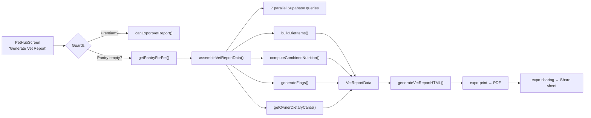

# M6 Vet Report PDF — Walkthrough

## Summary

Implemented the complete Vet Report PDF feature: data assembly, HTML template, and UI integration. The report generates a clinical, diet-centric summary for veterinary consultations, D-095 compliant (observational, never prescriptive).

## Files Created/Modified

### New Files (4)

| File | Lines | Purpose |
|------|-------|---------|
| [vetReport.ts](file:///Users/stevendiaz/kiba-antigravity/src/types/vetReport.ts) | 159 | Type definitions for the entire report pipeline |
| [ownerDietaryCards.ts](file:///Users/stevendiaz/kiba-antigravity/src/data/ownerDietaryCards.ts) | 468 | 28 clinical dietary cards (14 conditions × 2 species) + selection/conflict logic |
| [vetReportService.ts](file:///Users/stevendiaz/kiba-antigravity/src/services/vetReportService.ts) | 722 | Data assembly service with parallel queries, nutrition math, flag generation |
| [vetReportHTML.ts](file:///Users/stevendiaz/kiba-antigravity/src/utils/vetReportHTML.ts) | ~350 | 4-page HTML template for expo-print with BCS gauge |

### Modified Files (1)

| File | Changes |
|------|---------|
| [PetHubScreen.tsx](file:///Users/stevendiaz/kiba-antigravity/src/screens/PetHubScreen.tsx) | Added "Generate Vet Report" button with premium gate, empty pantry guard, loading state |

---

## Architecture

## Key Design Decisions

### BCS Gauge
- 9-segment horizontal bar with 4 color-coded ranges (Underweight/Ideal/Overweight/Obese)
- Triangle marker (`▼`) positioned at the assessed BCS value
- Monochrome-friendly with distinct backgrounds

### Calorie-Weighted Nutrition
- Combined macros use calorie-weighted average, not simple average
- This gives higher-calorie foods proportionally more influence
- DMB conversion: `as_fed / (100 - moisture) × 100`

### Treat Waterfall
1. `useTreatBatteryStore` → today's tracked treat consumption
2. Pantry treat-category items → planned daily kcal
3. `null` → "Not tracked"

### Empty Pantry Guard
- Fires **before** any async work (no spinner, no Supabase calls)
- Two-button Alert: Cancel / Go to Pantry
- Uses `getParent()?.navigate()` for cross-tab navigation

## Validation

- ✅ All 4 new files type-check clean (`npx tsc --noEmit --strict`)
- ✅ PetHubScreen modifications type-check clean
- ✅ No duplicate type definitions (ownerDietaryCards imports from vetReport.ts)
