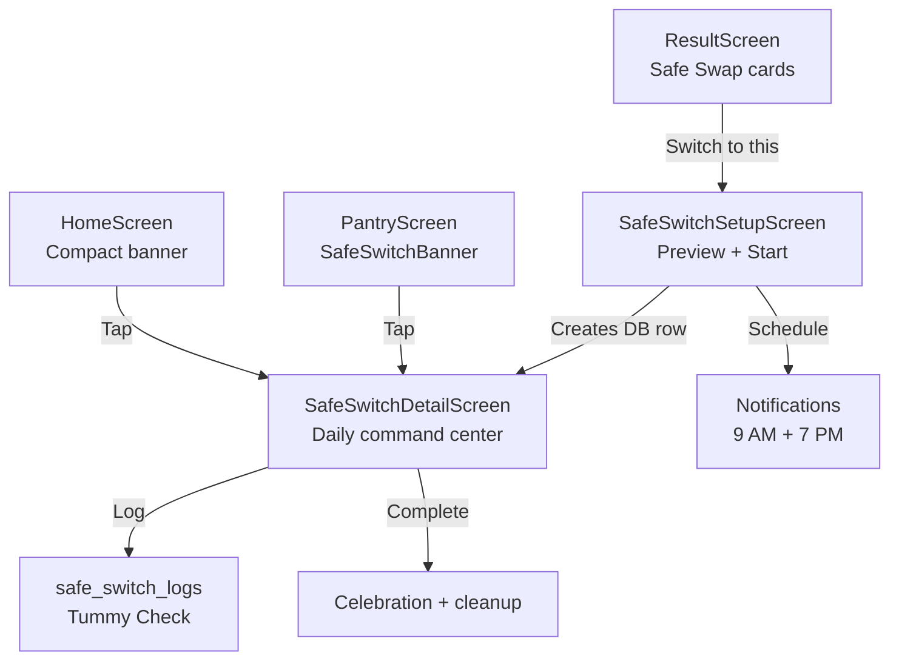

# M7: Safe Switch Guide — Walkthrough

Guided food transition feature: gradual old→new food switch over 7 days (dogs) / 10 days (cats) with daily mix ratios and Tummy Check logging.

## Plan vs Implementation Audit

| Planned Item | Status |
|---|---|
| Migration 025 | Done |
| `safeSwitch.ts` types | Done |
| `safeSwitchService.ts` | Done |
| `safeSwitchHelpers.ts` | Done |
| `safeSwitchNotificationScheduler.ts` | Done |
| `SafeSwitchBanner.tsx` | Done |
| `SafeSwitchSetupScreen.tsx` | Done |
| `SafeSwitchDetailScreen.tsx` | Done |
| `navigation.ts` — add routes | Done |
| `PantryScreen.tsx` — insert banner | Done |
| `HomeScreen.tsx` — insert status card | Done |
| `ResultScreen.tsx` — "Switch to this" on Safe Swap | Done |
| `PantryCard.tsx` — "Find a replacement" link | Done |
| `safeSwitchHelpers.test.ts` | Done (29 tests) |
| `safeSwitchService.test.ts` | **Deferred** — needs Supabase mocking |
| **Unplanned additions:** `navigation/index.tsx` (screen registration), `__mocks__/react-native-svg.js`, `package.json` (Jest config) | Done |

## Test Results

| Metric | Before | After |
|--------|--------|-------|
| Test Suites | 57 | **58** |
| Tests | 1,249 | **1,278** (+29) |
| Regressions | — | **0** |

---

## New Files (12)

### Database
- [025_safe_switches.sql](file:///Users/stevendiaz/kiba-antigravity/supabase/migrations/025_safe_switches.sql) — `safe_switches` + `safe_switch_logs` tables, RLS policies, partial unique index enforcing one active switch per pet

### Types
- [safeSwitch.ts](file:///Users/stevendiaz/kiba-antigravity/src/types/safeSwitch.ts) — `SafeSwitch`, `SafeSwitchLog`, `SafeSwitchCardData`, `TransitionDay`, `TummyCheck` types

### Pure Helpers
- [safeSwitchHelpers.ts](file:///Users/stevendiaz/kiba-antigravity/src/utils/safeSwitchHelpers.ts) — `getTransitionSchedule()`, `getMixForDay()`, `getCurrentDay()`, `getCupSplit()`, `shouldShowUpsetAdvisory()`, `getSpeciesNote()`, `getDefaultDuration()`

### Service Layer
- [safeSwitchService.ts](file:///Users/stevendiaz/kiba-antigravity/src/services/safeSwitchService.ts) — CRUD (create/complete/cancel/pause/resume), `logTummyCheck()` upsert, `getActiveSwitchForPet()` composite loader with product+score+log joins

### Notifications
- [safeSwitchNotificationScheduler.ts](file:///Users/stevendiaz/kiba-antigravity/src/services/safeSwitchNotificationScheduler.ts) — Daily 9 AM mix reminder + 7 PM tummy check nudge, full-resync pattern

### UI Components
- [SafeSwitchBanner.tsx](file:///Users/stevendiaz/kiba-antigravity/src/components/pantry/SafeSwitchBanner.tsx) — Full mode (PantryScreen: day ring + mix ratios) and compact mode (HomeScreen: single-line status card)

### Screens
- [SafeSwitchSetupScreen.tsx](file:///Users/stevendiaz/kiba-antigravity/src/screens/SafeSwitchSetupScreen.tsx) — Old→new product cards, mini phase bars, species note, "Start Safe Switch" CTA
- [SafeSwitchDetailScreen.tsx](file:///Users/stevendiaz/kiba-antigravity/src/screens/SafeSwitchDetailScreen.tsx) — Today's mix proportion bar, tummy check logger (3 pills), vertical timeline, upset advisory, pause/cancel/complete actions, completion celebration

### Tests
- [safeSwitchHelpers.test.ts](file:///Users/stevendiaz/kiba-antigravity/__tests__/utils/safeSwitchHelpers.test.ts) — 29 tests covering schedule math, day clamping, cup splits, upset advisory

### Jest Infrastructure
- [react-native-svg.js](file:///Users/stevendiaz/kiba-antigravity/__mocks__/react-native-svg.js) — Mock for `react-native-svg` (SafeSwitchBanner uses SVG for day progress ring)

---

## Modified Files (8)

### [navigation.ts](file:///Users/stevendiaz/kiba-antigravity/src/types/navigation.ts)
```diff:navigation.ts
// Kiba — Navigation Type Definitions
// Typed param lists for React Navigation 7.x stack navigators

// ─── Stack Param Lists ─────────────────────────────────

export type ScanStackParamList = {
  ScanMain: undefined;
  Result: { productId: string; petId: string | null };
  RecallDetail: { productId: string };
  CommunityContribution: { scannedUpc: string };
  ProductConfirm: {
    scannedUpc: string;
    externalName: string | null;
    externalBrand: string | null;
    externalImageUrl: string | null;
  };
  IngredientCapture: {
    scannedUpc: string;
    productName: string | null;
    brand: string | null;
  };
  Compare: { productAId: string; productBId: string; petId: string };
};

export type HomeStackParamList = {
  HomeMain: undefined;
  Result: { productId: string; petId: string | null };
  RecallDetail: { productId: string };
  AppointmentDetail: { appointmentId: string };
  Compare: { productAId: string; productBId: string; petId: string };
};

export type CommunityStackParamList = {
  CommunityMain: undefined;
  Result: { productId: string; petId: string | null };
  RecallDetail: { productId: string };
  Compare: { productAId: string; productBId: string; petId: string };
};

export type PantryStackParamList = {
  PantryMain: undefined;
  EditPantryItem: { itemId: string };
  Result: { productId: string; petId: string | null };
  RecallDetail: { productId: string };
  Compare: { productAId: string; productBId: string; petId: string };
};

export type MeStackParamList = {
  MeMain: undefined;
  PetProfile: { petId: string };
  SpeciesSelect: undefined;
  CreatePet: { species: 'dog' | 'cat' };
  EditPet: { petId: string };
  HealthConditions: { petId: string; fromCreate?: boolean };
  MedicationForm: {
    petId: string;
    petName: string;
    medication?: import('./pet').PetMedication;
    conditions: string[];
  };
  BCSReference: { petId: string };
  Appointments: undefined;
  CreateAppointment: undefined;
  AppointmentDetail: { appointmentId: string };
  NotificationPreferences: undefined;
  Settings: undefined;
  Result: { productId: string; petId: string | null };
  RecallDetail: { productId: string };
  Compare: { productAId: string; productBId: string; petId: string };
};

// ─── Paywall Trigger ─────────────────────────────────

export type PaywallTrigger =
  | 'scan_limit'
  | 'pet_limit'
  | 'safe_swap'
  | 'search'
  | 'compare'
  | 'vet_report'
  | 'elimination_diet'
  | 'appointment_limit';

// ─── Root & Tab Navigators ─────────────────────────────

export type RootStackParamList = {
  Terms: undefined;
  Onboarding: undefined;
  Main: undefined;
  Paywall: { trigger: PaywallTrigger; petName?: string };
};

export type TabParamList = {
  Home: undefined;
  Community: undefined;
  Scan: undefined;
  Pantry: undefined;
  Me: undefined;
};
===
// Kiba — Navigation Type Definitions
// Typed param lists for React Navigation 7.x stack navigators

// ─── Stack Param Lists ─────────────────────────────────

export type ScanStackParamList = {
  ScanMain: undefined;
  Result: { productId: string; petId: string | null };
  RecallDetail: { productId: string };
  CommunityContribution: { scannedUpc: string };
  ProductConfirm: {
    scannedUpc: string;
    externalName: string | null;
    externalBrand: string | null;
    externalImageUrl: string | null;
  };
  IngredientCapture: {
    scannedUpc: string;
    productName: string | null;
    brand: string | null;
  };
  Compare: { productAId: string; productBId: string; petId: string };
};

export type HomeStackParamList = {
  HomeMain: undefined;
  Result: { productId: string; petId: string | null };
  RecallDetail: { productId: string };
  AppointmentDetail: { appointmentId: string };
  Compare: { productAId: string; productBId: string; petId: string };
  SafeSwitchDetail: { switchId: string };
};

export type CommunityStackParamList = {
  CommunityMain: undefined;
  Result: { productId: string; petId: string | null };
  RecallDetail: { productId: string };
  Compare: { productAId: string; productBId: string; petId: string };
};

export type PantryStackParamList = {
  PantryMain: undefined;
  EditPantryItem: { itemId: string };
  SafeSwitchSetup: { oldProductId: string; newProductId: string; petId: string };
  SafeSwitchDetail: { switchId: string };
  Result: { productId: string; petId: string | null };
  RecallDetail: { productId: string };
  Compare: { productAId: string; productBId: string; petId: string };
};

export type MeStackParamList = {
  MeMain: undefined;
  PetProfile: { petId: string };
  SpeciesSelect: undefined;
  CreatePet: { species: 'dog' | 'cat' };
  EditPet: { petId: string };
  HealthConditions: { petId: string; fromCreate?: boolean };
  MedicationForm: {
    petId: string;
    petName: string;
    medication?: import('./pet').PetMedication;
    conditions: string[];
  };
  BCSReference: { petId: string };
  Appointments: undefined;
  CreateAppointment: undefined;
  AppointmentDetail: { appointmentId: string };
  NotificationPreferences: undefined;
  Settings: undefined;
  Result: { productId: string; petId: string | null };
  RecallDetail: { productId: string };
  Compare: { productAId: string; productBId: string; petId: string };
};

// ─── Paywall Trigger ─────────────────────────────────

export type PaywallTrigger =
  | 'scan_limit'
  | 'pet_limit'
  | 'safe_swap'
  | 'search'
  | 'compare'
  | 'vet_report'
  | 'elimination_diet'
  | 'appointment_limit';

// ─── Root & Tab Navigators ─────────────────────────────

export type RootStackParamList = {
  Terms: undefined;
  Onboarding: undefined;
  Main: undefined;
  Paywall: { trigger: PaywallTrigger; petName?: string };
};

export type TabParamList = {
  Home: undefined;
  Community: undefined;
  Scan: undefined;
  Pantry: undefined;
  Me: undefined;
};
```

### [index.tsx](file:///Users/stevendiaz/kiba-antigravity/src/navigation/index.tsx)
```diff:index.tsx
// Kiba — Navigation Shell
import React from 'react';
import { View, TouchableOpacity, StyleSheet, GestureResponderEvent } from 'react-native';
import { BlurView } from 'expo-blur';
import { NavigationContainer, DefaultTheme, createNavigationContainerRef } from '@react-navigation/native';
import { createBottomTabNavigator, BottomTabBarButtonProps } from '@react-navigation/bottom-tabs';
import { createNativeStackNavigator } from '@react-navigation/native-stack';
import { Ionicons } from '@expo/vector-icons';
import { Colors } from '../utils/constants';

import HomeScreen from '../screens/HomeScreen';
import CommunityScreen from '../screens/CommunityScreen';
import ScanScreen from '../screens/ScanScreen';
import PantryScreen from '../screens/PantryScreen';
import EditPantryItemScreen from '../screens/EditPantryItemScreen';
import PetHubScreen from '../screens/PetHubScreen';
import ResultScreen from '../screens/ResultScreen';
import RecallDetailScreen from '../screens/RecallDetailScreen';
import SpeciesSelectScreen from '../screens/SpeciesSelectScreen';
import CreatePetScreen from '../screens/CreatePetScreen';
import EditPetScreen from '../screens/EditPetScreen';
import HealthConditionsScreen from '../screens/HealthConditionsScreen';
import MedicationFormScreen from '../screens/MedicationFormScreen';
import AppointmentsListScreen from '../screens/AppointmentsListScreen';
import CreateAppointmentScreen from '../screens/CreateAppointmentScreen';
import AppointmentDetailScreen from '../screens/AppointmentDetailScreen';
import NotificationPreferencesScreen from '../screens/NotificationPreferencesScreen';
import BCSReferenceScreen from '../screens/BCSReferenceScreen';
import SettingsScreen from '../screens/SettingsScreen';
import TermsScreen from '../screens/TermsScreen';
import OnboardingScreen from '../screens/OnboardingScreen';
import PaywallScreen from '../screens/PaywallScreen';
import CommunityContributionScreen from '../screens/CommunityContributionScreen';
import ProductConfirmScreen from '../screens/ProductConfirmScreen';
import IngredientCaptureScreen from '../screens/IngredientCaptureScreen';
import CompareScreen from '../screens/CompareScreen';
import { useAppStore } from '../stores/useAppStore';
import {
  HomeStackParamList,
  CommunityStackParamList,
  ScanStackParamList,
  PantryStackParamList,
  MeStackParamList,
  RootStackParamList,
  TabParamList,
} from '../types/navigation';

export const navigationRef = createNavigationContainerRef<RootStackParamList>();

// ─── Stack Navigators ───────────────────────────────────

const HomeStack = createNativeStackNavigator<HomeStackParamList>();
function HomeStackScreen() {
  return (
    <HomeStack.Navigator screenOptions={{ headerShown: false }}>
      <HomeStack.Screen name="HomeMain" component={HomeScreen} />
      <HomeStack.Screen name="Result" component={ResultScreen} />
      <HomeStack.Screen name="RecallDetail" component={RecallDetailScreen} />
      <HomeStack.Screen name="AppointmentDetail" component={AppointmentDetailScreen} />
      <HomeStack.Screen name="Compare" component={CompareScreen} />
    </HomeStack.Navigator>
  );
}

const CommunityStack = createNativeStackNavigator<CommunityStackParamList>();
function CommunityStackScreen() {
  return (
    <CommunityStack.Navigator screenOptions={{ headerShown: false }}>
      <CommunityStack.Screen name="CommunityMain" component={CommunityScreen} />
      <CommunityStack.Screen name="Result" component={ResultScreen} />
      <CommunityStack.Screen name="RecallDetail" component={RecallDetailScreen} />
      <CommunityStack.Screen name="Compare" component={CompareScreen} />
    </CommunityStack.Navigator>
  );
}

const ScanStack = createNativeStackNavigator<ScanStackParamList>();
function ScanStackScreen() {
  return (
    <ScanStack.Navigator screenOptions={{ headerShown: false }}>
      <ScanStack.Screen name="ScanMain" component={ScanScreen} />
      <ScanStack.Screen name="Result" component={ResultScreen} />
      <ScanStack.Screen name="RecallDetail" component={RecallDetailScreen} />
      <ScanStack.Screen name="CommunityContribution" component={CommunityContributionScreen} />
      <ScanStack.Screen name="ProductConfirm" component={ProductConfirmScreen} />
      <ScanStack.Screen name="IngredientCapture" component={IngredientCaptureScreen} />
      <ScanStack.Screen name="Compare" component={CompareScreen} />
    </ScanStack.Navigator>
  );
}

const PantryStack = createNativeStackNavigator<PantryStackParamList>();
function PantryStackScreen() {
  return (
    <PantryStack.Navigator screenOptions={{ headerShown: false }}>
      <PantryStack.Screen name="PantryMain" component={PantryScreen} />
      <PantryStack.Screen name="EditPantryItem" component={EditPantryItemScreen} />
      <PantryStack.Screen name="Result" component={ResultScreen} />
      <PantryStack.Screen name="RecallDetail" component={RecallDetailScreen} />
      <PantryStack.Screen name="Compare" component={CompareScreen} />
    </PantryStack.Navigator>
  );
}

const MeStack = createNativeStackNavigator<MeStackParamList>();
function MeStackScreen() {
  return (
    <MeStack.Navigator screenOptions={{ headerShown: false }}>
      <MeStack.Screen name="MeMain" component={PetHubScreen} />
      <MeStack.Screen name="SpeciesSelect" component={SpeciesSelectScreen} />
      <MeStack.Screen name="CreatePet" component={CreatePetScreen} />
      <MeStack.Screen name="EditPet" component={EditPetScreen} />
      <MeStack.Screen name="HealthConditions" component={HealthConditionsScreen} />
      <MeStack.Screen name="BCSReference" component={BCSReferenceScreen} />
      <MeStack.Screen name="MedicationForm" component={MedicationFormScreen} />
      <MeStack.Screen name="Appointments" component={AppointmentsListScreen} />
      <MeStack.Screen name="CreateAppointment" component={CreateAppointmentScreen} />
      <MeStack.Screen name="AppointmentDetail" component={AppointmentDetailScreen} />
      <MeStack.Screen name="NotificationPreferences" component={NotificationPreferencesScreen} />
      <MeStack.Screen name="Settings" component={SettingsScreen} />
      <MeStack.Screen name="Result" component={ResultScreen} />
      <MeStack.Screen name="RecallDetail" component={RecallDetailScreen} />
      <MeStack.Screen name="Compare" component={CompareScreen} />
    </MeStack.Navigator>
  );
}

// ─── Root Stack (Onboarding gate) ───────────────────────

const RootStack = createNativeStackNavigator<RootStackParamList>();

// ─── Tab Navigator ──────────────────────────────────────

const Tab = createBottomTabNavigator<TabParamList>();

const KibaDarkTheme = {
  ...DefaultTheme,
  dark: true,
  colors: {
    ...DefaultTheme.colors,
    primary: Colors.accent,
    background: Colors.background,
    card: Colors.tabBarBackground,
    text: Colors.textPrimary,
    border: Colors.tabBarBorder,
    notification: Colors.severityRed,
  },
};

function RaisedScanButton({ children, onPress }: BottomTabBarButtonProps) {
  return (
    <TouchableOpacity style={styles.scanButton} onPress={onPress as (e: GestureResponderEvent) => void} activeOpacity={0.8}>
      <View style={styles.scanButtonInner}>{children}</View>
    </TouchableOpacity>
  );
}

function TabNavigator() {
  return (
    <Tab.Navigator
      screenOptions={{
        headerShown: false,
        tabBarActiveTintColor: Colors.tabBarActive,
        tabBarInactiveTintColor: Colors.tabBarInactive,
        tabBarBackground: () => (
          <BlurView
            intensity={80}
            tint="dark"
            style={StyleSheet.absoluteFill}
          />
        ),
        tabBarStyle: {
          position: 'absolute',
          backgroundColor: 'transparent',
          borderTopColor: 'rgba(255,255,255,0.08)',
          borderTopWidth: 1,
          height: 88,
          paddingBottom: 28,
          paddingTop: 8,
        },
        tabBarLabelStyle: {
          fontSize: 11,
          fontWeight: '600',
        },
      }}
    >
      <Tab.Screen
        name="Home"
        component={HomeStackScreen}
        options={{
          tabBarIcon: ({ color, size }) => (
            <Ionicons name="home-outline" size={size} color={color} />
          ),
        }}
      />
      <Tab.Screen
        name="Community"
        component={CommunityStackScreen}
        options={{
          tabBarIcon: ({ color, size }) => (
            <Ionicons name="people-outline" size={size} color={color} />
          ),
        }}
      />
      <Tab.Screen
        name="Scan"
        component={ScanStackScreen}
        options={{
          tabBarIcon: ({ color, size }) => (
            <Ionicons name="scan-outline" size={28} color="#FFFFFF" />
          ),
          tabBarButton: (props) => <RaisedScanButton {...props} />,
          tabBarLabel: () => null,
        }}
      />
      <Tab.Screen
        name="Pantry"
        component={PantryStackScreen}
        options={{
          tabBarIcon: ({ color, size }) => (
            <Ionicons name="basket-outline" size={size} color={color} />
          ),
        }}
      />
      <Tab.Screen
        name="Me"
        component={MeStackScreen}
        options={{
          tabBarIcon: ({ color, size }) => (
            <Ionicons name="person-outline" size={size} color={color} />
          ),
        }}
      />
    </Tab.Navigator>
  );
}

// ─── Root Navigation ────────────────────────────────────

export default function Navigation() {
  const hasAcceptedTos = useAppStore((s) => s.hasAcceptedTos);
  const hasCompletedOnboarding = useAppStore((s) => s.hasCompletedOnboarding);

  return (
    <NavigationContainer ref={navigationRef} theme={KibaDarkTheme}>
      <RootStack.Navigator screenOptions={{ headerShown: false }}>
        {!hasAcceptedTos ? (
          <RootStack.Screen name="Terms" component={TermsScreen} />
        ) : !hasCompletedOnboarding ? (
          <RootStack.Screen name="Onboarding" component={OnboardingScreen} />
        ) : (
          <RootStack.Screen name="Main" component={TabNavigator} />
        )}
        <RootStack.Screen
          name="Paywall"
          component={PaywallScreen}
          options={{ presentation: 'modal' }}
        />
      </RootStack.Navigator>
    </NavigationContainer>
  );
}

// ─── Styles ─────────────────────────────────────────────

const styles = StyleSheet.create({
  scanButton: {
    top: -20,
    justifyContent: 'center',
    alignItems: 'center',
  },
  scanButtonInner: {
    width: 64,
    height: 64,
    borderRadius: 32,
    backgroundColor: Colors.accent,
    justifyContent: 'center',
    alignItems: 'center',
    shadowColor: Colors.accent,
    shadowOffset: { width: 0, height: 4 },
    shadowOpacity: 0.3,
    shadowRadius: 8,
    elevation: 8,
  },
});
===
// Kiba — Navigation Shell
import React from 'react';
import { View, TouchableOpacity, StyleSheet, GestureResponderEvent } from 'react-native';
import { BlurView } from 'expo-blur';
import { NavigationContainer, DefaultTheme, createNavigationContainerRef } from '@react-navigation/native';
import { createBottomTabNavigator, BottomTabBarButtonProps } from '@react-navigation/bottom-tabs';
import { createNativeStackNavigator } from '@react-navigation/native-stack';
import { Ionicons } from '@expo/vector-icons';
import { Colors } from '../utils/constants';

import HomeScreen from '../screens/HomeScreen';
import CommunityScreen from '../screens/CommunityScreen';
import ScanScreen from '../screens/ScanScreen';
import PantryScreen from '../screens/PantryScreen';
import EditPantryItemScreen from '../screens/EditPantryItemScreen';
import PetHubScreen from '../screens/PetHubScreen';
import ResultScreen from '../screens/ResultScreen';
import RecallDetailScreen from '../screens/RecallDetailScreen';
import SpeciesSelectScreen from '../screens/SpeciesSelectScreen';
import CreatePetScreen from '../screens/CreatePetScreen';
import EditPetScreen from '../screens/EditPetScreen';
import HealthConditionsScreen from '../screens/HealthConditionsScreen';
import MedicationFormScreen from '../screens/MedicationFormScreen';
import AppointmentsListScreen from '../screens/AppointmentsListScreen';
import CreateAppointmentScreen from '../screens/CreateAppointmentScreen';
import AppointmentDetailScreen from '../screens/AppointmentDetailScreen';
import NotificationPreferencesScreen from '../screens/NotificationPreferencesScreen';
import BCSReferenceScreen from '../screens/BCSReferenceScreen';
import SettingsScreen from '../screens/SettingsScreen';
import TermsScreen from '../screens/TermsScreen';
import OnboardingScreen from '../screens/OnboardingScreen';
import PaywallScreen from '../screens/PaywallScreen';
import CommunityContributionScreen from '../screens/CommunityContributionScreen';
import ProductConfirmScreen from '../screens/ProductConfirmScreen';
import IngredientCaptureScreen from '../screens/IngredientCaptureScreen';
import CompareScreen from '../screens/CompareScreen';
import SafeSwitchSetupScreen from '../screens/SafeSwitchSetupScreen';
import SafeSwitchDetailScreen from '../screens/SafeSwitchDetailScreen';
import { useAppStore } from '../stores/useAppStore';
import {
  HomeStackParamList,
  CommunityStackParamList,
  ScanStackParamList,
  PantryStackParamList,
  MeStackParamList,
  RootStackParamList,
  TabParamList,
} from '../types/navigation';

export const navigationRef = createNavigationContainerRef<RootStackParamList>();

// ─── Stack Navigators ───────────────────────────────────

const HomeStack = createNativeStackNavigator<HomeStackParamList>();
function HomeStackScreen() {
  return (
    <HomeStack.Navigator screenOptions={{ headerShown: false }}>
      <HomeStack.Screen name="HomeMain" component={HomeScreen} />
      <HomeStack.Screen name="Result" component={ResultScreen} />
      <HomeStack.Screen name="RecallDetail" component={RecallDetailScreen} />
      <HomeStack.Screen name="AppointmentDetail" component={AppointmentDetailScreen} />
      <HomeStack.Screen name="Compare" component={CompareScreen} />
      <HomeStack.Screen name="SafeSwitchDetail" component={SafeSwitchDetailScreen} />
    </HomeStack.Navigator>
  );
}

const CommunityStack = createNativeStackNavigator<CommunityStackParamList>();
function CommunityStackScreen() {
  return (
    <CommunityStack.Navigator screenOptions={{ headerShown: false }}>
      <CommunityStack.Screen name="CommunityMain" component={CommunityScreen} />
      <CommunityStack.Screen name="Result" component={ResultScreen} />
      <CommunityStack.Screen name="RecallDetail" component={RecallDetailScreen} />
      <CommunityStack.Screen name="Compare" component={CompareScreen} />
    </CommunityStack.Navigator>
  );
}

const ScanStack = createNativeStackNavigator<ScanStackParamList>();
function ScanStackScreen() {
  return (
    <ScanStack.Navigator screenOptions={{ headerShown: false }}>
      <ScanStack.Screen name="ScanMain" component={ScanScreen} />
      <ScanStack.Screen name="Result" component={ResultScreen} />
      <ScanStack.Screen name="RecallDetail" component={RecallDetailScreen} />
      <ScanStack.Screen name="CommunityContribution" component={CommunityContributionScreen} />
      <ScanStack.Screen name="ProductConfirm" component={ProductConfirmScreen} />
      <ScanStack.Screen name="IngredientCapture" component={IngredientCaptureScreen} />
      <ScanStack.Screen name="Compare" component={CompareScreen} />
    </ScanStack.Navigator>
  );
}

const PantryStack = createNativeStackNavigator<PantryStackParamList>();
function PantryStackScreen() {
  return (
    <PantryStack.Navigator screenOptions={{ headerShown: false }}>
      <PantryStack.Screen name="PantryMain" component={PantryScreen} />
      <PantryStack.Screen name="EditPantryItem" component={EditPantryItemScreen} />
      <PantryStack.Screen name="SafeSwitchSetup" component={SafeSwitchSetupScreen} />
      <PantryStack.Screen name="SafeSwitchDetail" component={SafeSwitchDetailScreen} />
      <PantryStack.Screen name="Result" component={ResultScreen} />
      <PantryStack.Screen name="RecallDetail" component={RecallDetailScreen} />
      <PantryStack.Screen name="Compare" component={CompareScreen} />
    </PantryStack.Navigator>
  );
}

const MeStack = createNativeStackNavigator<MeStackParamList>();
function MeStackScreen() {
  return (
    <MeStack.Navigator screenOptions={{ headerShown: false }}>
      <MeStack.Screen name="MeMain" component={PetHubScreen} />
      <MeStack.Screen name="SpeciesSelect" component={SpeciesSelectScreen} />
      <MeStack.Screen name="CreatePet" component={CreatePetScreen} />
      <MeStack.Screen name="EditPet" component={EditPetScreen} />
      <MeStack.Screen name="HealthConditions" component={HealthConditionsScreen} />
      <MeStack.Screen name="BCSReference" component={BCSReferenceScreen} />
      <MeStack.Screen name="MedicationForm" component={MedicationFormScreen} />
      <MeStack.Screen name="Appointments" component={AppointmentsListScreen} />
      <MeStack.Screen name="CreateAppointment" component={CreateAppointmentScreen} />
      <MeStack.Screen name="AppointmentDetail" component={AppointmentDetailScreen} />
      <MeStack.Screen name="NotificationPreferences" component={NotificationPreferencesScreen} />
      <MeStack.Screen name="Settings" component={SettingsScreen} />
      <MeStack.Screen name="Result" component={ResultScreen} />
      <MeStack.Screen name="RecallDetail" component={RecallDetailScreen} />
      <MeStack.Screen name="Compare" component={CompareScreen} />
    </MeStack.Navigator>
  );
}

// ─── Root Stack (Onboarding gate) ───────────────────────

const RootStack = createNativeStackNavigator<RootStackParamList>();

// ─── Tab Navigator ──────────────────────────────────────

const Tab = createBottomTabNavigator<TabParamList>();

const KibaDarkTheme = {
  ...DefaultTheme,
  dark: true,
  colors: {
    ...DefaultTheme.colors,
    primary: Colors.accent,
    background: Colors.background,
    card: Colors.tabBarBackground,
    text: Colors.textPrimary,
    border: Colors.tabBarBorder,
    notification: Colors.severityRed,
  },
};

function RaisedScanButton({ children, onPress }: BottomTabBarButtonProps) {
  return (
    <TouchableOpacity style={styles.scanButton} onPress={onPress as (e: GestureResponderEvent) => void} activeOpacity={0.8}>
      <View style={styles.scanButtonInner}>{children}</View>
    </TouchableOpacity>
  );
}

function TabNavigator() {
  return (
    <Tab.Navigator
      screenOptions={{
        headerShown: false,
        tabBarActiveTintColor: Colors.tabBarActive,
        tabBarInactiveTintColor: Colors.tabBarInactive,
        tabBarBackground: () => (
          <BlurView
            intensity={80}
            tint="dark"
            style={StyleSheet.absoluteFill}
          />
        ),
        tabBarStyle: {
          position: 'absolute',
          backgroundColor: 'transparent',
          borderTopColor: 'rgba(255,255,255,0.08)',
          borderTopWidth: 1,
          height: 88,
          paddingBottom: 28,
          paddingTop: 8,
        },
        tabBarLabelStyle: {
          fontSize: 11,
          fontWeight: '600',
        },
      }}
    >
      <Tab.Screen
        name="Home"
        component={HomeStackScreen}
        options={{
          tabBarIcon: ({ color, size }) => (
            <Ionicons name="home-outline" size={size} color={color} />
          ),
        }}
      />
      <Tab.Screen
        name="Community"
        component={CommunityStackScreen}
        options={{
          tabBarIcon: ({ color, size }) => (
            <Ionicons name="people-outline" size={size} color={color} />
          ),
        }}
      />
      <Tab.Screen
        name="Scan"
        component={ScanStackScreen}
        options={{
          tabBarIcon: ({ color, size }) => (
            <Ionicons name="scan-outline" size={28} color="#FFFFFF" />
          ),
          tabBarButton: (props) => <RaisedScanButton {...props} />,
          tabBarLabel: () => null,
        }}
      />
      <Tab.Screen
        name="Pantry"
        component={PantryStackScreen}
        options={{
          tabBarIcon: ({ color, size }) => (
            <Ionicons name="basket-outline" size={size} color={color} />
          ),
        }}
      />
      <Tab.Screen
        name="Me"
        component={MeStackScreen}
        options={{
          tabBarIcon: ({ color, size }) => (
            <Ionicons name="person-outline" size={size} color={color} />
          ),
        }}
      />
    </Tab.Navigator>
  );
}

// ─── Root Navigation ────────────────────────────────────

export default function Navigation() {
  const hasAcceptedTos = useAppStore((s) => s.hasAcceptedTos);
  const hasCompletedOnboarding = useAppStore((s) => s.hasCompletedOnboarding);

  return (
    <NavigationContainer ref={navigationRef} theme={KibaDarkTheme}>
      <RootStack.Navigator screenOptions={{ headerShown: false }}>
        {!hasAcceptedTos ? (
          <RootStack.Screen name="Terms" component={TermsScreen} />
        ) : !hasCompletedOnboarding ? (
          <RootStack.Screen name="Onboarding" component={OnboardingScreen} />
        ) : (
          <RootStack.Screen name="Main" component={TabNavigator} />
        )}
        <RootStack.Screen
          name="Paywall"
          component={PaywallScreen}
          options={{ presentation: 'modal' }}
        />
      </RootStack.Navigator>
    </NavigationContainer>
  );
}

// ─── Styles ─────────────────────────────────────────────

const styles = StyleSheet.create({
  scanButton: {
    top: -20,
    justifyContent: 'center',
    alignItems: 'center',
  },
  scanButtonInner: {
    width: 64,
    height: 64,
    borderRadius: 32,
    backgroundColor: Colors.accent,
    justifyContent: 'center',
    alignItems: 'center',
    shadowColor: Colors.accent,
    shadowOffset: { width: 0, height: 4 },
    shadowOpacity: 0.3,
    shadowRadius: 8,
    elevation: 8,
  },
});
```

### [PantryScreen.tsx](file:///Users/stevendiaz/kiba-antigravity/src/screens/PantryScreen.tsx)
```diff:PantryScreen.tsx
// Kiba — Pantry Screen (M5)
// Main Pantry tab: pet food inventory, diet completeness, filter/sort, remove/restock.
// D-084: Zero emoji — Ionicons only. D-094: Score framing. D-095: UPVM compliant.
// D-155: Empty item handling. D-157: Mixed feeding removal nudge.

import React, { useState, useCallback, useMemo } from 'react';
import {
  View,
  Text,
  FlatList,
  TouchableOpacity,
  Image,
  Alert,
  Modal,
  Pressable,
  StyleSheet,
  ActivityIndicator,
  RefreshControl,
  ScrollView,
} from 'react-native';
import { Ionicons } from '@expo/vector-icons';
import { BlurView } from 'expo-blur';
import { useFocusEffect } from '@react-navigation/native';
import { useSafeAreaInsets } from 'react-native-safe-area-context';
import type { NativeStackScreenProps } from '@react-navigation/native-stack';

import { Colors, FontSizes, Spacing, SEVERITY_COLORS } from '../utils/constants';
import { PantryCard } from '../components/pantry/PantryCard';
import { useActivePetStore } from '../stores/useActivePetStore';
import { usePantryStore } from '../stores/usePantryStore';
import type { PantryCardData, DietCompletenessResult } from '../types/pantry';
import type { PantryStackParamList } from '../types/navigation';

// ─── Types ──────────────────────────────────────────────

export type FilterChip = 'all' | 'dry' | 'wet' | 'treats' | 'supplemental' | 'recalled' | 'running_low';
export type SortOption = 'default' | 'name' | 'score' | 'days_remaining';

type Props = NativeStackScreenProps<PantryStackParamList, 'PantryMain'>;

// ─── Exported Helpers (pure, testable) ──────────────────

export function filterItems(items: PantryCardData[], filter: FilterChip): PantryCardData[] {
  switch (filter) {
    case 'all': return items;
    case 'dry': return items.filter(i => i.product.product_form === 'dry');
    case 'wet': return items.filter(i => i.product.product_form === 'wet');
    case 'treats': return items.filter(i => i.product.category === 'treat');
    case 'supplemental': return items.filter(i => i.product.is_supplemental);
    case 'recalled': return items.filter(i => i.product.is_recalled);
    case 'running_low': return items.filter(i => i.is_low_stock && !i.is_empty);
  }
}

export function sortItems(items: PantryCardData[], sort: SortOption): PantryCardData[] {
  if (sort === 'default') return items;
  const sorted = [...items];
  switch (sort) {
    case 'name':
      return sorted.sort((a, b) => a.product.name.localeCompare(b.product.name));
    case 'score':
      return sorted.sort((a, b) => (b.resolved_score ?? -1) - (a.resolved_score ?? -1));
    case 'days_remaining':
      return sorted.sort((a, b) => (a.days_remaining ?? Infinity) - (b.days_remaining ?? Infinity));
  }
}

export function shouldShowD157Nudge(
  removedItem: PantryCardData,
  remainingItems: PantryCardData[],
  petId: string,
): boolean {
  if (removedItem.product.category !== 'daily_food') return false;
  const removedAssignment = removedItem.assignments.find(a => a.pet_id === petId);
  if (!removedAssignment || removedAssignment.feeding_frequency !== 'daily') return false;
  return remainingItems.some(
    item => item.product.category === 'daily_food'
      && item.assignments.some(a => a.pet_id === petId && a.feeding_frequency === 'daily'),
  );
}

export function getDietBannerConfig(
  dietStatus: DietCompletenessResult | null,
): { show: boolean; color: string; message: string } | null {
  if (!dietStatus) return null;
  if (dietStatus.status === 'complete' || dietStatus.status === 'empty') return null;
  if (dietStatus.status === 'amber_warning') {
    return { show: true, color: Colors.severityAmber, message: dietStatus.message ?? '' };
  }
  if (dietStatus.status === 'red_warning') {
    return { show: true, color: Colors.severityRed, message: dietStatus.message ?? '' };
  }
  return null;
}

// ─── Filter Chip Config ─────────────────────────────────

const FILTER_CHIPS: { key: FilterChip; label: string }[] = [
  { key: 'all', label: 'All' },
  { key: 'dry', label: 'Dry' },
  { key: 'wet', label: 'Wet' },
  { key: 'treats', label: 'Treats' },
  { key: 'supplemental', label: 'Supplemental' },
  { key: 'recalled', label: 'Recalled' },
  { key: 'running_low', label: 'Running Low' },
];

function getChipAccentColor(chip: FilterChip): string {
  switch (chip) {
    case 'supplemental': return '#14B8A6';
    case 'recalled': return Colors.severityRed;
    case 'running_low': return Colors.severityAmber;
    default: return Colors.accent;
  }
}

const SORT_OPTIONS: { key: SortOption; label: string }[] = [
  { key: 'default', label: 'Default' },
  { key: 'name', label: 'Name (A\u2013Z)' },
  { key: 'score', label: 'Score (high to low)' },
  { key: 'days_remaining', label: 'Days remaining (urgent first)' },
];

const FILTER_LABEL_MAP: Record<FilterChip, string> = {
  all: '', dry: 'dry', wet: 'wet', treats: 'treat',
  supplemental: 'supplemental', recalled: 'recalled', running_low: 'low stock',
};

// ─── Component ──────────────────────────────────────────

export default function PantryScreen({ navigation }: Props) {
  const insets = useSafeAreaInsets();

  // ── Stores ──
  const pets = useActivePetStore(s => s.pets);
  const activePetId = useActivePetStore(s => s.activePetId);
  const setActivePet = useActivePetStore(s => s.setActivePet);
  const activePet = useMemo(() => pets.find(p => p.id === activePetId) ?? null, [pets, activePetId]);

  const items = usePantryStore(s => s.items);
  const dietStatus = usePantryStore(s => s.dietStatus);
  const loading = usePantryStore(s => s.loading);
  const loadPantry = usePantryStore(s => s.loadPantry);
  const removeItem = usePantryStore(s => s.removeItem);
  const restockItem = usePantryStore(s => s.restockItem);
  const logTreat = usePantryStore(s => s.logTreat);

  // ── Local state ──
  const [activeFilter, setActiveFilter] = useState<FilterChip>('all');
  const [activeSort, setActiveSort] = useState<SortOption>('default');
  const [sortModalVisible, setSortModalVisible] = useState(false);
  const [removeSheetItem, setRemoveSheetItem] = useState<PantryCardData | null>(null);
  const [refreshing, setRefreshing] = useState(false);

  // ── Derived data ──
  const filteredItems = useMemo(() => filterItems(items, activeFilter), [items, activeFilter]);
  const displayItems = useMemo(() => sortItems(filteredItems, activeSort), [filteredItems, activeSort]);
  const bannerConfig = useMemo(() => getDietBannerConfig(dietStatus), [dietStatus]);
  const recalledItems = useMemo(() => items.filter(i => i.product?.is_recalled), [items]);
  const hasMultiplePets = pets.length > 1;

  // ── Lifecycle ──
  useFocusEffect(
    useCallback(() => {
      if (!activePetId) return;
      let cancelled = false;
      loadPantry(activePetId).then(() => { if (cancelled) return; });
      return () => { cancelled = true; };
    }, [activePetId, loadPantry]),
  );

  // ── Handlers ──
  const handleRefresh = useCallback(async () => {
    if (!activePetId) return;
    setRefreshing(true);
    await loadPantry(activePetId);
    setRefreshing(false);
  }, [activePetId, loadPantry]);

  const handleTap = useCallback((itemId: string) => {
    const item = items.find(i => i.id === itemId);
    if (item?.product?.is_recalled) {
      navigation.navigate('RecallDetail', { productId: item.product_id });
    } else {
      navigation.navigate('EditPantryItem', { itemId });
    }
  }, [navigation, items]);

  const checkD157Nudge = useCallback((removedItem: PantryCardData) => {
    const remaining = items.filter(i => i.id !== removedItem.id);
    if (activePetId && shouldShowD157Nudge(removedItem, remaining, activePetId)) {
      const petName = activePet?.name ?? 'Your pet';
      Alert.alert('Intake Changed', `${petName}'s daily intake from pantry items has changed.`);
    }
  }, [items, activePetId, activePet]);

  const handleGaveTreat = useCallback(async (itemId: string) => {
    if (!activePetId) return;
    await logTreat(itemId, activePetId);
  }, [activePetId, logTreat]);

  const handleRestock = useCallback(async (itemId: string) => {
    const item = items.find(i => i.id === itemId);
    if (!item) return;
    await restockItem(item.id);
    Alert.alert('Restocked', `${item.product.name} restocked.`);
  }, [items, restockItem]);

  const handleRemove = useCallback((itemId: string) => {
    const item = items.find(i => i.id === itemId);
    if (!item) return;

    if (item.assignments.length > 1) {
      setRemoveSheetItem(item);
      return;
    }

    Alert.alert(
      'Remove Item',
      `Remove ${item.product.name} from your pantry?`,
      [
        { text: 'Cancel', style: 'cancel' },
        {
          text: 'Remove', style: 'destructive', onPress: async () => {
            await removeItem(item.id);
            checkD157Nudge(item);
          },
        },
      ],
    );
  }, [items, removeItem, checkD157Nudge]);

  const handleSharedRemoveAll = useCallback(async () => {
    if (!removeSheetItem) return;
    const item = removeSheetItem;
    setRemoveSheetItem(null);
    await removeItem(item.id);
    checkD157Nudge(item);
  }, [removeSheetItem, removeItem, checkD157Nudge]);

  const handleSharedRemovePetOnly = useCallback(async () => {
    if (!removeSheetItem || !activePetId) return;
    const item = removeSheetItem;
    setRemoveSheetItem(null);
    await removeItem(item.id, activePetId);
    checkD157Nudge(item);
  }, [removeSheetItem, activePetId, removeItem, checkD157Nudge]);

  const handlePetSwitch = useCallback((petId: string) => {
    setActivePet(petId);
    setActiveFilter('all');
    setActiveSort('default');
  }, [setActivePet]);

  // ── No pet empty state ──
  if (!activePet) {
    return (
      <View style={[styles.container, { paddingTop: insets.top }]}>
        <View style={styles.header}>
          <Text style={styles.title}>Pantry</Text>
        </View>
        <View style={styles.emptyCenter}>
          <View style={styles.emptyIconPlatter}>
            <Ionicons name="paw-outline" size={40} color={Colors.accent} />
          </View>
          <Text style={styles.emptyTitle}>No pet profile yet</Text>
          <Text style={styles.emptySubtitle}>
            Create a pet profile to start{'\n'}building their pantry
          </Text>
          <TouchableOpacity
            style={styles.ctaButton}
            onPress={() => (navigation.getParent() as any)?.navigate('Me', {
              screen: 'CreatePet', params: { species: 'dog' },
            })}
            activeOpacity={0.7}
          >
            <Ionicons name="add-circle-outline" size={18} color="#FFFFFF" />
            <Text style={styles.ctaText}>Add Your Pet</Text>
          </TouchableOpacity>
        </View>
      </View>
    );
  }

  // ── Loading (first load, no cached items) ──
  if (loading && items.length === 0) {
    return (
      <View style={[styles.container, { paddingTop: insets.top }]}>
        <View style={styles.header}>
          <Text style={styles.title}>Pantry</Text>
        </View>
        <View style={styles.emptyCenter}>
          <ActivityIndicator size="large" color={Colors.accent} />
        </View>
      </View>
    );
  }

  // ── Main screen ──
  return (
    <View style={[styles.container, { paddingTop: insets.top }]}>
      {/* Header */}
      <View style={styles.header}>
        <View style={styles.headerRow}>
          <Text style={styles.title}>Pantry</Text>
          {!hasMultiplePets && (
            <View style={styles.headerPet}>
              <View style={styles.headerAvatar}>
                {activePet.photo_url ? (
                  <Image source={{ uri: activePet.photo_url }} style={styles.headerPhoto} />
                ) : (
                  <Ionicons name="paw-outline" size={16} color={Colors.accent} />
                )}
              </View>
              <Text style={styles.headerPetName} numberOfLines={1}>{activePet.name}</Text>
            </View>
          )}
        </View>
      </View>

      {/* Pet switcher */}
      {hasMultiplePets && (
        <ScrollView
          horizontal
          showsHorizontalScrollIndicator={false}
          contentContainerStyle={styles.carouselContent}
          style={styles.carousel}
        >
          {pets.map(pet => {
            const isActive = pet.id === activePetId;
            return (
              <TouchableOpacity
                key={pet.id}
                onPress={() => !isActive && handlePetSwitch(pet.id)}
                activeOpacity={0.7}
                style={styles.carouselItem}
              >
                <View style={[
                  styles.carouselAvatar,
                  isActive ? styles.carouselAvatarActive : styles.carouselAvatarInactive,
                ]}>
                  {pet.photo_url ? (
                    <Image
                      source={{ uri: pet.photo_url }}
                      style={[
                        styles.carouselPhoto,
                        isActive ? styles.carouselPhotoActive : styles.carouselPhotoInactive,
                      ]}
                    />
                  ) : (
                    <Ionicons
                      name="paw-outline"
                      size={isActive ? 20 : 16}
                      color={Colors.accent}
                    />
                  )}
                </View>
                <Text
                  style={[styles.carouselName, !isActive && styles.carouselNameInactive]}
                  numberOfLines={1}
                >
                  {pet.name}
                </Text>
              </TouchableOpacity>
            );
          })}
        </ScrollView>
      )}

      {/* Recall alert banner — D-125: always free, top priority */}
      {recalledItems.length > 0 && (
        <TouchableOpacity
          style={styles.recallBanner}
          onPress={() => setActiveFilter('recalled')}
          activeOpacity={0.7}
        >
          <View style={{ marginTop: 2 }}>
            <Ionicons name="warning-outline" size={16} color={Colors.severityRed} />
          </View>
          <Text style={styles.recallBannerText}>
            Recall Alert: {recalledItems.length} product{recalledItems.length > 1 ? 's' : ''} in {activePet.name}'s pantry {recalledItems.length > 1 ? 'have' : 'has'} been recalled. Tap to review.
          </Text>
        </TouchableOpacity>
      )}

      {/* Diet completeness banner */}
      {bannerConfig && (
        <View style={[
          styles.banner,
          { backgroundColor: `${bannerConfig.color}15`, borderLeftColor: bannerConfig.color },
        ]}>
          <View style={{ marginTop: 2 }}>
            <Ionicons name="warning-outline" size={16} color={bannerConfig.color} />
          </View>
          <Text style={[styles.bannerText, { color: bannerConfig.color }]}>
            {bannerConfig.message}
          </Text>
        </View>
      )}

      {/* Filter / sort bar */}
      <View style={styles.filterRow}>
        <ScrollView
          horizontal
          showsHorizontalScrollIndicator={false}
          contentContainerStyle={styles.filterChipsContent}
          style={styles.filterChips}
        >
          {FILTER_CHIPS.map(chip => {
            const selected = activeFilter === chip.key;
            const accentColor = getChipAccentColor(chip.key);
            return (
              <TouchableOpacity
                key={chip.key}
                style={[
                  styles.chip,
                  selected
                    ? { backgroundColor: accentColor }
                    : { backgroundColor: Colors.cardBorder },
                ]}
                onPress={() => setActiveFilter(chip.key)}
                activeOpacity={0.7}
              >
                <Text style={[
                  styles.chipText,
                  selected
                    ? { color: '#FFFFFF' }
                    : { color: Colors.textSecondary },
                ]}>
                  {chip.label}
                </Text>
              </TouchableOpacity>
            );
          })}
        </ScrollView>
        <TouchableOpacity
          style={styles.sortButton}
          onPress={() => setSortModalVisible(true)}
          activeOpacity={0.7}
        >
          <Ionicons
            name="swap-vertical-outline"
            size={20}
            color={activeSort !== 'default' ? Colors.accent : Colors.textSecondary}
          />
        </TouchableOpacity>
      </View>

      {/* Item list */}
      <FlatList
        data={displayItems}
        keyExtractor={item => item.id}
        showsVerticalScrollIndicator={false}
        contentInsetAdjustmentBehavior="never"
        renderItem={({ item }) => (
          <PantryCard
            item={item}
            activePet={activePet}
            onTap={handleTap}
            onRestock={handleRestock}
            onRemove={handleRemove}
            onGaveTreat={handleGaveTreat}
          />
        )}
        refreshControl={
          <RefreshControl
            refreshing={refreshing}
            onRefresh={handleRefresh}
            tintColor={Colors.accent}
          />
        }
        contentContainerStyle={[
          styles.listContent,
          displayItems.length === 0 && styles.listContentEmpty,
        ]}
        ListEmptyComponent={
          items.length === 0 ? (
            <View style={styles.emptyCenter}>
              <View style={styles.emptyIconPlatter}>
                <Ionicons name="scan-outline" size={40} color={Colors.accent} />
              </View>
              <Text style={styles.emptyTitle}>Pantry is empty</Text>
              <Text style={styles.emptySubtitle}>
                Scan a product to add it to{'\n'}{activePet.name}'s pantry
              </Text>
              <TouchableOpacity
                style={styles.ctaButton}
                onPress={() => (navigation.getParent() as any)?.navigate('Scan')}
                activeOpacity={0.7}
              >
                <Ionicons name="scan-outline" size={18} color={Colors.accent} />
                <Text style={styles.ctaText}>Scan a Product</Text>
              </TouchableOpacity>
            </View>
          ) : (
            <View style={styles.emptyFilter}>
              <View style={styles.emptyIconPlatter}>
                <Ionicons name="filter-outline" size={40} color={Colors.accent} />
              </View>
              <Text style={styles.emptyFilterText}>
                No {FILTER_LABEL_MAP[activeFilter]} items in pantry
              </Text>
            </View>
          )
        }
      />

      {/* Sort modal */}
      <Modal
        visible={sortModalVisible}
        transparent
        animationType="fade"
        onRequestClose={() => setSortModalVisible(false)}
      >
        <Pressable style={styles.modalOverlay} onPress={() => setSortModalVisible(false)}>
          <BlurView intensity={30} style={StyleSheet.absoluteFill} />
        </Pressable>
        <View style={styles.modalSheet}>
          <View style={styles.dragHandle} />
          <Text style={styles.modalTitle}>Sort By</Text>
          {SORT_OPTIONS.map(option => (
            <TouchableOpacity
              key={option.key}
              style={styles.modalOption}
              onPress={() => { setActiveSort(option.key); setSortModalVisible(false); }}
              activeOpacity={0.7}
            >
              <Text style={[
                styles.modalOptionText,
                activeSort === option.key && { color: Colors.accent },
              ]}>
                {option.label}
              </Text>
              {activeSort === option.key && (
                <Ionicons name="checkmark" size={18} color={Colors.accent} />
              )}
            </TouchableOpacity>
          ))}
        </View>
      </Modal>

      {/* Shared remove modal */}
      <Modal
        visible={removeSheetItem !== null}
        transparent
        animationType="fade"
        onRequestClose={() => setRemoveSheetItem(null)}
      >
        <Pressable style={styles.modalOverlay} onPress={() => setRemoveSheetItem(null)}>
          <BlurView intensity={30} style={StyleSheet.absoluteFill} />
        </Pressable>
        <View style={styles.modalSheet}>
          <View style={styles.dragHandle} />
          <Text style={styles.modalTitle}>Remove Item</Text>
          <Text style={styles.modalSubtitle}>
            {removeSheetItem?.product.name} is shared with multiple pets.
          </Text>
          <TouchableOpacity
            style={styles.modalOption}
            onPress={handleSharedRemoveAll}
            activeOpacity={0.7}
          >
            <Text style={[styles.modalOptionText, { color: SEVERITY_COLORS.danger }]}>
              Remove for all pets
            </Text>
          </TouchableOpacity>
          <TouchableOpacity
            style={styles.modalOption}
            onPress={handleSharedRemovePetOnly}
            activeOpacity={0.7}
          >
            <Text style={styles.modalOptionText}>
              Remove for {activePet.name} only
            </Text>
          </TouchableOpacity>
          <TouchableOpacity
            style={styles.modalOption}
            onPress={() => setRemoveSheetItem(null)}
            activeOpacity={0.7}
          >
            <Text style={[styles.modalOptionText, { color: Colors.textTertiary }]}>Cancel</Text>
          </TouchableOpacity>
        </View>
      </Modal>
    </View>
  );
}

// ─── Styles ─────────────────────────────────────────────

const styles = StyleSheet.create({
  container: {
    flex: 1,
    backgroundColor: Colors.background,
  },

  // Header
  header: {
    paddingHorizontal: Spacing.lg,
    paddingTop: 0,
    paddingBottom: 2,
  },
  headerRow: {
    flexDirection: 'row',
    justifyContent: 'space-between',
    alignItems: 'center',
  },
  title: {
    fontSize: FontSizes.xxl,
    fontWeight: '800',
    color: Colors.textPrimary,
    lineHeight: 30,
  },
  headerPet: {
    flexDirection: 'row',
    alignItems: 'center',
    gap: 8,
  },
  headerAvatar: {
    width: 32,
    height: 32,
    borderRadius: 16,
    backgroundColor: '#00B4D815',
    justifyContent: 'center',
    alignItems: 'center',
    overflow: 'hidden',
  },
  headerPhoto: {
    width: 32,
    height: 32,
    borderRadius: 16,
  },
  headerPetName: {
    fontSize: FontSizes.sm,
    color: Colors.textSecondary,
    maxWidth: 100,
  },

  // Pet carousel
  carousel: {
    flexGrow: 0,
    marginTop: 0,
    marginBottom: 0,
  },
  carouselContent: {
    paddingHorizontal: Spacing.lg,
    paddingTop: 0,
    paddingBottom: 2,
    gap: 10,
    alignItems: 'center',
  },
  carouselItem: {
    alignItems: 'center',
    width: 52,
  },
  carouselAvatar: {
    justifyContent: 'center',
    alignItems: 'center',
    backgroundColor: Colors.card,
    overflow: 'hidden',
  },
  carouselAvatarActive: {
    width: 44,
    height: 44,
    borderRadius: 22,
    borderWidth: 2,
    borderColor: Colors.accent,
    backgroundColor: Colors.background,
  },
  carouselAvatarInactive: {
    width: 36,
    height: 36,
    borderRadius: 18,
    opacity: 0.6,
  },
  carouselPhoto: {
    borderRadius: 22,
  },
  carouselPhotoActive: {
    width: 40,
    height: 40,
    borderRadius: 20,
  },
  carouselPhotoInactive: {
    width: 36,
    height: 36,
    borderRadius: 18,
  },
  carouselName: {
    fontSize: 10,
    color: Colors.textPrimary,
    marginTop: 2,
    textAlign: 'center',
  },
  carouselNameInactive: {
    opacity: 0.5,
  },

  // Recall banner
  recallBanner: {
    flexDirection: 'row',
    alignItems: 'flex-start',
    gap: Spacing.sm,
    marginHorizontal: Spacing.lg,
    marginTop: 4,
    marginBottom: 4,
    paddingVertical: 8,
    paddingHorizontal: Spacing.md,
    borderRadius: 12,
    borderLeftWidth: 3,
    borderLeftColor: Colors.severityRed,
    backgroundColor: `${Colors.severityRed}15`,
  },
  recallBannerText: {
    flex: 1,
    fontSize: FontSizes.sm,
    color: Colors.severityRed,
    lineHeight: 18,
  },

  // Diet banner
  banner: {
    flexDirection: 'row',
    alignItems: 'flex-start',
    gap: Spacing.sm,
    marginHorizontal: Spacing.lg,
    marginTop: 4,
    marginBottom: 4,
    paddingVertical: 8,
    paddingHorizontal: Spacing.md,
    borderRadius: 12,
    borderLeftWidth: 3,
  },
  bannerText: {
    flex: 1,
    fontSize: FontSizes.sm,
    lineHeight: 18,
  },

  // Filter / sort bar
  filterRow: {
    flexDirection: 'row',
    alignItems: 'center',
    marginTop: 0,
    marginBottom: 2,
  },
  filterChips: {
    flex: 1,
  },
  filterChipsContent: {
    paddingHorizontal: Spacing.lg,
    gap: 8,
  },
  chip: {
    borderRadius: 20,
    paddingHorizontal: 12,
    paddingVertical: 6,
  },
  chipText: {
    fontSize: FontSizes.sm,
    fontWeight: '500',
  },
  sortButton: {
    paddingHorizontal: Spacing.md,
    paddingVertical: Spacing.sm,
    backgroundColor: Colors.background,
    borderLeftWidth: StyleSheet.hairlineWidth,
    borderLeftColor: Colors.cardBorder,
  },

  // List
  listContent: {
    paddingHorizontal: Spacing.lg,
    paddingBottom: 88,
    gap: Spacing.sm,
  },
  listContentEmpty: {
    flexGrow: 1,
  },

  // Empty states
  emptyCenter: {
    flex: 1,
    justifyContent: 'center',
    alignItems: 'center',
    paddingBottom: 40,
    gap: Spacing.sm,
  },
  emptyTitle: {
    fontSize: FontSizes.lg,
    fontWeight: '700',
    color: Colors.textPrimary,
    marginTop: Spacing.md,
  },
  emptySubtitle: {
    fontSize: FontSizes.md,
    color: Colors.textSecondary,
    textAlign: 'center',
    lineHeight: 22,
  },
  ctaButton: {
    flexDirection: 'row',
    alignItems: 'center',
    gap: 8,
    backgroundColor: `${Colors.accent}15`,
    borderRadius: 12,
    paddingVertical: 12,
    paddingHorizontal: Spacing.lg,
    marginTop: Spacing.md,
  },
  ctaText: {
    fontSize: FontSizes.md,
    fontWeight: '600',
    color: Colors.accent,
  },
  emptyFilter: {
    flex: 1,
    justifyContent: 'center',
    alignItems: 'center',
    paddingBottom: 40,
    gap: Spacing.sm,
  },
  emptyFilterText: {
    fontSize: FontSizes.md,
    color: Colors.textSecondary,
  },
  emptyIconPlatter: {
    width: 88,
    height: 88,
    borderRadius: 44,
    backgroundColor: `${Colors.accent}15`,
    justifyContent: 'center',
    alignItems: 'center',
    marginBottom: Spacing.sm,
  },

  // Modal (sort + shared remove)
  modalOverlay: {
    ...StyleSheet.absoluteFillObject,
    backgroundColor: 'rgba(0,0,0,0.5)',
  },
  modalSheet: {
    position: 'absolute',
    bottom: 0,
    left: 0,
    right: 0,
    backgroundColor: Colors.card,
    borderTopLeftRadius: 20,
    borderTopRightRadius: 20,
    paddingHorizontal: Spacing.lg,
    paddingTop: Spacing.lg,
    paddingBottom: Spacing.xxl,
  },
  dragHandle: {
    width: 36,
    height: 4,
    borderRadius: 2,
    backgroundColor: Colors.textTertiary,
    opacity: 0.3,
    alignSelf: 'center',
    marginBottom: Spacing.md,
  },
  modalTitle: {
    fontSize: FontSizes.lg,
    fontWeight: '700',
    color: Colors.textPrimary,
    marginBottom: Spacing.md,
  },
  modalSubtitle: {
    fontSize: FontSizes.md,
    color: Colors.textSecondary,
    marginBottom: Spacing.md,
    lineHeight: 22,
  },
  modalOption: {
    flexDirection: 'row',
    justifyContent: 'space-between',
    alignItems: 'center',
    paddingVertical: 14,
    borderTopWidth: StyleSheet.hairlineWidth,
    borderTopColor: Colors.cardBorder,
  },
  modalOptionText: {
    fontSize: FontSizes.md,
    color: Colors.textPrimary,
  },
});
===
// Kiba — Pantry Screen (M5)
// Main Pantry tab: pet food inventory, diet completeness, filter/sort, remove/restock.
// D-084: Zero emoji — Ionicons only. D-094: Score framing. D-095: UPVM compliant.
// D-155: Empty item handling. D-157: Mixed feeding removal nudge.

import React, { useState, useCallback, useMemo } from 'react';
import {
  View,
  Text,
  FlatList,
  TouchableOpacity,
  Image,
  Alert,
  Modal,
  Pressable,
  StyleSheet,
  ActivityIndicator,
  RefreshControl,
  ScrollView,
} from 'react-native';
import { Ionicons } from '@expo/vector-icons';
import { BlurView } from 'expo-blur';
import { useFocusEffect } from '@react-navigation/native';
import { useSafeAreaInsets } from 'react-native-safe-area-context';
import type { NativeStackScreenProps } from '@react-navigation/native-stack';

import { Colors, FontSizes, Spacing, SEVERITY_COLORS } from '../utils/constants';
import { PantryCard } from '../components/pantry/PantryCard';
import { SafeSwitchBanner } from '../components/pantry/SafeSwitchBanner';
import { useActivePetStore } from '../stores/useActivePetStore';
import { usePantryStore } from '../stores/usePantryStore';
import { getActiveSwitchForPet } from '../services/safeSwitchService';
import type { PantryCardData, DietCompletenessResult } from '../types/pantry';
import type { SafeSwitchCardData } from '../types/safeSwitch';
import type { PantryStackParamList } from '../types/navigation';

// ─── Types ──────────────────────────────────────────────

export type FilterChip = 'all' | 'dry' | 'wet' | 'treats' | 'supplemental' | 'recalled' | 'running_low';
export type SortOption = 'default' | 'name' | 'score' | 'days_remaining';

type Props = NativeStackScreenProps<PantryStackParamList, 'PantryMain'>;

// ─── Exported Helpers (pure, testable) ──────────────────

export function filterItems(items: PantryCardData[], filter: FilterChip): PantryCardData[] {
  switch (filter) {
    case 'all': return items;
    case 'dry': return items.filter(i => i.product.product_form === 'dry');
    case 'wet': return items.filter(i => i.product.product_form === 'wet');
    case 'treats': return items.filter(i => i.product.category === 'treat');
    case 'supplemental': return items.filter(i => i.product.is_supplemental);
    case 'recalled': return items.filter(i => i.product.is_recalled);
    case 'running_low': return items.filter(i => i.is_low_stock && !i.is_empty);
  }
}

export function sortItems(items: PantryCardData[], sort: SortOption): PantryCardData[] {
  if (sort === 'default') return items;
  const sorted = [...items];
  switch (sort) {
    case 'name':
      return sorted.sort((a, b) => a.product.name.localeCompare(b.product.name));
    case 'score':
      return sorted.sort((a, b) => (b.resolved_score ?? -1) - (a.resolved_score ?? -1));
    case 'days_remaining':
      return sorted.sort((a, b) => (a.days_remaining ?? Infinity) - (b.days_remaining ?? Infinity));
  }
}

export function shouldShowD157Nudge(
  removedItem: PantryCardData,
  remainingItems: PantryCardData[],
  petId: string,
): boolean {
  if (removedItem.product.category !== 'daily_food') return false;
  const removedAssignment = removedItem.assignments.find(a => a.pet_id === petId);
  if (!removedAssignment || removedAssignment.feeding_frequency !== 'daily') return false;
  return remainingItems.some(
    item => item.product.category === 'daily_food'
      && item.assignments.some(a => a.pet_id === petId && a.feeding_frequency === 'daily'),
  );
}

export function getDietBannerConfig(
  dietStatus: DietCompletenessResult | null,
): { show: boolean; color: string; message: string } | null {
  if (!dietStatus) return null;
  if (dietStatus.status === 'complete' || dietStatus.status === 'empty') return null;
  if (dietStatus.status === 'amber_warning') {
    return { show: true, color: Colors.severityAmber, message: dietStatus.message ?? '' };
  }
  if (dietStatus.status === 'red_warning') {
    return { show: true, color: Colors.severityRed, message: dietStatus.message ?? '' };
  }
  return null;
}

// ─── Filter Chip Config ─────────────────────────────────

const FILTER_CHIPS: { key: FilterChip; label: string }[] = [
  { key: 'all', label: 'All' },
  { key: 'dry', label: 'Dry' },
  { key: 'wet', label: 'Wet' },
  { key: 'treats', label: 'Treats' },
  { key: 'supplemental', label: 'Supplemental' },
  { key: 'recalled', label: 'Recalled' },
  { key: 'running_low', label: 'Running Low' },
];

function getChipAccentColor(chip: FilterChip): string {
  switch (chip) {
    case 'supplemental': return '#14B8A6';
    case 'recalled': return Colors.severityRed;
    case 'running_low': return Colors.severityAmber;
    default: return Colors.accent;
  }
}

const SORT_OPTIONS: { key: SortOption; label: string }[] = [
  { key: 'default', label: 'Default' },
  { key: 'name', label: 'Name (A\u2013Z)' },
  { key: 'score', label: 'Score (high to low)' },
  { key: 'days_remaining', label: 'Days remaining (urgent first)' },
];

const FILTER_LABEL_MAP: Record<FilterChip, string> = {
  all: '', dry: 'dry', wet: 'wet', treats: 'treat',
  supplemental: 'supplemental', recalled: 'recalled', running_low: 'low stock',
};

// ─── Component ──────────────────────────────────────────

export default function PantryScreen({ navigation }: Props) {
  const insets = useSafeAreaInsets();

  // ── Stores ──
  const pets = useActivePetStore(s => s.pets);
  const activePetId = useActivePetStore(s => s.activePetId);
  const setActivePet = useActivePetStore(s => s.setActivePet);
  const activePet = useMemo(() => pets.find(p => p.id === activePetId) ?? null, [pets, activePetId]);

  const items = usePantryStore(s => s.items);
  const dietStatus = usePantryStore(s => s.dietStatus);
  const loading = usePantryStore(s => s.loading);
  const loadPantry = usePantryStore(s => s.loadPantry);
  const removeItem = usePantryStore(s => s.removeItem);
  const restockItem = usePantryStore(s => s.restockItem);
  const logTreat = usePantryStore(s => s.logTreat);

  // ── Local state ──
  const [activeFilter, setActiveFilter] = useState<FilterChip>('all');
  const [activeSort, setActiveSort] = useState<SortOption>('default');
  const [sortModalVisible, setSortModalVisible] = useState(false);
  const [removeSheetItem, setRemoveSheetItem] = useState<PantryCardData | null>(null);
  const [refreshing, setRefreshing] = useState(false);
  const [activeSwitchData, setActiveSwitchData] = useState<SafeSwitchCardData | null>(null);

  // ── Derived data ──
  const filteredItems = useMemo(() => filterItems(items, activeFilter), [items, activeFilter]);
  const displayItems = useMemo(() => sortItems(filteredItems, activeSort), [filteredItems, activeSort]);
  const bannerConfig = useMemo(() => getDietBannerConfig(dietStatus), [dietStatus]);
  const recalledItems = useMemo(() => items.filter(i => i.product?.is_recalled), [items]);
  const hasMultiplePets = pets.length > 1;

  // ── Lifecycle ──
  useFocusEffect(
    useCallback(() => {
      if (!activePetId) return;
      let cancelled = false;
      loadPantry(activePetId).then(() => { if (cancelled) return; });
      // Load active safe switch
      getActiveSwitchForPet(activePetId).then(data => {
        if (!cancelled) setActiveSwitchData(data);
      });
      return () => { cancelled = true; };
    }, [activePetId, loadPantry]),
  );

  // ── Handlers ──
  const handleRefresh = useCallback(async () => {
    if (!activePetId) return;
    setRefreshing(true);
    await loadPantry(activePetId);
    setRefreshing(false);
  }, [activePetId, loadPantry]);

  const handleTap = useCallback((itemId: string) => {
    const item = items.find(i => i.id === itemId);
    if (item?.product?.is_recalled) {
      navigation.navigate('RecallDetail', { productId: item.product_id });
    } else {
      navigation.navigate('EditPantryItem', { itemId });
    }
  }, [navigation, items]);

  const checkD157Nudge = useCallback((removedItem: PantryCardData) => {
    const remaining = items.filter(i => i.id !== removedItem.id);
    if (activePetId && shouldShowD157Nudge(removedItem, remaining, activePetId)) {
      const petName = activePet?.name ?? 'Your pet';
      Alert.alert('Intake Changed', `${petName}'s daily intake from pantry items has changed.`);
    }
  }, [items, activePetId, activePet]);

  const handleGaveTreat = useCallback(async (itemId: string) => {
    if (!activePetId) return;
    await logTreat(itemId, activePetId);
  }, [activePetId, logTreat]);

  const handleRestock = useCallback(async (itemId: string) => {
    const item = items.find(i => i.id === itemId);
    if (!item) return;
    await restockItem(item.id);
    Alert.alert('Restocked', `${item.product.name} restocked.`);
  }, [items, restockItem]);

  const handleRemove = useCallback((itemId: string) => {
    const item = items.find(i => i.id === itemId);
    if (!item) return;

    if (item.assignments.length > 1) {
      setRemoveSheetItem(item);
      return;
    }

    Alert.alert(
      'Remove Item',
      `Remove ${item.product.name} from your pantry?`,
      [
        { text: 'Cancel', style: 'cancel' },
        {
          text: 'Remove', style: 'destructive', onPress: async () => {
            await removeItem(item.id);
            checkD157Nudge(item);
          },
        },
      ],
    );
  }, [items, removeItem, checkD157Nudge]);

  const handleSharedRemoveAll = useCallback(async () => {
    if (!removeSheetItem) return;
    const item = removeSheetItem;
    setRemoveSheetItem(null);
    await removeItem(item.id);
    checkD157Nudge(item);
  }, [removeSheetItem, removeItem, checkD157Nudge]);

  const handleSharedRemovePetOnly = useCallback(async () => {
    if (!removeSheetItem || !activePetId) return;
    const item = removeSheetItem;
    setRemoveSheetItem(null);
    await removeItem(item.id, activePetId);
    checkD157Nudge(item);
  }, [removeSheetItem, activePetId, removeItem, checkD157Nudge]);

  const handlePetSwitch = useCallback((petId: string) => {
    setActivePet(petId);
    setActiveFilter('all');
    setActiveSort('default');
  }, [setActivePet]);

  // ── No pet empty state ──
  if (!activePet) {
    return (
      <View style={[styles.container, { paddingTop: insets.top }]}>
        <View style={styles.header}>
          <Text style={styles.title}>Pantry</Text>
        </View>
        <View style={styles.emptyCenter}>
          <View style={styles.emptyIconPlatter}>
            <Ionicons name="paw-outline" size={40} color={Colors.accent} />
          </View>
          <Text style={styles.emptyTitle}>No pet profile yet</Text>
          <Text style={styles.emptySubtitle}>
            Create a pet profile to start{'\n'}building their pantry
          </Text>
          <TouchableOpacity
            style={styles.ctaButton}
            onPress={() => (navigation.getParent() as any)?.navigate('Me', {
              screen: 'CreatePet', params: { species: 'dog' },
            })}
            activeOpacity={0.7}
          >
            <Ionicons name="add-circle-outline" size={18} color="#FFFFFF" />
            <Text style={styles.ctaText}>Add Your Pet</Text>
          </TouchableOpacity>
        </View>
      </View>
    );
  }

  // ── Loading (first load, no cached items) ──
  if (loading && items.length === 0) {
    return (
      <View style={[styles.container, { paddingTop: insets.top }]}>
        <View style={styles.header}>
          <Text style={styles.title}>Pantry</Text>
        </View>
        <View style={styles.emptyCenter}>
          <ActivityIndicator size="large" color={Colors.accent} />
        </View>
      </View>
    );
  }

  // ── Main screen ──
  return (
    <View style={[styles.container, { paddingTop: insets.top }]}>
      {/* Header */}
      <View style={styles.header}>
        <View style={styles.headerRow}>
          <Text style={styles.title}>Pantry</Text>
          {!hasMultiplePets && (
            <View style={styles.headerPet}>
              <View style={styles.headerAvatar}>
                {activePet.photo_url ? (
                  <Image source={{ uri: activePet.photo_url }} style={styles.headerPhoto} />
                ) : (
                  <Ionicons name="paw-outline" size={16} color={Colors.accent} />
                )}
              </View>
              <Text style={styles.headerPetName} numberOfLines={1}>{activePet.name}</Text>
            </View>
          )}
        </View>
      </View>

      {/* Pet switcher */}
      {hasMultiplePets && (
        <ScrollView
          horizontal
          showsHorizontalScrollIndicator={false}
          contentContainerStyle={styles.carouselContent}
          style={styles.carousel}
        >
          {pets.map(pet => {
            const isActive = pet.id === activePetId;
            return (
              <TouchableOpacity
                key={pet.id}
                onPress={() => !isActive && handlePetSwitch(pet.id)}
                activeOpacity={0.7}
                style={styles.carouselItem}
              >
                <View style={[
                  styles.carouselAvatar,
                  isActive ? styles.carouselAvatarActive : styles.carouselAvatarInactive,
                ]}>
                  {pet.photo_url ? (
                    <Image
                      source={{ uri: pet.photo_url }}
                      style={[
                        styles.carouselPhoto,
                        isActive ? styles.carouselPhotoActive : styles.carouselPhotoInactive,
                      ]}
                    />
                  ) : (
                    <Ionicons
                      name="paw-outline"
                      size={isActive ? 20 : 16}
                      color={Colors.accent}
                    />
                  )}
                </View>
                <Text
                  style={[styles.carouselName, !isActive && styles.carouselNameInactive]}
                  numberOfLines={1}
                >
                  {pet.name}
                </Text>
              </TouchableOpacity>
            );
          })}
        </ScrollView>
      )}

      {/* Recall alert banner — D-125: always free, top priority */}
      {recalledItems.length > 0 && (
        <TouchableOpacity
          style={styles.recallBanner}
          onPress={() => setActiveFilter('recalled')}
          activeOpacity={0.7}
        >
          <View style={{ marginTop: 2 }}>
            <Ionicons name="warning-outline" size={16} color={Colors.severityRed} />
          </View>
          <Text style={styles.recallBannerText}>
            Recall Alert: {recalledItems.length} product{recalledItems.length > 1 ? 's' : ''} in {activePet.name}'s pantry {recalledItems.length > 1 ? 'have' : 'has'} been recalled. Tap to review.
          </Text>
        </TouchableOpacity>
      )}

      {/* Diet completeness banner */}
      {bannerConfig && (
        <View style={[
          styles.banner,
          { backgroundColor: `${bannerConfig.color}15`, borderLeftColor: bannerConfig.color },
        ]}>
          <View style={{ marginTop: 2 }}>
            <Ionicons name="warning-outline" size={16} color={bannerConfig.color} />
          </View>
          <Text style={[styles.bannerText, { color: bannerConfig.color }]}>
            {bannerConfig.message}
          </Text>
        </View>
      )}

      {/* Safe Switch banner (M7) */}
      {activeSwitchData && (
        <SafeSwitchBanner
          data={activeSwitchData}
          onPress={() => navigation.navigate('SafeSwitchDetail', { switchId: activeSwitchData.switch.id })}
        />
      )}

      {/* Filter / sort bar */}
      <View style={styles.filterRow}>
        <ScrollView
          horizontal
          showsHorizontalScrollIndicator={false}
          contentContainerStyle={styles.filterChipsContent}
          style={styles.filterChips}
        >
          {FILTER_CHIPS.map(chip => {
            const selected = activeFilter === chip.key;
            const accentColor = getChipAccentColor(chip.key);
            return (
              <TouchableOpacity
                key={chip.key}
                style={[
                  styles.chip,
                  selected
                    ? { backgroundColor: accentColor }
                    : { backgroundColor: Colors.cardBorder },
                ]}
                onPress={() => setActiveFilter(chip.key)}
                activeOpacity={0.7}
              >
                <Text style={[
                  styles.chipText,
                  selected
                    ? { color: '#FFFFFF' }
                    : { color: Colors.textSecondary },
                ]}>
                  {chip.label}
                </Text>
              </TouchableOpacity>
            );
          })}
        </ScrollView>
        <TouchableOpacity
          style={styles.sortButton}
          onPress={() => setSortModalVisible(true)}
          activeOpacity={0.7}
        >
          <Ionicons
            name="swap-vertical-outline"
            size={20}
            color={activeSort !== 'default' ? Colors.accent : Colors.textSecondary}
          />
        </TouchableOpacity>
      </View>

      {/* Item list */}
      <FlatList
        data={displayItems}
        keyExtractor={item => item.id}
        showsVerticalScrollIndicator={false}
        contentInsetAdjustmentBehavior="never"
        renderItem={({ item }) => (
          <PantryCard
            item={item}
            activePet={activePet}
            onTap={handleTap}
            onRestock={handleRestock}
            onRemove={handleRemove}
            onGaveTreat={handleGaveTreat}
            onFindReplacement={(productId) => {
              navigation.navigate('Result', { productId, petId: activePetId });
            }}
          />
        )}
        refreshControl={
          <RefreshControl
            refreshing={refreshing}
            onRefresh={handleRefresh}
            tintColor={Colors.accent}
          />
        }
        contentContainerStyle={[
          styles.listContent,
          displayItems.length === 0 && styles.listContentEmpty,
        ]}
        ListEmptyComponent={
          items.length === 0 ? (
            <View style={styles.emptyCenter}>
              <View style={styles.emptyIconPlatter}>
                <Ionicons name="scan-outline" size={40} color={Colors.accent} />
              </View>
              <Text style={styles.emptyTitle}>Pantry is empty</Text>
              <Text style={styles.emptySubtitle}>
                Scan a product to add it to{'\n'}{activePet.name}'s pantry
              </Text>
              <TouchableOpacity
                style={styles.ctaButton}
                onPress={() => (navigation.getParent() as any)?.navigate('Scan')}
                activeOpacity={0.7}
              >
                <Ionicons name="scan-outline" size={18} color={Colors.accent} />
                <Text style={styles.ctaText}>Scan a Product</Text>
              </TouchableOpacity>
            </View>
          ) : (
            <View style={styles.emptyFilter}>
              <View style={styles.emptyIconPlatter}>
                <Ionicons name="filter-outline" size={40} color={Colors.accent} />
              </View>
              <Text style={styles.emptyFilterText}>
                No {FILTER_LABEL_MAP[activeFilter]} items in pantry
              </Text>
            </View>
          )
        }
      />

      {/* Sort modal */}
      <Modal
        visible={sortModalVisible}
        transparent
        animationType="fade"
        onRequestClose={() => setSortModalVisible(false)}
      >
        <Pressable style={styles.modalOverlay} onPress={() => setSortModalVisible(false)}>
          <BlurView intensity={30} style={StyleSheet.absoluteFill} />
        </Pressable>
        <View style={styles.modalSheet}>
          <View style={styles.dragHandle} />
          <Text style={styles.modalTitle}>Sort By</Text>
          {SORT_OPTIONS.map(option => (
            <TouchableOpacity
              key={option.key}
              style={styles.modalOption}
              onPress={() => { setActiveSort(option.key); setSortModalVisible(false); }}
              activeOpacity={0.7}
            >
              <Text style={[
                styles.modalOptionText,
                activeSort === option.key && { color: Colors.accent },
              ]}>
                {option.label}
              </Text>
              {activeSort === option.key && (
                <Ionicons name="checkmark" size={18} color={Colors.accent} />
              )}
            </TouchableOpacity>
          ))}
        </View>
      </Modal>

      {/* Shared remove modal */}
      <Modal
        visible={removeSheetItem !== null}
        transparent
        animationType="fade"
        onRequestClose={() => setRemoveSheetItem(null)}
      >
        <Pressable style={styles.modalOverlay} onPress={() => setRemoveSheetItem(null)}>
          <BlurView intensity={30} style={StyleSheet.absoluteFill} />
        </Pressable>
        <View style={styles.modalSheet}>
          <View style={styles.dragHandle} />
          <Text style={styles.modalTitle}>Remove Item</Text>
          <Text style={styles.modalSubtitle}>
            {removeSheetItem?.product.name} is shared with multiple pets.
          </Text>
          <TouchableOpacity
            style={styles.modalOption}
            onPress={handleSharedRemoveAll}
            activeOpacity={0.7}
          >
            <Text style={[styles.modalOptionText, { color: SEVERITY_COLORS.danger }]}>
              Remove for all pets
            </Text>
          </TouchableOpacity>
          <TouchableOpacity
            style={styles.modalOption}
            onPress={handleSharedRemovePetOnly}
            activeOpacity={0.7}
          >
            <Text style={styles.modalOptionText}>
              Remove for {activePet.name} only
            </Text>
          </TouchableOpacity>
          <TouchableOpacity
            style={styles.modalOption}
            onPress={() => setRemoveSheetItem(null)}
            activeOpacity={0.7}
          >
            <Text style={[styles.modalOptionText, { color: Colors.textTertiary }]}>Cancel</Text>
          </TouchableOpacity>
        </View>
      </Modal>
    </View>
  );
}

// ─── Styles ─────────────────────────────────────────────

const styles = StyleSheet.create({
  container: {
    flex: 1,
    backgroundColor: Colors.background,
  },

  // Header
  header: {
    paddingHorizontal: Spacing.lg,
    paddingTop: 0,
    paddingBottom: 2,
  },
  headerRow: {
    flexDirection: 'row',
    justifyContent: 'space-between',
    alignItems: 'center',
  },
  title: {
    fontSize: FontSizes.xxl,
    fontWeight: '800',
    color: Colors.textPrimary,
    lineHeight: 30,
  },
  headerPet: {
    flexDirection: 'row',
    alignItems: 'center',
    gap: 8,
  },
  headerAvatar: {
    width: 32,
    height: 32,
    borderRadius: 16,
    backgroundColor: '#00B4D815',
    justifyContent: 'center',
    alignItems: 'center',
    overflow: 'hidden',
  },
  headerPhoto: {
    width: 32,
    height: 32,
    borderRadius: 16,
  },
  headerPetName: {
    fontSize: FontSizes.sm,
    color: Colors.textSecondary,
    maxWidth: 100,
  },

  // Pet carousel
  carousel: {
    flexGrow: 0,
    marginTop: 0,
    marginBottom: 0,
  },
  carouselContent: {
    paddingHorizontal: Spacing.lg,
    paddingTop: 0,
    paddingBottom: 2,
    gap: 10,
    alignItems: 'center',
  },
  carouselItem: {
    alignItems: 'center',
    width: 52,
  },
  carouselAvatar: {
    justifyContent: 'center',
    alignItems: 'center',
    backgroundColor: Colors.card,
    overflow: 'hidden',
  },
  carouselAvatarActive: {
    width: 44,
    height: 44,
    borderRadius: 22,
    borderWidth: 2,
    borderColor: Colors.accent,
    backgroundColor: Colors.background,
  },
  carouselAvatarInactive: {
    width: 36,
    height: 36,
    borderRadius: 18,
    opacity: 0.6,
  },
  carouselPhoto: {
    borderRadius: 22,
  },
  carouselPhotoActive: {
    width: 40,
    height: 40,
    borderRadius: 20,
  },
  carouselPhotoInactive: {
    width: 36,
    height: 36,
    borderRadius: 18,
  },
  carouselName: {
    fontSize: 10,
    color: Colors.textPrimary,
    marginTop: 2,
    textAlign: 'center',
  },
  carouselNameInactive: {
    opacity: 0.5,
  },

  // Recall banner
  recallBanner: {
    flexDirection: 'row',
    alignItems: 'flex-start',
    gap: Spacing.sm,
    marginHorizontal: Spacing.lg,
    marginTop: 4,
    marginBottom: 4,
    paddingVertical: 8,
    paddingHorizontal: Spacing.md,
    borderRadius: 12,
    borderLeftWidth: 3,
    borderLeftColor: Colors.severityRed,
    backgroundColor: `${Colors.severityRed}15`,
  },
  recallBannerText: {
    flex: 1,
    fontSize: FontSizes.sm,
    color: Colors.severityRed,
    lineHeight: 18,
  },

  // Diet banner
  banner: {
    flexDirection: 'row',
    alignItems: 'flex-start',
    gap: Spacing.sm,
    marginHorizontal: Spacing.lg,
    marginTop: 4,
    marginBottom: 4,
    paddingVertical: 8,
    paddingHorizontal: Spacing.md,
    borderRadius: 12,
    borderLeftWidth: 3,
  },
  bannerText: {
    flex: 1,
    fontSize: FontSizes.sm,
    lineHeight: 18,
  },

  // Filter / sort bar
  filterRow: {
    flexDirection: 'row',
    alignItems: 'center',
    marginTop: 0,
    marginBottom: 2,
  },
  filterChips: {
    flex: 1,
  },
  filterChipsContent: {
    paddingHorizontal: Spacing.lg,
    gap: 8,
  },
  chip: {
    borderRadius: 20,
    paddingHorizontal: 12,
    paddingVertical: 6,
  },
  chipText: {
    fontSize: FontSizes.sm,
    fontWeight: '500',
  },
  sortButton: {
    paddingHorizontal: Spacing.md,
    paddingVertical: Spacing.sm,
    backgroundColor: Colors.background,
    borderLeftWidth: StyleSheet.hairlineWidth,
    borderLeftColor: Colors.cardBorder,
  },

  // List
  listContent: {
    paddingHorizontal: Spacing.lg,
    paddingBottom: 88,
    gap: Spacing.sm,
  },
  listContentEmpty: {
    flexGrow: 1,
  },

  // Empty states
  emptyCenter: {
    flex: 1,
    justifyContent: 'center',
    alignItems: 'center',
    paddingBottom: 40,
    gap: Spacing.sm,
  },
  emptyTitle: {
    fontSize: FontSizes.lg,
    fontWeight: '700',
    color: Colors.textPrimary,
    marginTop: Spacing.md,
  },
  emptySubtitle: {
    fontSize: FontSizes.md,
    color: Colors.textSecondary,
    textAlign: 'center',
    lineHeight: 22,
  },
  ctaButton: {
    flexDirection: 'row',
    alignItems: 'center',
    gap: 8,
    backgroundColor: `${Colors.accent}15`,
    borderRadius: 12,
    paddingVertical: 12,
    paddingHorizontal: Spacing.lg,
    marginTop: Spacing.md,
  },
  ctaText: {
    fontSize: FontSizes.md,
    fontWeight: '600',
    color: Colors.accent,
  },
  emptyFilter: {
    flex: 1,
    justifyContent: 'center',
    alignItems: 'center',
    paddingBottom: 40,
    gap: Spacing.sm,
  },
  emptyFilterText: {
    fontSize: FontSizes.md,
    color: Colors.textSecondary,
  },
  emptyIconPlatter: {
    width: 88,
    height: 88,
    borderRadius: 44,
    backgroundColor: `${Colors.accent}15`,
    justifyContent: 'center',
    alignItems: 'center',
    marginBottom: Spacing.sm,
  },

  // Modal (sort + shared remove)
  modalOverlay: {
    ...StyleSheet.absoluteFillObject,
    backgroundColor: 'rgba(0,0,0,0.5)',
  },
  modalSheet: {
    position: 'absolute',
    bottom: 0,
    left: 0,
    right: 0,
    backgroundColor: Colors.card,
    borderTopLeftRadius: 20,
    borderTopRightRadius: 20,
    paddingHorizontal: Spacing.lg,
    paddingTop: Spacing.lg,
    paddingBottom: Spacing.xxl,
  },
  dragHandle: {
    width: 36,
    height: 4,
    borderRadius: 2,
    backgroundColor: Colors.textTertiary,
    opacity: 0.3,
    alignSelf: 'center',
    marginBottom: Spacing.md,
  },
  modalTitle: {
    fontSize: FontSizes.lg,
    fontWeight: '700',
    color: Colors.textPrimary,
    marginBottom: Spacing.md,
  },
  modalSubtitle: {
    fontSize: FontSizes.md,
    color: Colors.textSecondary,
    marginBottom: Spacing.md,
    lineHeight: 22,
  },
  modalOption: {
    flexDirection: 'row',
    justifyContent: 'space-between',
    alignItems: 'center',
    paddingVertical: 14,
    borderTopWidth: StyleSheet.hairlineWidth,
    borderTopColor: Colors.cardBorder,
  },
  modalOptionText: {
    fontSize: FontSizes.md,
    color: Colors.textPrimary,
  },
});
```

### [HomeScreen.tsx](file:///Users/stevendiaz/kiba-antigravity/src/screens/HomeScreen.tsx)
```diff:HomeScreen.tsx
// Kiba — Home Dashboard v2
// Search bar, browse categories, recall alerts, slim pantry row, scan activity.
import React, { useState, useCallback, useMemo, useRef, useEffect } from 'react';
import {
  View,
  Text,
  TextInput,
  TouchableOpacity,
  StyleSheet,
  SafeAreaView,
  ScrollView,
  Image,
  ActivityIndicator,
  Keyboard,
} from 'react-native';
import { Ionicons } from '@expo/vector-icons';
import { useNavigation, useFocusEffect } from '@react-navigation/native';
import { NativeStackNavigationProp } from '@react-navigation/native-stack';
import { Colors, FontSizes, Spacing, Limits, SEVERITY_COLORS, getScoreColor } from '../utils/constants';
import { stripBrandFromName } from '../utils/formatters';
import { canSearch, isPremium, getScanWindowInfo } from '../utils/permissions';
import { useActivePetStore } from '../stores/useActivePetStore';
import { usePantryStore } from '../stores/usePantryStore';
import { getUpcomingAppointments } from '../services/appointmentService';
import { getRecentScans } from '../services/scanHistoryService';
import { searchProducts } from '../services/topMatches';
import { supabase } from '../services/supabase';
import { InfoTooltip } from '../components/ui/InfoTooltip';
import type { ProductSearchResult } from '../services/topMatches';
import type { Appointment, AppointmentType } from '../types/appointment';
import type { ScanHistoryItem } from '../types/scanHistory';
import type { HomeStackParamList, TabParamList } from '../types/navigation';
import type { BottomTabNavigationProp } from '@react-navigation/bottom-tabs';

type HomeNav = NativeStackNavigationProp<HomeStackParamList, 'HomeMain'>;

// ─── Constants ──────────────────────────────────────────

const APPT_TYPE_ICONS: Record<AppointmentType, keyof typeof Ionicons.glyphMap> = {
  vet_visit: 'medical-outline',
  grooming: 'cut-outline',
  medication: 'medkit-outline',
  vaccination: 'shield-checkmark-outline',
  deworming: 'fitness-outline',
  other: 'calendar-outline',
};

const APPT_TYPE_LABELS: Record<AppointmentType, string> = {
  vet_visit: 'vet visit',
  grooming: 'grooming',
  medication: 'medication',
  vaccination: 'vaccination',
  deworming: 'deworming',
  other: 'appointment',
};

const DAYS = ['Sunday', 'Monday', 'Tuesday', 'Wednesday', 'Thursday', 'Friday', 'Saturday'];
const MONTHS = ['Jan', 'Feb', 'Mar', 'Apr', 'May', 'Jun', 'Jul', 'Aug', 'Sep', 'Oct', 'Nov', 'Dec'];

const BROWSE_CATEGORIES: readonly {
  key: 'daily_food' | 'treat';
  label: string;
  icon: keyof typeof Ionicons.glyphMap;
  tint: string;
}[] = [
  { key: 'daily_food', label: 'Daily Food', icon: 'nutrition-outline', tint: Colors.accent },
  { key: 'treat', label: 'Treats', icon: 'fish-outline', tint: Colors.severityAmber },
] as const;

// ─── Helpers ────────────────────────────────────────────

function formatRelativeDay(isoStr: string): string {
  const date = new Date(isoStr);
  const now = new Date();
  const today = new Date(now.getFullYear(), now.getMonth(), now.getDate());
  const target = new Date(date.getFullYear(), date.getMonth(), date.getDate());
  const diffDays = Math.round((target.getTime() - today.getTime()) / (1000 * 60 * 60 * 24));

  if (diffDays === 0) return 'Today';
  if (diffDays === 1) return 'Tomorrow';
  if (diffDays > 1 && diffDays <= 6) return DAYS[date.getDay()];
  return `${MONTHS[date.getMonth()]} ${date.getDate()}`;
}

// ─── Component ──────────────────────────────────────────

export default function HomeScreen() {
  const navigation = useNavigation<HomeNav>();
  const rootNav = useNavigation();
  const activePetId = useActivePetStore((s) => s.activePetId);
  const pets = useActivePetStore((s) => s.pets);
  const activePet = pets.find((p) => p.id === activePetId);

  const pantryItems = usePantryStore((s) => s.items);
  const loadPantry = usePantryStore((s) => s.loadPantry);

  const [nextAppointment, setNextAppointment] = useState<Appointment | null>(null);
  const [appointmentLoading, setAppointmentLoading] = useState(false);
  const [recentScans, setRecentScans] = useState<ScanHistoryItem[]>([]);

  // ── Search state (local to HomeScreen) ──
  const [searchQuery, setSearchQuery] = useState('');
  const [searchResults, setSearchResults] = useState<ProductSearchResult[]>([]);
  const [searchLoading, setSearchLoading] = useState(false);
  const [isSearchFocused, setIsSearchFocused] = useState(false);
  const debounceRef = useRef<ReturnType<typeof setTimeout> | null>(null);
  const isSearchActive = searchQuery.trim().length > 0 || isSearchFocused;

  // ── Scan counter state (free users) ──
  const [scanWindowInfo, setScanWindowInfo] = useState<{
    count: number;
    remaining: number;
    oldestScanAt: string | null;
  } | null>(null);
  const premium = isPremium();

  // Cleanup debounce on unmount
  useEffect(() => {
    return () => {
      if (debounceRef.current) clearTimeout(debounceRef.current);
    };
  }, []);

  // ── Derived values ──

  const weeklyCount = useMemo(() => {
    const weekAgo = Date.now() - 7 * 24 * 60 * 60 * 1000;
    return recentScans.filter((s) => new Date(s.scanned_at).getTime() >= weekAgo).length;
  }, [recentScans]);

  const recalledItems = useMemo(
    () => pantryItems.filter((i) => i.product?.is_recalled),
    [pantryItems],
  );

  const pantryCategories = useMemo(() => {
    const foods = pantryItems.filter((i) => i.product?.category !== 'treat').length;
    const treats = pantryItems.filter((i) => i.product?.category === 'treat').length;
    return { foods, treats };
  }, [pantryItems]);

  const scanTooltipText = useMemo(() => {
    if (!scanWindowInfo || premium) return '';
    const { remaining, oldestScanAt } = scanWindowInfo;
    if (remaining > 0) {
      return `Scans refresh on a rolling 7-day window. You have ${remaining} scan${remaining !== 1 ? 's' : ''} remaining.`;
    }
    if (oldestScanAt) {
      const unlockAt = new Date(new Date(oldestScanAt).getTime() + 7 * 24 * 60 * 60 * 1000);
      const diffMs = unlockAt.getTime() - Date.now();
      const hours = Math.max(1, Math.ceil(diffMs / (1000 * 60 * 60)));
      const relativeTime = hours >= 24
        ? `${Math.ceil(hours / 24)} day${Math.ceil(hours / 24) !== 1 ? 's' : ''}`
        : `${hours} hour${hours !== 1 ? 's' : ''}`;
      return `Scans refresh on a rolling 7-day window. Your next scan unlocks in ~${relativeTime}.`;
    }
    return 'Scans refresh on a rolling 7-day window.';
  }, [scanWindowInfo, premium]);

  const scanCounterColor = useMemo(() => {
    if (!scanWindowInfo) return Colors.severityGreen;
    const { remaining } = scanWindowInfo;
    if (remaining >= 3) return Colors.severityGreen;
    if (remaining >= 1) return Colors.severityAmber;
    return Colors.severityRed;
  }, [scanWindowInfo]);

  // ── Data loading ──

  useFocusEffect(
    useCallback(() => {
      if (!activePetId) return;

      if (usePantryStore.getState()._petId !== activePetId) {
        loadPantry(activePetId);
      }

      let cancelled = false;
      (async () => {
        setAppointmentLoading(true);
        try {
          const {
            data: { session },
          } = await supabase.auth.getSession();
          if (!session?.user?.id || cancelled) return;

          const [appointmentResult, scansResult] = await Promise.allSettled([
            getUpcomingAppointments(session.user.id),
            getRecentScans(activePetId, 5),
          ]);
          if (!cancelled) {
            setNextAppointment(
              appointmentResult.status === 'fulfilled' ? appointmentResult.value[0] ?? null : null,
            );
            setRecentScans(
              scansResult.status === 'fulfilled' ? scansResult.value : [],
            );
          }

          // Load scan window info for free users
          if (!isPremium()) {
            try {
              const info = await getScanWindowInfo();
              if (!cancelled) setScanWindowInfo(info);
            } catch {
              // Non-critical
            }
          }
        } catch {
          // Non-critical — skip silently
        } finally {
          if (!cancelled) setAppointmentLoading(false);
        }
      })();

      return () => {
        cancelled = true;
        setIsSearchFocused(false);
      };
    }, [activePetId, loadPantry]),
  );

  const appointmentPetName = useMemo(() => {
    if (!nextAppointment) return '';
    const pet = pets.find((p) => nextAppointment.pet_ids.includes(p.id));
    return pet?.name ?? activePet?.name ?? '';
  }, [nextAppointment, pets, activePet]);

  // ── Handlers ──

  const navigateToPantry = useCallback(() => {
    navigation
      .getParent<BottomTabNavigationProp<TabParamList>>()
      ?.navigate('Pantry');
  }, [navigation]);

  const handleSearchBarPress = useCallback(() => {
    if (!canSearch()) {
      (rootNav as any).navigate('Paywall', { trigger: 'search' });
    }
  }, [rootNav]);

  const handleSearchChange = useCallback((text: string) => {
    setSearchQuery(text);
    if (debounceRef.current) clearTimeout(debounceRef.current);
    if (!text.trim()) {
      setSearchResults([]);
      setSearchLoading(false);
      return;
    }
    if (!canSearch()) return;
    setSearchLoading(true);
    debounceRef.current = setTimeout(async () => {
      if (!activePet) return;
      try {
        const results = await searchProducts(text, activePet.species);
        setSearchResults(results);
      } catch {
        setSearchResults([]);
      } finally {
        setSearchLoading(false);
      }
    }, 300);
  }, [activePet]);

  const handleCategoryTap = useCallback((category: 'daily_food' | 'treat') => {
    if (!canSearch()) {
      (rootNav as any).navigate('Paywall', { trigger: 'search' });
      return;
    }
    if (!activePet) return;
    setIsSearchFocused(true);
    setSearchLoading(true);
    (async () => {
      try {
        const results = await searchProducts('', activePet.species, { category });
        setSearchResults(results);
      } catch {
        setSearchResults([]);
      } finally {
        setSearchLoading(false);
      }
    })();
  }, [activePet, rootNav]);

  const handleSearchResultTap = useCallback((item: ProductSearchResult) => {
    Keyboard.dismiss();
    navigation.navigate('Result', { productId: item.product_id, petId: activePetId });
  }, [navigation, activePetId]);

  const clearSearch = useCallback(() => {
    setSearchQuery('');
    setSearchResults([]);
    setIsSearchFocused(false);
    Keyboard.dismiss();
  }, []);

  // ── Render ──

  const hasContent = recentScans.length > 0 || pantryItems.length > 0;

  return (
    <SafeAreaView style={styles.container}>
      <View style={styles.header}>
        <Text style={styles.title}>Kiba</Text>
        {activePet && (
          <View style={styles.petBadgeRow}>
            <Ionicons name="paw-outline" size={14} color={Colors.accent} />
            <Text style={styles.petBadge}>Scanning for {activePet.name}</Text>
          </View>
        )}
      </View>

      <ScrollView
        style={styles.scroll}
        contentContainerStyle={styles.content}
        showsVerticalScrollIndicator={false}
        keyboardDismissMode="on-drag"
      >
        {/* 1. Recall alert — highest priority, always first (D-125: free) */}
        {recalledItems.length > 0 && activePet && (
          <TouchableOpacity
            style={styles.recallCard}
            onPress={navigateToPantry}
            activeOpacity={0.7}
          >
            <Ionicons
              name="warning-outline"
              size={20}
              color={SEVERITY_COLORS.danger}
            />
            <Text style={styles.recallCardBody} numberOfLines={2}>
              {recalledItems.length} recalled product
              {recalledItems.length !== 1 ? 's' : ''} in{' '}
              {activePet.name}&apos;s pantry
            </Text>
            <Ionicons
              name="chevron-forward"
              size={16}
              color={Colors.textTertiary}
            />
          </TouchableOpacity>
        )}

        {/* 2. Search bar — premium: real input; free: tappable facade → paywall */}
        <View style={styles.searchBarContainer}>
          {canSearch() ? (
            <View style={styles.searchBar}>
              <Ionicons name="search-outline" size={18} color={Colors.textTertiary} />
              <TextInput
                style={styles.searchInput}
                placeholder="Search pet food products..."
                placeholderTextColor={Colors.textTertiary}
                value={searchQuery}
                onChangeText={handleSearchChange}
                onFocus={() => setIsSearchFocused(true)}
                returnKeyType="search"
                autoCorrect={false}
              />
              {searchLoading && <ActivityIndicator size="small" color={Colors.accent} />}
              {searchQuery.length > 0 && !searchLoading && (
                <TouchableOpacity onPress={clearSearch} hitSlop={{ top: 8, bottom: 8, left: 8, right: 8 }}>
                  <Ionicons name="close-circle" size={16} color={Colors.textTertiary} />
                </TouchableOpacity>
              )}
            </View>
          ) : (
            <TouchableOpacity
              style={styles.searchBar}
              onPress={handleSearchBarPress}
              activeOpacity={0.7}
            >
              <Ionicons name="search-outline" size={18} color={Colors.textTertiary} />
              <Text style={styles.searchPlaceholder}>Search pet food products...</Text>
            </TouchableOpacity>
          )}
        </View>

        {/* 3. Browse categories — hidden when search active */}
        {!isSearchActive && (
          <ScrollView
            horizontal
            showsHorizontalScrollIndicator={false}
            contentContainerStyle={styles.categoryScrollContent}
            style={styles.categoryScroll}
          >
            {BROWSE_CATEGORIES.map((cat) => (
              <TouchableOpacity
                key={cat.key}
                style={styles.categoryCard}
                onPress={() => handleCategoryTap(cat.key)}
                activeOpacity={0.7}
              >
                <Ionicons name={cat.icon} size={28} color={cat.tint} />
                <Text style={styles.categoryLabel}>{cat.label}</Text>
              </TouchableOpacity>
            ))}
          </ScrollView>
        )}

        {/* 4. Search results — shown when search active */}
        {isSearchActive && (
          <View style={styles.searchResultsContainer}>
            {searchResults.length > 0 ? (
              searchResults.map((item) => (
                <TouchableOpacity
                  key={item.product_id}
                  style={styles.searchResultRow}
                  onPress={() => handleSearchResultTap(item)}
                  activeOpacity={0.7}
                >
                  {item.image_url ? (
                    <Image source={{ uri: item.image_url }} style={styles.searchResultImage} />
                  ) : (
                    <View style={[styles.searchResultImage, styles.searchResultImagePlaceholder]}>
                      <Ionicons name="cube-outline" size={18} color={Colors.textTertiary} />
                    </View>
                  )}
                  <View style={styles.searchResultInfo}>
                    <Text style={styles.searchResultBrand} numberOfLines={1}>
                      {item.brand}
                    </Text>
                    <Text style={styles.searchResultName} numberOfLines={1}>
                      {stripBrandFromName(item.brand, item.product_name)}
                    </Text>
                  </View>
                  <Ionicons name="chevron-forward" size={16} color={Colors.textTertiary} />
                </TouchableOpacity>
              ))
            ) : searchLoading ? (
              <ActivityIndicator size="small" color={Colors.accent} style={{ marginTop: Spacing.xl }} />
            ) : searchQuery.trim() ? (
              <View style={styles.searchEmptyState}>
                <Text style={styles.searchEmptyText}>
                  No products found for &quot;{searchQuery}&quot;
                </Text>
              </View>
            ) : null}
          </View>
        )}

        {/* ── Normal content (hidden when search active) ── */}
        {!isSearchActive && (
          <>
            {/* 5. Upcoming appointment */}
            {!appointmentLoading && nextAppointment && appointmentPetName ? (
              <TouchableOpacity
                style={styles.appointmentRow}
                onPress={() =>
                  navigation.navigate('AppointmentDetail', {
                    appointmentId: nextAppointment.id,
                  })
                }
                activeOpacity={0.7}
              >
                <Ionicons
                  name={APPT_TYPE_ICONS[nextAppointment.type]}
                  size={20}
                  color={Colors.accent}
                />
                <Text style={styles.appointmentText} numberOfLines={1}>
                  {appointmentPetName}&apos;s{' '}
                  {APPT_TYPE_LABELS[nextAppointment.type]}
                </Text>
                <Text style={styles.appointmentDate}>
                  {formatRelativeDay(nextAppointment.scheduled_at)}
                </Text>
                <Ionicons
                  name="chevron-forward"
                  size={16}
                  color={Colors.textTertiary}
                />
              </TouchableOpacity>
            ) : null}

            {/* 6. Pantry nav row (slim) */}
            {activePet && (
              <TouchableOpacity
                style={styles.pantryRow}
                onPress={navigateToPantry}
                activeOpacity={0.7}
              >
                <View style={styles.pantryRowAvatar}>
                  {activePet.photo_url ? (
                    <Image source={{ uri: activePet.photo_url }} style={styles.pantryRowPhoto} />
                  ) : (
                    <Ionicons name="paw-outline" size={12} color={Colors.accent} />
                  )}
                </View>
                <Text style={styles.pantryRowTitle} numberOfLines={1}>
                  {activePet.name}&apos;s Pantry
                </Text>
                {pantryItems.length > 0 ? (
                  <Text style={styles.pantryRowSubtitle}>
                    {pantryCategories.foods} food{pantryCategories.foods !== 1 ? 's' : ''} ·{' '}
                    {pantryCategories.treats} treat{pantryCategories.treats !== 1 ? 's' : ''}
                  </Text>
                ) : (
                  <Text style={styles.pantryRowSubtitle}>Start tracking</Text>
                )}
                <Ionicons name="chevron-forward" size={16} color={Colors.textTertiary} />
              </TouchableOpacity>
            )}

            {/* 7. Recent Scans — redesigned counter */}
            {recentScans.length > 0 && activePet && (
              <View style={styles.recentScansSection}>
                <View style={styles.recentScansHeader}>
                  <Text style={styles.recentScansTitle}>Recent Scans</Text>
                  {!premium && scanWindowInfo ? (
                    <View style={styles.scanCounterRow}>
                      <View style={[styles.scanCounterPill, { backgroundColor: `${scanCounterColor}20` }]}>
                        <Text style={[styles.scanCounterText, { color: scanCounterColor }]}>
                          {scanWindowInfo.count}/{Limits.freeScansPerWeek} this week
                        </Text>
                      </View>
                      <InfoTooltip text={scanTooltipText} size={14} />
                    </View>
                  ) : (
                    <Text style={styles.recentScansWeekly}>
                      {weeklyCount} this week
                    </Text>
                  )}
                </View>
                {recentScans.map((scan) => {
                  const scoreColor =
                    scan.final_score != null
                      ? getScoreColor(scan.final_score, scan.product.is_supplemental)
                      : null;

                  return (
                    <TouchableOpacity
                      key={scan.id}
                      style={styles.scanRow}
                      onPress={() => {
                        if (scan.product.is_recalled) {
                          navigation.navigate('RecallDetail', {
                            productId: scan.product_id,
                          });
                        } else {
                          navigation.navigate('Result', {
                            productId: scan.product_id,
                            petId: activePetId,
                          });
                        }
                      }}
                      activeOpacity={0.7}
                    >
                      {scan.product.image_url ? (
                        <Image
                          source={{ uri: scan.product.image_url }}
                          style={styles.scanRowImage}
                        />
                      ) : (
                        <View style={styles.scanRowImagePlaceholder}>
                          <Ionicons
                            name="cube-outline"
                            size={18}
                            color={Colors.textTertiary}
                          />
                        </View>
                      )}
                      <View style={styles.scanRowInfo}>
                        <Text style={styles.scanRowBrand} numberOfLines={1}>
                          {scan.product.brand}
                        </Text>
                        <Text style={styles.scanRowName} numberOfLines={1}>
                          {stripBrandFromName(scan.product.brand, scan.product.name)}
                        </Text>
                      </View>
                      {scoreColor ? (
                        <View
                          style={[
                            styles.scorePill,
                            { backgroundColor: `${scoreColor}33` },
                          ]}
                        >
                          <Text style={[styles.scorePillText, { color: scoreColor }]}>
                            {scan.final_score}%
                          </Text>
                        </View>
                      ) : (
                        <Ionicons
                          name="chevron-forward"
                          size={16}
                          color={Colors.textTertiary}
                        />
                      )}
                    </TouchableOpacity>
                  );
                })}
              </View>
            )}

            {/* 8. Empty state */}
            {!hasContent && (
              <View style={styles.emptyState}>
                <Ionicons
                  name="camera-outline"
                  size={48}
                  color={Colors.textTertiary}
                  style={{ marginBottom: Spacing.md }}
                />
                <Text style={styles.emptyTitle}>Scan your first product</Text>
                <Text style={styles.emptySubtitle}>
                  Tap the scan button below to check{'\n'}a pet food, treat, or
                  supplement.
                </Text>
              </View>
            )}
          </>
        )}
      </ScrollView>
    </SafeAreaView>
  );
}

// ─── Styles ─────────────────────────────────────────────

const styles = StyleSheet.create({
  container: {
    flex: 1,
    backgroundColor: Colors.background,
  },
  header: {
    flexDirection: 'row',
    justifyContent: 'space-between',
    alignItems: 'center',
    paddingHorizontal: Spacing.lg,
    paddingTop: Spacing.md,
    paddingBottom: Spacing.sm,
  },
  title: {
    fontSize: FontSizes.xxl,
    fontWeight: '800',
    color: Colors.accent,
    letterSpacing: 1,
  },
  petBadgeRow: {
    flexDirection: 'row',
    alignItems: 'center',
    gap: 4,
    backgroundColor: '#00B4D815',
    paddingHorizontal: Spacing.md,
    paddingVertical: Spacing.xs,
    borderRadius: 20,
  },
  petBadge: {
    fontSize: FontSizes.sm,
    fontWeight: '600',
    color: Colors.accent,
  },
  scroll: {
    flex: 1,
  },
  content: {
    paddingHorizontal: Spacing.lg,
    paddingTop: Spacing.md,
    paddingBottom: 120,
  },

  // Recall card
  recallCard: {
    flexDirection: 'row',
    alignItems: 'center',
    gap: 12,
    backgroundColor: `${SEVERITY_COLORS.danger}15`,
    borderLeftWidth: 3,
    borderLeftColor: SEVERITY_COLORS.danger,
    borderRadius: 16,
    padding: Spacing.md,
    marginBottom: Spacing.md,
  },
  recallCardBody: {
    flex: 1,
    fontSize: FontSizes.sm,
    fontWeight: '600',
    color: SEVERITY_COLORS.danger,
    lineHeight: 18,
  },

  // Search bar
  searchBarContainer: {
    marginBottom: Spacing.md,
  },
  searchBar: {
    height: 44,
    backgroundColor: Colors.card,
    borderRadius: 12,
    paddingHorizontal: Spacing.md,
    flexDirection: 'row',
    alignItems: 'center',
    gap: 8,
    borderWidth: 1,
    borderColor: Colors.cardBorder,
  },
  searchInput: {
    flex: 1,
    fontSize: FontSizes.md,
    color: Colors.textPrimary,
    padding: 0,
  },
  searchPlaceholder: {
    flex: 1,
    fontSize: FontSizes.md,
    color: Colors.textTertiary,
  },

  // Browse categories
  categoryScroll: {
    marginBottom: Spacing.md,
    marginHorizontal: -Spacing.lg,
  },
  categoryScrollContent: {
    paddingHorizontal: Spacing.lg,
    gap: Spacing.sm,
  },
  categoryCard: {
    width: 120,
    backgroundColor: Colors.card,
    borderRadius: 16,
    paddingVertical: Spacing.md,
    alignItems: 'center',
    gap: Spacing.xs,
    borderWidth: 1,
    borderColor: Colors.cardBorder,
  },
  categoryLabel: {
    fontSize: FontSizes.sm,
    fontWeight: '600',
    color: Colors.textPrimary,
  },

  // Search results
  searchResultsContainer: {
    gap: Spacing.xs,
  },
  searchResultRow: {
    flexDirection: 'row',
    alignItems: 'center',
    gap: Spacing.sm,
    paddingVertical: Spacing.sm,
  },
  searchResultImage: {
    width: 40,
    height: 40,
    borderRadius: 8,
  },
  searchResultImagePlaceholder: {
    backgroundColor: Colors.card,
    justifyContent: 'center',
    alignItems: 'center',
  },
  searchResultInfo: {
    flex: 1,
    gap: 2,
  },
  searchResultBrand: {
    fontSize: 12,
    color: Colors.textSecondary,
  },
  searchResultName: {
    fontSize: 14,
    fontWeight: '600',
    color: Colors.textPrimary,
  },
  searchEmptyState: {
    alignItems: 'center',
    paddingVertical: Spacing.xl,
  },
  searchEmptyText: {
    fontSize: FontSizes.md,
    color: Colors.textSecondary,
    textAlign: 'center',
  },

  // Appointment row
  appointmentRow: {
    flexDirection: 'row',
    alignItems: 'center',
    gap: 10,
    backgroundColor: Colors.card,
    borderRadius: 16,
    padding: Spacing.md,
    borderWidth: 1,
    borderColor: Colors.cardBorder,
    marginBottom: Spacing.md,
  },
  appointmentText: {
    flex: 1,
    fontSize: FontSizes.sm,
    fontWeight: '600',
    color: Colors.textPrimary,
  },
  appointmentDate: {
    fontSize: FontSizes.sm,
    color: Colors.accent,
    fontWeight: '600',
  },

  // Pantry slim row
  pantryRow: {
    flexDirection: 'row',
    alignItems: 'center',
    gap: 8,
    paddingVertical: Spacing.sm,
    marginBottom: Spacing.sm,
  },
  pantryRowAvatar: {
    width: 24,
    height: 24,
    borderRadius: 12,
    backgroundColor: '#00B4D815',
    justifyContent: 'center',
    alignItems: 'center',
    overflow: 'hidden',
  },
  pantryRowPhoto: {
    width: 24,
    height: 24,
    borderRadius: 12,
  },
  pantryRowTitle: {
    fontSize: FontSizes.sm,
    fontWeight: '600',
    color: Colors.textPrimary,
  },
  pantryRowSubtitle: {
    flex: 1,
    fontSize: FontSizes.sm,
    color: Colors.textSecondary,
    textAlign: 'right',
  },

  // Scan counter
  scanCounterRow: {
    flexDirection: 'row',
    alignItems: 'center',
    gap: 6,
  },
  scanCounterPill: {
    borderRadius: 10,
    paddingHorizontal: 8,
    paddingVertical: 2,
  },
  scanCounterText: {
    fontSize: FontSizes.xs,
    fontWeight: '600',
  },

  // Recent scans
  recentScansSection: {
    marginBottom: Spacing.md,
  },
  recentScansHeader: {
    flexDirection: 'row',
    justifyContent: 'space-between',
    alignItems: 'center',
    marginBottom: Spacing.sm,
  },
  recentScansTitle: {
    fontSize: FontSizes.md,
    fontWeight: '700',
    color: Colors.textPrimary,
  },
  recentScansWeekly: {
    fontSize: FontSizes.sm,
    color: Colors.accent,
  },
  scanRow: {
    flexDirection: 'row',
    alignItems: 'center',
    gap: Spacing.sm,
    paddingVertical: Spacing.sm,
  },
  scanRowImage: {
    width: 40,
    height: 40,
    borderRadius: 8,
  },
  scanRowImagePlaceholder: {
    width: 40,
    height: 40,
    borderRadius: 8,
    backgroundColor: Colors.card,
    justifyContent: 'center',
    alignItems: 'center',
  },
  scanRowInfo: {
    flex: 1,
    gap: 2,
  },
  scanRowBrand: {
    fontSize: 12,
    color: Colors.textSecondary,
  },
  scanRowName: {
    fontSize: 14,
    fontWeight: '600',
    color: Colors.textPrimary,
  },
  scorePill: {
    borderRadius: 10,
    paddingHorizontal: 8,
    paddingVertical: 2,
  },
  scorePillText: {
    fontSize: FontSizes.xs,
    fontWeight: '700',
  },

  // Empty state
  emptyState: {
    alignItems: 'center',
    paddingVertical: 40,
  },
  emptyTitle: {
    fontSize: FontSizes.xl,
    fontWeight: '700',
    color: Colors.textPrimary,
    marginBottom: Spacing.sm,
  },
  emptySubtitle: {
    fontSize: FontSizes.md,
    color: Colors.textSecondary,
    textAlign: 'center',
    lineHeight: 22,
  },
});
===
// Kiba — Home Dashboard v2
// Search bar, browse categories, recall alerts, slim pantry row, scan activity.
import React, { useState, useCallback, useMemo, useRef, useEffect } from 'react';
import {
  View,
  Text,
  TextInput,
  TouchableOpacity,
  StyleSheet,
  SafeAreaView,
  ScrollView,
  Image,
  ActivityIndicator,
  Keyboard,
} from 'react-native';
import { Ionicons } from '@expo/vector-icons';
import { useNavigation, useFocusEffect } from '@react-navigation/native';
import { NativeStackNavigationProp } from '@react-navigation/native-stack';
import { Colors, FontSizes, Spacing, Limits, SEVERITY_COLORS, getScoreColor } from '../utils/constants';
import { stripBrandFromName } from '../utils/formatters';
import { canSearch, isPremium, getScanWindowInfo } from '../utils/permissions';
import { useActivePetStore } from '../stores/useActivePetStore';
import { usePantryStore } from '../stores/usePantryStore';
import { getUpcomingAppointments } from '../services/appointmentService';
import { getRecentScans } from '../services/scanHistoryService';
import { searchProducts } from '../services/topMatches';
import { supabase } from '../services/supabase';
import { InfoTooltip } from '../components/ui/InfoTooltip';
import type { ProductSearchResult } from '../services/topMatches';
import type { Appointment, AppointmentType } from '../types/appointment';
import type { ScanHistoryItem } from '../types/scanHistory';
import type { HomeStackParamList, TabParamList } from '../types/navigation';
import type { BottomTabNavigationProp } from '@react-navigation/bottom-tabs';
import type { SafeSwitchCardData } from '../types/safeSwitch';
import { SafeSwitchBanner } from '../components/pantry/SafeSwitchBanner';
import { getActiveSwitchForPet } from '../services/safeSwitchService';

type HomeNav = NativeStackNavigationProp<HomeStackParamList, 'HomeMain'>;

// ─── Constants ──────────────────────────────────────────

const APPT_TYPE_ICONS: Record<AppointmentType, keyof typeof Ionicons.glyphMap> = {
  vet_visit: 'medical-outline',
  grooming: 'cut-outline',
  medication: 'medkit-outline',
  vaccination: 'shield-checkmark-outline',
  deworming: 'fitness-outline',
  other: 'calendar-outline',
};

const APPT_TYPE_LABELS: Record<AppointmentType, string> = {
  vet_visit: 'vet visit',
  grooming: 'grooming',
  medication: 'medication',
  vaccination: 'vaccination',
  deworming: 'deworming',
  other: 'appointment',
};

const DAYS = ['Sunday', 'Monday', 'Tuesday', 'Wednesday', 'Thursday', 'Friday', 'Saturday'];
const MONTHS = ['Jan', 'Feb', 'Mar', 'Apr', 'May', 'Jun', 'Jul', 'Aug', 'Sep', 'Oct', 'Nov', 'Dec'];

const BROWSE_CATEGORIES: readonly {
  key: 'daily_food' | 'treat';
  label: string;
  icon: keyof typeof Ionicons.glyphMap;
  tint: string;
}[] = [
  { key: 'daily_food', label: 'Daily Food', icon: 'nutrition-outline', tint: Colors.accent },
  { key: 'treat', label: 'Treats', icon: 'fish-outline', tint: Colors.severityAmber },
] as const;

// ─── Helpers ────────────────────────────────────────────

function formatRelativeDay(isoStr: string): string {
  const date = new Date(isoStr);
  const now = new Date();
  const today = new Date(now.getFullYear(), now.getMonth(), now.getDate());
  const target = new Date(date.getFullYear(), date.getMonth(), date.getDate());
  const diffDays = Math.round((target.getTime() - today.getTime()) / (1000 * 60 * 60 * 24));

  if (diffDays === 0) return 'Today';
  if (diffDays === 1) return 'Tomorrow';
  if (diffDays > 1 && diffDays <= 6) return DAYS[date.getDay()];
  return `${MONTHS[date.getMonth()]} ${date.getDate()}`;
}

// ─── Component ──────────────────────────────────────────

export default function HomeScreen() {
  const navigation = useNavigation<HomeNav>();
  const rootNav = useNavigation();
  const activePetId = useActivePetStore((s) => s.activePetId);
  const pets = useActivePetStore((s) => s.pets);
  const activePet = pets.find((p) => p.id === activePetId);

  const pantryItems = usePantryStore((s) => s.items);
  const loadPantry = usePantryStore((s) => s.loadPantry);

  const [nextAppointment, setNextAppointment] = useState<Appointment | null>(null);
  const [appointmentLoading, setAppointmentLoading] = useState(false);
  const [recentScans, setRecentScans] = useState<ScanHistoryItem[]>([]);
  const [activeSwitchData, setActiveSwitchData] = useState<SafeSwitchCardData | null>(null);

  // ── Search state (local to HomeScreen) ──
  const [searchQuery, setSearchQuery] = useState('');
  const [searchResults, setSearchResults] = useState<ProductSearchResult[]>([]);
  const [searchLoading, setSearchLoading] = useState(false);
  const [isSearchFocused, setIsSearchFocused] = useState(false);
  const debounceRef = useRef<ReturnType<typeof setTimeout> | null>(null);
  const isSearchActive = searchQuery.trim().length > 0 || isSearchFocused;

  // ── Scan counter state (free users) ──
  const [scanWindowInfo, setScanWindowInfo] = useState<{
    count: number;
    remaining: number;
    oldestScanAt: string | null;
  } | null>(null);
  const premium = isPremium();

  // Cleanup debounce on unmount
  useEffect(() => {
    return () => {
      if (debounceRef.current) clearTimeout(debounceRef.current);
    };
  }, []);

  // ── Derived values ──

  const weeklyCount = useMemo(() => {
    const weekAgo = Date.now() - 7 * 24 * 60 * 60 * 1000;
    return recentScans.filter((s) => new Date(s.scanned_at).getTime() >= weekAgo).length;
  }, [recentScans]);

  const recalledItems = useMemo(
    () => pantryItems.filter((i) => i.product?.is_recalled),
    [pantryItems],
  );

  const pantryCategories = useMemo(() => {
    const foods = pantryItems.filter((i) => i.product?.category !== 'treat').length;
    const treats = pantryItems.filter((i) => i.product?.category === 'treat').length;
    return { foods, treats };
  }, [pantryItems]);

  const scanTooltipText = useMemo(() => {
    if (!scanWindowInfo || premium) return '';
    const { remaining, oldestScanAt } = scanWindowInfo;
    if (remaining > 0) {
      return `Scans refresh on a rolling 7-day window. You have ${remaining} scan${remaining !== 1 ? 's' : ''} remaining.`;
    }
    if (oldestScanAt) {
      const unlockAt = new Date(new Date(oldestScanAt).getTime() + 7 * 24 * 60 * 60 * 1000);
      const diffMs = unlockAt.getTime() - Date.now();
      const hours = Math.max(1, Math.ceil(diffMs / (1000 * 60 * 60)));
      const relativeTime = hours >= 24
        ? `${Math.ceil(hours / 24)} day${Math.ceil(hours / 24) !== 1 ? 's' : ''}`
        : `${hours} hour${hours !== 1 ? 's' : ''}`;
      return `Scans refresh on a rolling 7-day window. Your next scan unlocks in ~${relativeTime}.`;
    }
    return 'Scans refresh on a rolling 7-day window.';
  }, [scanWindowInfo, premium]);

  const scanCounterColor = useMemo(() => {
    if (!scanWindowInfo) return Colors.severityGreen;
    const { remaining } = scanWindowInfo;
    if (remaining >= 3) return Colors.severityGreen;
    if (remaining >= 1) return Colors.severityAmber;
    return Colors.severityRed;
  }, [scanWindowInfo]);

  // ── Data loading ──

  useFocusEffect(
    useCallback(() => {
      if (!activePetId) return;

      if (usePantryStore.getState()._petId !== activePetId) {
        loadPantry(activePetId);
      }

      let cancelled = false;
      (async () => {
        setAppointmentLoading(true);
        try {
          const {
            data: { session },
          } = await supabase.auth.getSession();
          if (!session?.user?.id || cancelled) return;

          const [appointmentResult, scansResult] = await Promise.allSettled([
            getUpcomingAppointments(session.user.id),
            getRecentScans(activePetId, 5),
          ]);
          if (!cancelled) {
            setNextAppointment(
              appointmentResult.status === 'fulfilled' ? appointmentResult.value[0] ?? null : null,
            );
            setRecentScans(
              scansResult.status === 'fulfilled' ? scansResult.value : [],
            );
          }

          // Load scan window info for free users
          if (!isPremium()) {
            try {
              const info = await getScanWindowInfo();
              if (!cancelled) setScanWindowInfo(info);
            } catch {
              // Non-critical
            }
          }

          // Load active safe switch
          try {
            if (activePetId) {
              const switchData = await getActiveSwitchForPet(activePetId);
              if (!cancelled) setActiveSwitchData(switchData);
            }
          } catch {
            // Non-critical
          }
        } catch {
          // Non-critical — skip silently
        } finally {
          if (!cancelled) setAppointmentLoading(false);
        }
      })();

      return () => {
        cancelled = true;
        setIsSearchFocused(false);
      };
    }, [activePetId, loadPantry]),
  );

  const appointmentPetName = useMemo(() => {
    if (!nextAppointment) return '';
    const pet = pets.find((p) => nextAppointment.pet_ids.includes(p.id));
    return pet?.name ?? activePet?.name ?? '';
  }, [nextAppointment, pets, activePet]);

  // ── Handlers ──

  const navigateToPantry = useCallback(() => {
    navigation
      .getParent<BottomTabNavigationProp<TabParamList>>()
      ?.navigate('Pantry');
  }, [navigation]);

  const handleSearchBarPress = useCallback(() => {
    if (!canSearch()) {
      (rootNav as any).navigate('Paywall', { trigger: 'search' });
    }
  }, [rootNav]);

  const handleSearchChange = useCallback((text: string) => {
    setSearchQuery(text);
    if (debounceRef.current) clearTimeout(debounceRef.current);
    if (!text.trim()) {
      setSearchResults([]);
      setSearchLoading(false);
      return;
    }
    if (!canSearch()) return;
    setSearchLoading(true);
    debounceRef.current = setTimeout(async () => {
      if (!activePet) return;
      try {
        const results = await searchProducts(text, activePet.species);
        setSearchResults(results);
      } catch {
        setSearchResults([]);
      } finally {
        setSearchLoading(false);
      }
    }, 300);
  }, [activePet]);

  const handleCategoryTap = useCallback((category: 'daily_food' | 'treat') => {
    if (!canSearch()) {
      (rootNav as any).navigate('Paywall', { trigger: 'search' });
      return;
    }
    if (!activePet) return;
    setIsSearchFocused(true);
    setSearchLoading(true);
    (async () => {
      try {
        const results = await searchProducts('', activePet.species, { category });
        setSearchResults(results);
      } catch {
        setSearchResults([]);
      } finally {
        setSearchLoading(false);
      }
    })();
  }, [activePet, rootNav]);

  const handleSearchResultTap = useCallback((item: ProductSearchResult) => {
    Keyboard.dismiss();
    navigation.navigate('Result', { productId: item.product_id, petId: activePetId });
  }, [navigation, activePetId]);

  const clearSearch = useCallback(() => {
    setSearchQuery('');
    setSearchResults([]);
    setIsSearchFocused(false);
    Keyboard.dismiss();
  }, []);

  // ── Render ──

  const hasContent = recentScans.length > 0 || pantryItems.length > 0;

  return (
    <SafeAreaView style={styles.container}>
      <View style={styles.header}>
        <Text style={styles.title}>Kiba</Text>
        {activePet && (
          <View style={styles.petBadgeRow}>
            <Ionicons name="paw-outline" size={14} color={Colors.accent} />
            <Text style={styles.petBadge}>Scanning for {activePet.name}</Text>
          </View>
        )}
      </View>

      <ScrollView
        style={styles.scroll}
        contentContainerStyle={styles.content}
        showsVerticalScrollIndicator={false}
        keyboardDismissMode="on-drag"
      >
        {/* 1. Recall alert — highest priority, always first (D-125: free) */}
        {recalledItems.length > 0 && activePet && (
          <TouchableOpacity
            style={styles.recallCard}
            onPress={navigateToPantry}
            activeOpacity={0.7}
          >
            <Ionicons
              name="warning-outline"
              size={20}
              color={SEVERITY_COLORS.danger}
            />
            <Text style={styles.recallCardBody} numberOfLines={2}>
              {recalledItems.length} recalled product
              {recalledItems.length !== 1 ? 's' : ''} in{' '}
              {activePet.name}&apos;s pantry
            </Text>
            <Ionicons
              name="chevron-forward"
              size={16}
              color={Colors.textTertiary}
            />
          </TouchableOpacity>
        )}

        {/* 2. Search bar — premium: real input; free: tappable facade → paywall */}
        <View style={styles.searchBarContainer}>
          {canSearch() ? (
            <View style={styles.searchBar}>
              <Ionicons name="search-outline" size={18} color={Colors.textTertiary} />
              <TextInput
                style={styles.searchInput}
                placeholder="Search pet food products..."
                placeholderTextColor={Colors.textTertiary}
                value={searchQuery}
                onChangeText={handleSearchChange}
                onFocus={() => setIsSearchFocused(true)}
                returnKeyType="search"
                autoCorrect={false}
              />
              {searchLoading && <ActivityIndicator size="small" color={Colors.accent} />}
              {searchQuery.length > 0 && !searchLoading && (
                <TouchableOpacity onPress={clearSearch} hitSlop={{ top: 8, bottom: 8, left: 8, right: 8 }}>
                  <Ionicons name="close-circle" size={16} color={Colors.textTertiary} />
                </TouchableOpacity>
              )}
            </View>
          ) : (
            <TouchableOpacity
              style={styles.searchBar}
              onPress={handleSearchBarPress}
              activeOpacity={0.7}
            >
              <Ionicons name="search-outline" size={18} color={Colors.textTertiary} />
              <Text style={styles.searchPlaceholder}>Search pet food products...</Text>
            </TouchableOpacity>
          )}
        </View>

        {/* 3. Browse categories — hidden when search active */}
        {!isSearchActive && (
          <ScrollView
            horizontal
            showsHorizontalScrollIndicator={false}
            contentContainerStyle={styles.categoryScrollContent}
            style={styles.categoryScroll}
          >
            {BROWSE_CATEGORIES.map((cat) => (
              <TouchableOpacity
                key={cat.key}
                style={styles.categoryCard}
                onPress={() => handleCategoryTap(cat.key)}
                activeOpacity={0.7}
              >
                <Ionicons name={cat.icon} size={28} color={cat.tint} />
                <Text style={styles.categoryLabel}>{cat.label}</Text>
              </TouchableOpacity>
            ))}
          </ScrollView>
        )}

        {/* 4. Search results — shown when search active */}
        {isSearchActive && (
          <View style={styles.searchResultsContainer}>
            {searchResults.length > 0 ? (
              searchResults.map((item) => (
                <TouchableOpacity
                  key={item.product_id}
                  style={styles.searchResultRow}
                  onPress={() => handleSearchResultTap(item)}
                  activeOpacity={0.7}
                >
                  {item.image_url ? (
                    <Image source={{ uri: item.image_url }} style={styles.searchResultImage} />
                  ) : (
                    <View style={[styles.searchResultImage, styles.searchResultImagePlaceholder]}>
                      <Ionicons name="cube-outline" size={18} color={Colors.textTertiary} />
                    </View>
                  )}
                  <View style={styles.searchResultInfo}>
                    <Text style={styles.searchResultBrand} numberOfLines={1}>
                      {item.brand}
                    </Text>
                    <Text style={styles.searchResultName} numberOfLines={1}>
                      {stripBrandFromName(item.brand, item.product_name)}
                    </Text>
                  </View>
                  <Ionicons name="chevron-forward" size={16} color={Colors.textTertiary} />
                </TouchableOpacity>
              ))
            ) : searchLoading ? (
              <ActivityIndicator size="small" color={Colors.accent} style={{ marginTop: Spacing.xl }} />
            ) : searchQuery.trim() ? (
              <View style={styles.searchEmptyState}>
                <Text style={styles.searchEmptyText}>
                  No products found for &quot;{searchQuery}&quot;
                </Text>
              </View>
            ) : null}
          </View>
        )}

        {/* ── Normal content (hidden when search active) ── */}
        {!isSearchActive && (
          <>
            {/* 5. Upcoming appointment */}
            {!appointmentLoading && nextAppointment && appointmentPetName ? (
              <TouchableOpacity
                style={styles.appointmentRow}
                onPress={() =>
                  navigation.navigate('AppointmentDetail', {
                    appointmentId: nextAppointment.id,
                  })
                }
                activeOpacity={0.7}
              >
                <Ionicons
                  name={APPT_TYPE_ICONS[nextAppointment.type]}
                  size={20}
                  color={Colors.accent}
                />
                <Text style={styles.appointmentText} numberOfLines={1}>
                  {appointmentPetName}&apos;s{' '}
                  {APPT_TYPE_LABELS[nextAppointment.type]}
                </Text>
                <Text style={styles.appointmentDate}>
                  {formatRelativeDay(nextAppointment.scheduled_at)}
                </Text>
                <Ionicons
                  name="chevron-forward"
                  size={16}
                  color={Colors.textTertiary}
                />
              </TouchableOpacity>
            ) : null}

            {/* Safe Switch status (M7, compact) */}
            {activeSwitchData && (
              <SafeSwitchBanner
                data={activeSwitchData}
                onPress={() => navigation.navigate('SafeSwitchDetail', { switchId: activeSwitchData.switch.id })}
                compact
              />
            )}

            {/* 6. Pantry nav row (slim) */}
            {activePet && (
              <TouchableOpacity
                style={styles.pantryRow}
                onPress={navigateToPantry}
                activeOpacity={0.7}
              >
                <View style={styles.pantryRowAvatar}>
                  {activePet.photo_url ? (
                    <Image source={{ uri: activePet.photo_url }} style={styles.pantryRowPhoto} />
                  ) : (
                    <Ionicons name="paw-outline" size={12} color={Colors.accent} />
                  )}
                </View>
                <Text style={styles.pantryRowTitle} numberOfLines={1}>
                  {activePet.name}&apos;s Pantry
                </Text>
                {pantryItems.length > 0 ? (
                  <Text style={styles.pantryRowSubtitle}>
                    {pantryCategories.foods} food{pantryCategories.foods !== 1 ? 's' : ''} ·{' '}
                    {pantryCategories.treats} treat{pantryCategories.treats !== 1 ? 's' : ''}
                  </Text>
                ) : (
                  <Text style={styles.pantryRowSubtitle}>Start tracking</Text>
                )}
                <Ionicons name="chevron-forward" size={16} color={Colors.textTertiary} />
              </TouchableOpacity>
            )}

            {/* 7. Recent Scans — redesigned counter */}
            {recentScans.length > 0 && activePet && (
              <View style={styles.recentScansSection}>
                <View style={styles.recentScansHeader}>
                  <Text style={styles.recentScansTitle}>Recent Scans</Text>
                  {!premium && scanWindowInfo ? (
                    <View style={styles.scanCounterRow}>
                      <View style={[styles.scanCounterPill, { backgroundColor: `${scanCounterColor}20` }]}>
                        <Text style={[styles.scanCounterText, { color: scanCounterColor }]}>
                          {scanWindowInfo.count}/{Limits.freeScansPerWeek} this week
                        </Text>
                      </View>
                      <InfoTooltip text={scanTooltipText} size={14} />
                    </View>
                  ) : (
                    <Text style={styles.recentScansWeekly}>
                      {weeklyCount} this week
                    </Text>
                  )}
                </View>
                {recentScans.map((scan) => {
                  const scoreColor =
                    scan.final_score != null
                      ? getScoreColor(scan.final_score, scan.product.is_supplemental)
                      : null;

                  return (
                    <TouchableOpacity
                      key={scan.id}
                      style={styles.scanRow}
                      onPress={() => {
                        if (scan.product.is_recalled) {
                          navigation.navigate('RecallDetail', {
                            productId: scan.product_id,
                          });
                        } else {
                          navigation.navigate('Result', {
                            productId: scan.product_id,
                            petId: activePetId,
                          });
                        }
                      }}
                      activeOpacity={0.7}
                    >
                      {scan.product.image_url ? (
                        <Image
                          source={{ uri: scan.product.image_url }}
                          style={styles.scanRowImage}
                        />
                      ) : (
                        <View style={styles.scanRowImagePlaceholder}>
                          <Ionicons
                            name="cube-outline"
                            size={18}
                            color={Colors.textTertiary}
                          />
                        </View>
                      )}
                      <View style={styles.scanRowInfo}>
                        <Text style={styles.scanRowBrand} numberOfLines={1}>
                          {scan.product.brand}
                        </Text>
                        <Text style={styles.scanRowName} numberOfLines={1}>
                          {stripBrandFromName(scan.product.brand, scan.product.name)}
                        </Text>
                      </View>
                      {scoreColor ? (
                        <View
                          style={[
                            styles.scorePill,
                            { backgroundColor: `${scoreColor}33` },
                          ]}
                        >
                          <Text style={[styles.scorePillText, { color: scoreColor }]}>
                            {scan.final_score}%
                          </Text>
                        </View>
                      ) : (
                        <Ionicons
                          name="chevron-forward"
                          size={16}
                          color={Colors.textTertiary}
                        />
                      )}
                    </TouchableOpacity>
                  );
                })}
              </View>
            )}

            {/* 8. Empty state */}
            {!hasContent && (
              <View style={styles.emptyState}>
                <Ionicons
                  name="camera-outline"
                  size={48}
                  color={Colors.textTertiary}
                  style={{ marginBottom: Spacing.md }}
                />
                <Text style={styles.emptyTitle}>Scan your first product</Text>
                <Text style={styles.emptySubtitle}>
                  Tap the scan button below to check{'\n'}a pet food, treat, or
                  supplement.
                </Text>
              </View>
            )}
          </>
        )}
      </ScrollView>
    </SafeAreaView>
  );
}

// ─── Styles ─────────────────────────────────────────────

const styles = StyleSheet.create({
  container: {
    flex: 1,
    backgroundColor: Colors.background,
  },
  header: {
    flexDirection: 'row',
    justifyContent: 'space-between',
    alignItems: 'center',
    paddingHorizontal: Spacing.lg,
    paddingTop: Spacing.md,
    paddingBottom: Spacing.sm,
  },
  title: {
    fontSize: FontSizes.xxl,
    fontWeight: '800',
    color: Colors.accent,
    letterSpacing: 1,
  },
  petBadgeRow: {
    flexDirection: 'row',
    alignItems: 'center',
    gap: 4,
    backgroundColor: '#00B4D815',
    paddingHorizontal: Spacing.md,
    paddingVertical: Spacing.xs,
    borderRadius: 20,
  },
  petBadge: {
    fontSize: FontSizes.sm,
    fontWeight: '600',
    color: Colors.accent,
  },
  scroll: {
    flex: 1,
  },
  content: {
    paddingHorizontal: Spacing.lg,
    paddingTop: Spacing.md,
    paddingBottom: 120,
  },

  // Recall card
  recallCard: {
    flexDirection: 'row',
    alignItems: 'center',
    gap: 12,
    backgroundColor: `${SEVERITY_COLORS.danger}15`,
    borderLeftWidth: 3,
    borderLeftColor: SEVERITY_COLORS.danger,
    borderRadius: 16,
    padding: Spacing.md,
    marginBottom: Spacing.md,
  },
  recallCardBody: {
    flex: 1,
    fontSize: FontSizes.sm,
    fontWeight: '600',
    color: SEVERITY_COLORS.danger,
    lineHeight: 18,
  },

  // Search bar
  searchBarContainer: {
    marginBottom: Spacing.md,
  },
  searchBar: {
    height: 44,
    backgroundColor: Colors.card,
    borderRadius: 12,
    paddingHorizontal: Spacing.md,
    flexDirection: 'row',
    alignItems: 'center',
    gap: 8,
    borderWidth: 1,
    borderColor: Colors.cardBorder,
  },
  searchInput: {
    flex: 1,
    fontSize: FontSizes.md,
    color: Colors.textPrimary,
    padding: 0,
  },
  searchPlaceholder: {
    flex: 1,
    fontSize: FontSizes.md,
    color: Colors.textTertiary,
  },

  // Browse categories
  categoryScroll: {
    marginBottom: Spacing.md,
    marginHorizontal: -Spacing.lg,
  },
  categoryScrollContent: {
    paddingHorizontal: Spacing.lg,
    gap: Spacing.sm,
  },
  categoryCard: {
    width: 120,
    backgroundColor: Colors.card,
    borderRadius: 16,
    paddingVertical: Spacing.md,
    alignItems: 'center',
    gap: Spacing.xs,
    borderWidth: 1,
    borderColor: Colors.cardBorder,
  },
  categoryLabel: {
    fontSize: FontSizes.sm,
    fontWeight: '600',
    color: Colors.textPrimary,
  },

  // Search results
  searchResultsContainer: {
    gap: Spacing.xs,
  },
  searchResultRow: {
    flexDirection: 'row',
    alignItems: 'center',
    gap: Spacing.sm,
    paddingVertical: Spacing.sm,
  },
  searchResultImage: {
    width: 40,
    height: 40,
    borderRadius: 8,
  },
  searchResultImagePlaceholder: {
    backgroundColor: Colors.card,
    justifyContent: 'center',
    alignItems: 'center',
  },
  searchResultInfo: {
    flex: 1,
    gap: 2,
  },
  searchResultBrand: {
    fontSize: 12,
    color: Colors.textSecondary,
  },
  searchResultName: {
    fontSize: 14,
    fontWeight: '600',
    color: Colors.textPrimary,
  },
  searchEmptyState: {
    alignItems: 'center',
    paddingVertical: Spacing.xl,
  },
  searchEmptyText: {
    fontSize: FontSizes.md,
    color: Colors.textSecondary,
    textAlign: 'center',
  },

  // Appointment row
  appointmentRow: {
    flexDirection: 'row',
    alignItems: 'center',
    gap: 10,
    backgroundColor: Colors.card,
    borderRadius: 16,
    padding: Spacing.md,
    borderWidth: 1,
    borderColor: Colors.cardBorder,
    marginBottom: Spacing.md,
  },
  appointmentText: {
    flex: 1,
    fontSize: FontSizes.sm,
    fontWeight: '600',
    color: Colors.textPrimary,
  },
  appointmentDate: {
    fontSize: FontSizes.sm,
    color: Colors.accent,
    fontWeight: '600',
  },

  // Pantry slim row
  pantryRow: {
    flexDirection: 'row',
    alignItems: 'center',
    gap: 8,
    paddingVertical: Spacing.sm,
    marginBottom: Spacing.sm,
  },
  pantryRowAvatar: {
    width: 24,
    height: 24,
    borderRadius: 12,
    backgroundColor: '#00B4D815',
    justifyContent: 'center',
    alignItems: 'center',
    overflow: 'hidden',
  },
  pantryRowPhoto: {
    width: 24,
    height: 24,
    borderRadius: 12,
  },
  pantryRowTitle: {
    fontSize: FontSizes.sm,
    fontWeight: '600',
    color: Colors.textPrimary,
  },
  pantryRowSubtitle: {
    flex: 1,
    fontSize: FontSizes.sm,
    color: Colors.textSecondary,
    textAlign: 'right',
  },

  // Scan counter
  scanCounterRow: {
    flexDirection: 'row',
    alignItems: 'center',
    gap: 6,
  },
  scanCounterPill: {
    borderRadius: 10,
    paddingHorizontal: 8,
    paddingVertical: 2,
  },
  scanCounterText: {
    fontSize: FontSizes.xs,
    fontWeight: '600',
  },

  // Recent scans
  recentScansSection: {
    marginBottom: Spacing.md,
  },
  recentScansHeader: {
    flexDirection: 'row',
    justifyContent: 'space-between',
    alignItems: 'center',
    marginBottom: Spacing.sm,
  },
  recentScansTitle: {
    fontSize: FontSizes.md,
    fontWeight: '700',
    color: Colors.textPrimary,
  },
  recentScansWeekly: {
    fontSize: FontSizes.sm,
    color: Colors.accent,
  },
  scanRow: {
    flexDirection: 'row',
    alignItems: 'center',
    gap: Spacing.sm,
    paddingVertical: Spacing.sm,
  },
  scanRowImage: {
    width: 40,
    height: 40,
    borderRadius: 8,
  },
  scanRowImagePlaceholder: {
    width: 40,
    height: 40,
    borderRadius: 8,
    backgroundColor: Colors.card,
    justifyContent: 'center',
    alignItems: 'center',
  },
  scanRowInfo: {
    flex: 1,
    gap: 2,
  },
  scanRowBrand: {
    fontSize: 12,
    color: Colors.textSecondary,
  },
  scanRowName: {
    fontSize: 14,
    fontWeight: '600',
    color: Colors.textPrimary,
  },
  scorePill: {
    borderRadius: 10,
    paddingHorizontal: 8,
    paddingVertical: 2,
  },
  scorePillText: {
    fontSize: FontSizes.xs,
    fontWeight: '700',
  },

  // Empty state
  emptyState: {
    alignItems: 'center',
    paddingVertical: 40,
  },
  emptyTitle: {
    fontSize: FontSizes.xl,
    fontWeight: '700',
    color: Colors.textPrimary,
    marginBottom: Spacing.sm,
  },
  emptySubtitle: {
    fontSize: FontSizes.md,
    color: Colors.textSecondary,
    textAlign: 'center',
    lineHeight: 22,
  },
});
```

### [ResultScreen.tsx](file:///Users/stevendiaz/kiba-antigravity/src/screens/ResultScreen.tsx)
```diff:ResultScreen.tsx
// Kiba — Result Screen
// Single scrollable screen with progressive disclosure (D-108).
// Score framing: "[X]% match for [Pet Name]" (D-094). Zero emoji (D-084).
// Wires LoadingTerminal + scoreProduct pipeline.

import React, { useEffect, useRef, useState, useCallback, useMemo } from 'react';
import {
  View,
  Text,
  SafeAreaView,
  ScrollView,
  TouchableOpacity,
  Image,
  Alert,
} from 'react-native';
import { useNavigation, useRoute, RouteProp } from '@react-navigation/native';
import { NativeStackNavigationProp } from '@react-navigation/native-stack';
import { Ionicons } from '@expo/vector-icons';
import { LinearGradient } from 'expo-linear-gradient';

import { Colors, FontSizes, Spacing } from '../utils/constants';
import { styles } from './result/ResultScreenStyles';
import {
  ResultNoIngredientData,
  ResultVetDietBypass,
  ResultSpeciesMismatchBypass,
  ResultRecalledBypass,
  ResultVarietyPackBypass,
} from './result/ResultBypassViews';
import { canCompare } from '../utils/permissions';
import { ScanStackParamList } from '../types/navigation';
import type { Product, PetProfile } from '../types';
import type { ScoredResult, ProductIngredient } from '../types/scoring';
import { useActivePetStore } from '../stores/useActivePetStore';
import { useScanStore } from '../stores/useScanStore';
import { supabase } from '../services/supabase';
import { getPetAllergens, getPetConditions } from '../services/petService';
import { scoreProduct } from '../services/scoring/pipeline';
import { LoadingTerminal } from '../components/ui/LoadingTerminal';
import { ScoreRing, getScoreColor, getVerdictLabel } from '../components/scoring/ScoreRing';
import { ConcernTags } from '../components/scoring/ConcernTags';
import { SeverityBadgeStrip } from '../components/scoring/SeverityBadgeStrip';
import { ScoreWaterfall } from '../components/scoring/ScoreWaterfall';
import { CollapsibleSection } from '../components/ui/CollapsibleSection';
// GATable removed — raw GA values now accessible via expand/collapse in AafcoProgressBars
import { IngredientList } from '../components/ingredients/IngredientList';
import { IngredientDetailModal } from '../components/ingredients/IngredientDetailModal';
import { BreedContraindicationCard } from '../components/pet/BreedContraindicationCard';
import { BenchmarkBar } from '../components/scoring/BenchmarkBar';
import { MetadataBadgeStrip } from '../components/ui/MetadataBadgeStrip';
import { AafcoProgressBars } from '../components/scoring/AafcoProgressBars';
import { BonusNutrientGrid } from '../components/scoring/BonusNutrientGrid';
import { PositionMap } from '../components/scoring/PositionMap';
import { SplittingDetectionCard, buildSplittingClusters } from '../components/ingredients/SplittingDetectionCard';
import { deriveBonusNutrientFlags } from '../utils/bonusNutrients';
import { FlavorDeceptionCard } from '../components/ingredients/FlavorDeceptionCard';
import { detectFlavorDeception } from '../utils/flavorDeception';
import { DcmAdvisoryCard } from '../components/ingredients/DcmAdvisoryCard';
import { NursingAdvisoryCard } from '../components/pet/NursingAdvisoryCard';
import { evaluateDcmRisk } from '../services/scoring/speciesRules';
import { FormulaChangeTimeline } from '../components/ui/FormulaChangeTimeline';
import { WhatGoodLooksLike } from '../components/scoring/WhatGoodLooksLike';
import { PetShareCard } from '../components/pet/PetShareCard';
import { captureAndShare } from '../utils/shareCard';
import PortionCard from '../components/PortionCard';
import TreatBatteryGauge from '../components/TreatBatteryGauge';
import { isSupplementalByName } from '../utils/supplementalClassifier';
import { AddToPantrySheet } from '../components/pantry/AddToPantrySheet';
import { CompareProductPickerSheet } from '../components/compare/CompareProductPickerSheet';
import { HealthConditionAdvisories } from '../components/result/HealthConditionAdvisories';
import { SafeSwapSection } from '../components/result/SafeSwapSection';
import { AffiliateBuyButtons } from '../components/result/AffiliateBuyButtons';
import { checkDuplicateUpc, restockPantryItem } from '../services/pantryService';
import { calculateTreatBudget, calculateTreatsPerDay } from '../services/treatBattery';

import { resolveCalories, resolveKcalPerCup } from '../utils/calorieEstimation';
import { stripBrandFromName } from '../utils/formatters';
import { useTreatBatteryStore } from '../stores/useTreatBatteryStore';
import { computePetDer } from '../utils/pantryHelpers';
import type { CalorieSource } from '../utils/calorieEstimation';

// ─── Navigation Types ────────────────────────────────────

type ScreenRoute = RouteProp<ScanStackParamList, 'Result'>;
type ScreenNav = NativeStackNavigationProp<ScanStackParamList, 'Result'>;

// ─── Component ───────────────────────────────────────────

export default function ResultScreen() {
  const navigation = useNavigation<ScreenNav>();
  const route = useRoute<ScreenRoute>();
  const { productId, petId } = route.params;

  // ─── Store reads ────────────────────────────────────────
  const pets = useActivePetStore((s) => s.pets);
  const scanCache = useScanStore((s) => s.scanCache);

  const pet: PetProfile | null = petId
    ? pets.find((p) => p.id === petId) ?? null
    : null;
  const consumedTreatKcal = useTreatBatteryStore((s) =>
    petId ? (s.consumedByPet[petId]?.kcal ?? 0) : 0,
  );

  // DER computation for portion/treat advisory (D-106: display-only)
  // D-160: Uses computePetDer which respects weight_goal_level
  const petDer = useMemo(() => {
    if (!pet) return null;
    return computePetDer(pet, false, pet.weight_goal_level);
  }, [pet]);

  // ─── State ──────────────────────────────────────────────
  const [product, setProduct] = useState<Product | null>(
    scanCache.find((p) => p.id === productId) ?? null,
  );

  const treatBudget = petDer != null ? calculateTreatBudget(petDer) : 0;
  const calorieData = product ? resolveCalories(product) : null;
  const effectiveKcalPerUnit = calorieData?.kcalPerUnit ?? null;
  const calorieSource: CalorieSource = calorieData?.source ?? null;
  const treatsPerDay =
    effectiveKcalPerUnit && treatBudget > 0
      ? calculateTreatsPerDay(treatBudget, effectiveKcalPerUnit)
      : null;

  // Calorie note for health condition advisories (joint advisory)
  const kcalNote = useMemo(() => {
    if (!product) return null;
    const cupResult = resolveKcalPerCup(product);
    if (cupResult) return `${cupResult.kcalPerCup.toLocaleString()} kcal/cup`;
    if (calorieData && calorieData.kcalPerKg > 0) return `${calorieData.kcalPerKg.toLocaleString()} kcal/kg`;
    return null;
  }, [product, calorieData]);

  // D-094: never display a naked score — fall back to species name
  const petName = pet?.name ?? null;
  const species: 'dog' | 'cat' =
    pet?.species === 'cat' ? 'cat' : 'dog';
  const displayName = petName ?? (species === 'dog' ? 'your dog' : 'your cat');
  const [scoredResult, setScoredResult] = useState<ScoredResult | null>(null);
  const [hydratedIngredients, setHydratedIngredients] = useState<ProductIngredient[]>([]);
  const [terminalDone, setTerminalDone] = useState(false);
  const [scoringDone, setScoringDone] = useState(false);
  const [error, setError] = useState<string | null>(null);
  const [selectedIngredient, setSelectedIngredient] = useState<ProductIngredient | null>(null);
  const [pantrySheetVisible, setPantrySheetVisible] = useState(false);
  const [comparePickerVisible, setComparePickerVisible] = useState(false);
  const [petConditions, setPetConditions] = useState<string[]>([]);
  const [petAllergenGroups, setPetAllergenGroups] = useState<string[]>([]);
  const shareCardRef = useRef<View>(null);

  const phase: 'loading' | 'ready' =
    terminalDone && scoringDone ? 'ready' : 'loading';

  // ─── Add to Pantry handler ────────────────────────────
  const handleTrackFood = useCallback(async () => {
    if (!product || !pet) return;

    if (product.target_species !== pet.species) {
      Alert.alert(
        'Species Mismatch',
        `This is a ${product.target_species} food \u2014 can't add to ${pet.name}'s pantry.`,
      );
      return;
    }

    const dupeItemId = await checkDuplicateUpc(product.id, pet.id);
    if (dupeItemId) {
      Alert.alert(
        'Already in Pantry',
        'This product is already in the pantry. Restock instead?',
        [
          { text: 'Cancel', style: 'cancel' },
          {
            text: 'Restock',
            onPress: async () => {
              try {
                await restockPantryItem(dupeItemId);
                Alert.alert('Restocked', `${product.name} has been restocked.`);
              } catch {
                Alert.alert('Error', 'Failed to restock. Please try again.');
              }
            },
          },
        ],
      );
      return;
    }

    setPantrySheetVisible(true);
  }, [product, pet]);

  // ─── Product fallback fetch ─────────────────────────────
  useEffect(() => {
    if (product) return;

    let cancelled = false;
    (async () => {
      const { data, error: fetchError } = await supabase
        .from('products')
        .select('*')
        .eq('id', productId)
        .single();

      if (cancelled) return;

      if (fetchError || !data) {
        console.error('[ResultScreen] Product fetch failed:', fetchError?.message);
        setError('Could not load product data.');
        return;
      }
      setProduct(data as Product);
    })();

    return () => { cancelled = true; };
  }, [productId]); // eslint-disable-line react-hooks/exhaustive-deps

  // ─── Scoring pipeline ──────────────────────────────────
  const scoringStarted = useRef(false);

  useEffect(() => {
    if (!product || scoringStarted.current) return;
    scoringStarted.current = true;

    (async () => {
      try {
        // D-129: fetch pet's allergens and conditions for scoring
        let petAllergens: string[] = [];
        let petConditions: string[] = [];
        if (pet?.id) {
          const [allergenRows, conditionRows] = await Promise.all([
            getPetAllergens(pet.id),
            getPetConditions(pet.id),
          ]);
          petAllergens = allergenRows.map((a) => a.allergen);
          petConditions = conditionRows.map((c) => c.condition_tag);
        }
        setPetConditions(petConditions);
        setPetAllergenGroups(petAllergens);
        const { scoredResult: result, ingredients } = await scoreProduct(product, pet, petAllergens, petConditions);
        setScoredResult(result);
        setHydratedIngredients(ingredients);

        // Persist to scan_history for D-156 pantry score cascade (fire-and-forget)
        if (pet?.id && !result.bypass) {
          supabase.auth.getUser().then(({ data: userData }) => {
            console.log('[ResultScreen] scan_history insert: userId=', userData?.user?.id, 'petId=', pet.id, 'productId=', product.id);
            if (!userData?.user?.id) return;
            supabase.from('scan_history').insert({
              user_id: userData.user.id,
              pet_id: pet.id,
              product_id: product.id,
              final_score: result.finalScore,
              score_breakdown: {
                layer1: result.layer1,
                layer2: result.layer2,
                layer3: result.layer3,
                category: result.category,
                isPartialScore: result.isPartialScore,
              },
            }).then(({ error: insertErr }) => {
              if (insertErr) {
                console.warn('[ResultScreen] scan_history insert failed:', insertErr.message);
              }
            });
          });
        }
      } catch (err) {
        console.error('[ResultScreen] Scoring failed:', err);
        setError('Scoring failed. Please try again.');
      } finally {
        setScoringDone(true);
      }
    })();
  }, [product, pet]);

  // ─── Terminal complete handler ──────────────────────────
  const handleTerminalComplete = useCallback(() => {
    setTerminalDone(true);
  }, []);

  // ─── Treat logging auto-open (D-124) ─────────────────────
  const treatLoggingHandled = useRef(false);
  useEffect(() => {
    if (phase !== 'ready' || !product || !pet || treatLoggingHandled.current) return;
    const { treatLogging, setTreatLogging } = useScanStore.getState();
    if (treatLogging) {
      setTreatLogging(false);
      treatLoggingHandled.current = true;
      if (product.category === 'treat') {
        handleTrackFood();
      }
    }
  }, [phase, product, pet, handleTrackFood]);

  // ─── Error state ───────────────────────────────────────
  if (error) {
    return (
      <SafeAreaView style={styles.container}>
        <View style={styles.header}>
          <TouchableOpacity onPress={() => navigation.goBack()} hitSlop={12}>
            <Ionicons name="arrow-back" size={24} color={Colors.textPrimary} />
          </TouchableOpacity>
        </View>
        <View style={styles.errorContainer}>
          <Ionicons name="alert-circle-outline" size={48} color={Colors.severityAmber} />
          <Text style={styles.errorText}>{error}</Text>
          <TouchableOpacity
            style={styles.retryButton}
            onPress={() => navigation.goBack()}
          >
            <Text style={styles.retryText}>Go back</Text>
          </TouchableOpacity>
        </View>
      </SafeAreaView>
    );
  }

  // ─── Loading state ─────────────────────────────────────
  if (phase === 'loading') {
    return (
      <SafeAreaView style={styles.container}>
        <View style={styles.header}>
          <TouchableOpacity onPress={() => navigation.goBack()} hitSlop={12}>
            <Ionicons name="arrow-back" size={24} color={Colors.textPrimary} />
          </TouchableOpacity>
          {product && (
            <View style={styles.headerCenter}>
              <Text style={styles.productBrand} numberOfLines={1}>
                {product.brand}
              </Text>
              <Text style={styles.productName} numberOfLines={2} adjustsFontSizeToFit minimumFontScale={0.7}>
                {stripBrandFromName(product.brand, product.name)}
              </Text>
            </View>
          )}
          <View style={styles.headerSpacer} />
        </View>
        {product ? (
          <LoadingTerminal
            ingredientCount={15}
            species={species}
            petName={petName}
            proteinPct={product.ga_protein_pct}
            fatPct={product.ga_fat_pct}
            onComplete={handleTerminalComplete}
          />
        ) : (
          <View style={styles.loadingFallback}>
            <Text style={styles.loadingText}>Loading product data...</Text>
          </View>
        )}
      </SafeAreaView>
    );
  }

  // ─── Ready state (scrollable result) ───────────────────
  const score = scoredResult?.finalScore ?? 0;
  const hasNoIngredientData = scoredResult?.flags.includes('no_ingredient_data') ?? false;

  // Runtime supplemental detection — DB flag OR product name keywords
  const isSupplemental = (product?.is_supplemental ?? false) || isSupplementalByName(product?.name ?? null);

  // ─── Flags for display (below ScoreRing) ──────────────
  const displayFlags = (scoredResult?.flags ?? []).filter(
    (f) => f !== 'dcm_advisory' && f !== 'no_ingredient_data' && f !== 'preservative_type_unknown',
  );

  // ─── No ingredient data — simplified view ─────────────
  if (hasNoIngredientData) {
    return (
      <ResultNoIngredientData
        product={product!}
        scoredResult={scoredResult!}
        onGoBack={() => navigation.goBack()}
      />
    );
  }

  // ─── D-135: Vet diet bypass — no score, ingredients only ──
  const isVetDiet = product?.is_vet_diet === true;

  if (isVetDiet && scoredResult) {
    return (
      <ResultVetDietBypass
        product={product!}
        pet={pet}
        displayName={displayName}
        species={species}
        scoredResult={scoredResult}
        hydratedIngredients={hydratedIngredients}
        selectedIngredient={selectedIngredient}
        setSelectedIngredient={setSelectedIngredient}
        onGoBack={() => navigation.goBack()}
        onTrackFood={handleTrackFood}
        pantrySheetVisible={pantrySheetVisible}
        onClosePantrySheet={() => setPantrySheetVisible(false)}
      />
    );
  }

  // ─── Species mismatch bypass — wrong species, no score ──
  const isSpeciesMismatch = scoredResult?.bypass === 'species_mismatch';

  if (isSpeciesMismatch && scoredResult && product) {
    return (
      <ResultSpeciesMismatchBypass
        product={product}
        displayName={displayName}
        species={species}
        scoredResult={scoredResult}
        hydratedIngredients={hydratedIngredients}
        selectedIngredient={selectedIngredient}
        setSelectedIngredient={setSelectedIngredient}
        onGoBack={() => navigation.goBack()}
      />
    );
  }

  // ─── D-158: Recalled product bypass — no score, warning + ingredients ──
  const isRecalled = scoredResult?.bypass === 'recalled';

  if (isRecalled && scoredResult && product) {
    return (
      <ResultRecalledBypass
        product={product}
        pet={pet}
        displayName={displayName}
        species={species}
        scoredResult={scoredResult}
        hydratedIngredients={hydratedIngredients}
        selectedIngredient={selectedIngredient}
        setSelectedIngredient={setSelectedIngredient}
        onGoBack={() => navigation.goBack()}
        onNavigateToRecallDetail={() => navigation.navigate('RecallDetail', { productId })}
      />
    );
  }

  // ─── Variety pack bypass — multi-recipe, no score ──
  const isVarietyPack = scoredResult?.bypass === 'variety_pack';

  if (isVarietyPack && scoredResult && product) {
    return (
      <ResultVarietyPackBypass
        product={product}
        pet={pet}
        displayName={displayName}
        scoredResult={scoredResult}
        onGoBack={() => navigation.goBack()}
        onTrackFood={handleTrackFood}
        pantrySheetVisible={pantrySheetVisible}
        onClosePantrySheet={() => setPantrySheetVisible(false)}
      />
    );
  }

  // ─── Full result view ─────────────────────────────────
  return (
    <SafeAreaView style={styles.container}>
      <View style={styles.header}>
        <TouchableOpacity onPress={() => navigation.goBack()} hitSlop={12}>
          <Ionicons name="arrow-back" size={24} color={Colors.textPrimary} />
        </TouchableOpacity>
        <View style={styles.headerCenter}>
          <Text style={styles.productBrand} numberOfLines={1}>
            {product!.brand}
          </Text>
          <Text style={styles.productName} numberOfLines={2}>
            {stripBrandFromName(product!.brand, product!.name)}
          </Text>
        </View>
        <TouchableOpacity
          onPress={() => captureAndShare(shareCardRef, displayName, score)}
          hitSlop={{ top: 8, bottom: 8, left: 8, right: 8 }}
        >
          <Ionicons name="share-outline" size={22} color={Colors.textSecondary} />
        </TouchableOpacity>
      </View>

      <ScrollView
        style={styles.scrollView}
        contentContainerStyle={styles.scrollContent}
        showsVerticalScrollIndicator={false}
      >
        {/* Product image with gradient edge fade (D-093) */}
        {product!.image_url && (
          <View style={styles.productImageContainer}>
            <Image
              source={{ uri: product!.image_url }}
              style={styles.productImage}
              resizeMode="contain"
            />
            <LinearGradient
              colors={['transparent', Colors.background]}
              style={styles.imageGradientBottom}
            />
            <LinearGradient
              colors={[Colors.background, 'transparent', 'transparent', Colors.background]}
              start={{ x: 0, y: 0 }}
              end={{ x: 1, y: 0 }}
              style={styles.imageGradientSides}
            />
          </View>
        )}

        {/* ─── Above Fold ─────────────────────────────────── */}

        {/* Score Ring (D-094, D-136) */}
        <ScoreRing
          score={score}
          petName={displayName}
          petPhotoUri={pet?.photo_url ?? null}
          species={species}
          isPartialScore={scoredResult?.isPartialScore ?? false}
          isSupplemental={isSupplemental}
        />

        {/* Verdict text — qualitative suitability label (D-094 compliant) */}
        <Text
          style={[styles.verdictText, { color: getScoreColor(score, isSupplemental) }]}
          numberOfLines={1}
          ellipsizeMode="tail"
        >
          {getVerdictLabel(score, petName)}
        </Text>

        {/* Supplemental contextual line below score ring (D-136, D-095 compliant) */}
        {isSupplemental && (
          <Text style={styles.supplementalRingLine}>
            Best paired with a complete meal
          </Text>
        )}

        {/* Low-score feeding context (D-159) */}
        {score <= 64 && (
          <Text style={{
            fontSize: FontSizes.sm,
            color: Colors.textSecondary,
            textAlign: 'center',
            marginTop: Spacing.xs,
          }}>
            {score <= 50
              ? `Explore higher-scoring alternatives for ${displayName}`
              : 'Consider for occasional use'}
          </Text>
        )}

        {/* Metadata Badge Strip — TL;DR zone */}
        {product && scoredResult && (
          <MetadataBadgeStrip
            aafcoStatement={product.aafco_statement}
            category={scoredResult.category}
            isSupplemental={isSupplemental}
            productForm={product.product_form}
            preservativeType={product.preservative_type}
            lifeStageClaim={product.life_stage_claim}
            targetSpecies={species}
          />
        )}

        {/* Benchmark Bar (D-132) */}
        {product && (
          <BenchmarkBar
            score={score}
            category={scoredResult?.category ?? 'daily_food'}
            targetSpecies={species}
            isGrainFree={product.is_grain_free}
            isSupplemental={isSupplemental}
          />
        )}

        {/* Flag chips (non-splitting flags only) */}
        {displayFlags.filter((f) => f !== 'ingredient_splitting_detected').length > 0 && (
          <View style={styles.flagChipsRow}>
            {displayFlags
              .filter((f) => f !== 'ingredient_splitting_detected')
              .map((flag) => {
                if (flag === 'partial_ingredient_data') {
                  return (
                    <View key={flag} style={styles.flagChipMuted}>
                      <Text style={styles.flagChipMutedText}>Some ingredient data missing</Text>
                    </View>
                  );
                }
                if (flag === 'aafco_statement_not_available' || flag === 'aafco_statement_unrecognized') {
                  return null;
                }
                const label = flag.replace(/_/g, ' ').replace(/^\w/, (c) => c.toUpperCase());
                return (
                  <View key={flag} style={styles.flagChipGeneric}>
                    <Text style={styles.flagChipGenericText}>{label}</Text>
                  </View>
                );
              })}
          </View>
        )}

        {/* Concern Tags (D-107) — above fold, quick glance */}
        {hydratedIngredients.length > 0 && product && (
          <ConcernTags
            ingredients={hydratedIngredients}
            product={product}
            species={species}
            dcmFires={species === 'dog' && scoredResult?.layer2.appliedRules.some(r => r.ruleId === 'DCM_ADVISORY' && r.fired)}
          />
        )}

        {/* Severity Badge Strip (D-108) — above fold */}
        {hydratedIngredients.length > 0 && (
          <SeverityBadgeStrip
            ingredients={hydratedIngredients}
            species={species}
            onIngredientPress={setSelectedIngredient}
          />
        )}

        {/* ─── Advisories (expanded — safety-relevant) ─── */}
        {(scoredResult?.isRecalled ||
          scoredResult?.flags.includes('nursing_advisory') ||
          (scoredResult?.layer3.personalizations.some((p) => p.type === 'breed_contraindication') ?? false)) && (
          <CollapsibleSection title="Advisories" defaultExpanded>
            {scoredResult?.isRecalled && (
              <View style={styles.recallBanner}>
                <Ionicons name="warning-outline" size={20} color={Colors.severityRed} />
                <Text style={styles.recallText}>
                  This product has been subject to a recall
                </Text>
              </View>
            )}
            {scoredResult?.flags.includes('nursing_advisory') && (
              <NursingAdvisoryCard />
            )}
            {scoredResult && (
              <BreedContraindicationCard
                contraindications={scoredResult.layer3.personalizations.filter(
                  (p) => p.type === 'breed_contraindication',
                )}
              />
            )}
          </CollapsibleSection>
        )}

        {/* Health Condition Advisories (M6) */}
        {petConditions.length > 0 && scoredResult && !scoredResult.bypass && (
          <HealthConditionAdvisories
            conditions={petConditions}
            species={species}
            petName={displayName}
            personalizations={scoredResult.layer3.personalizations.filter(
              (p) => p.type === 'condition',
            )}
            finalScore={scoredResult.finalScore}
            kcalNote={kcalNote}
          />
        )}

        {/* Safe Swap Alternatives (M6) */}
        {product && (
          <SafeSwapSection
            productId={product.id}
            petId={pet?.id ?? ''}
            species={species}
            category={product.category}
            productForm={product.product_form}
            isSupplemental={product.is_supplemental}
            scannedScore={scoredResult?.finalScore ?? 0}
            petName={displayName}
            allergenGroups={petAllergenGroups}
            conditionTags={petConditions}
            petLifeStage={pet?.life_stage ?? null}
            isBypassed={!!scoredResult?.bypass}
          />
        )}

        {/* Share button */}
        <TouchableOpacity
          style={styles.shareButton}
          activeOpacity={0.7}
          onPress={() => captureAndShare(shareCardRef, displayName, score)}
        >
          <Ionicons name="share-outline" size={18} color={Colors.accent} />
          <Text style={styles.shareButtonText}>Share Result</Text>
        </TouchableOpacity>

        {/* ─── Below Fold — Collapsible Sections ─────────── */}

        {/* Score Breakdown OR Treat Battery */}
        {scoredResult?.category === 'treat' ? (
          petDer != null && (
            <CollapsibleSection title="Treat Battery">
              <TreatBatteryGauge
                treatBudgetKcal={treatBudget}
                consumedKcal={consumedTreatKcal}
                petName={displayName}
                calorieSource={calorieSource}
              />
              {treatsPerDay != null && treatsPerDay.count > 0 && (
                <Text style={styles.treatCountText}>
                  {displayName} can have {treatsPerDay.count} of these per day
                </Text>
              )}
              {treatsPerDay?.warning && (
                <Text style={styles.treatWarningText}>
                  A single treat exceeds {displayName}'s daily treat budget
                </Text>
              )}
            </CollapsibleSection>
          )
        ) : (
          <CollapsibleSection title="Score Breakdown">
            {scoredResult && (
              <ScoreWaterfall
                scoredResult={scoredResult}
                petName={displayName}
                species={species}
                category={isSupplemental ? 'supplemental' : scoredResult.category}
                ingredients={hydratedIngredients}
              />
            )}
          </CollapsibleSection>
        )}

        {/* Ingredients */}
        {hydratedIngredients.length > 0 && (
          <CollapsibleSection
            title="Ingredients"
            subtitle={`(${hydratedIngredients.length})`}
          >
            {(() => {
              const fd = product ? detectFlavorDeception(product.name, hydratedIngredients) : null;
              const annotation = fd?.detected && fd.actualPrimaryProtein && fd.namedProtein
                ? { primaryProteinName: fd.actualPrimaryProtein, namedProtein: fd.namedProtein }
                : null;
              return (
                <IngredientList
                  ingredients={hydratedIngredients}
                  species={species}
                  onIngredientPress={setSelectedIngredient}
                  flavorAnnotation={annotation}
                />
              );
            })()}
          </CollapsibleSection>
        )}

        {/* Insights */}
        <CollapsibleSection title="Insights">
          {hydratedIngredients.length > 0 && (
            <SplittingDetectionCard
              clusters={buildSplittingClusters(hydratedIngredients)}
            />
          )}
          {product && hydratedIngredients.length > 0 && (() => {
            const fd = detectFlavorDeception(product.name, hydratedIngredients);
            return fd.detected && fd.namedProtein && fd.actualPrimaryProtein ? (
              <FlavorDeceptionCard
                namedProtein={fd.namedProtein}
                actualPrimaryProtein={fd.actualPrimaryProtein}
                actualPrimaryPosition={fd.actualPrimaryPosition}
                namedProteinPosition={fd.namedProteinPosition}
                variant={fd.variant}
              />
            ) : null;
          })()}
          {scoredResult && product && species === 'dog' && (() => {
            const dcmRule = scoredResult.layer2.appliedRules.find(r => r.ruleId === 'DCM_ADVISORY');
            const mitigationRule = scoredResult.layer2.appliedRules.find(r => r.ruleId === 'TAURINE_MITIGATION');
            if (!dcmRule?.fired) return null;
            const dcmResult = evaluateDcmRisk(hydratedIngredients);
            const dcmPenalty = Math.abs(dcmRule.adjustment) - (mitigationRule?.adjustment ?? 0);
            return (
              <DcmAdvisoryCard
                dcmResult={dcmResult}
                dcmPenalty={dcmPenalty}
                petName={displayName}
              />
            );
          })()}
          {product?.formula_change_log && product.formula_change_log.length > 0 && (
            <FormulaChangeTimeline
              changes={product.formula_change_log}
              currentScore={score}
            />
          )}
          {scoredResult && (
            <WhatGoodLooksLike
              category={scoredResult.category === 'treat' ? 'treat' : 'daily_food'}
              species={species}
            />
          )}
        </CollapsibleSection>

        {/* Ingredient Composition — position map */}
        {hydratedIngredients.length > 0 && (
          <PositionMap
            ingredients={hydratedIngredients.map((ing) => ({
              canonical_name: ing.canonical_name,
              position: ing.position,
              severity: species === 'dog' ? ing.dog_base_severity : ing.cat_base_severity,
              allergenOverride: scoredResult?.layer3.allergenWarnings.some(
                (w) => w.label.includes(ing.canonical_name),
              ),
            }))}
          />
        )}

        {/* Nutritional Fit — AAFCO progress bars + bonus nutrients */}
        {scoredResult && product && (
          <AafcoProgressBars
            gaValues={{
              protein_pct: product.ga_protein_pct,
              fat_pct: product.ga_fat_pct,
              fiber_pct: product.ga_fiber_pct,
              moisture_pct: product.ga_moisture_pct,
            }}
            dmbValues={
              product.ga_moisture_pct != null && product.ga_moisture_pct > 12
                ? {
                    protein_pct: product.ga_protein_pct != null
                      ? (product.ga_protein_pct / (100 - product.ga_moisture_pct)) * 100
                      : 0,
                    fat_pct: product.ga_fat_pct != null
                      ? (product.ga_fat_pct / (100 - product.ga_moisture_pct)) * 100
                      : 0,
                    fiber_pct: product.ga_fiber_pct != null
                      ? (product.ga_fiber_pct / (100 - product.ga_moisture_pct)) * 100
                      : 0,
                  }
                : undefined
            }
            species={species}
            lifeStage={pet?.life_stage ?? null}
            category={scoredResult.category}
            petName={displayName}
            nutritionalDataSource={product.nutritional_data_source}
            isSupplemental={isSupplemental}
            carbEstimate={scoredResult.carbEstimate}
          />
        )}
        {product && hydratedIngredients.length > 0 && (
          <BonusNutrientGrid
            nutrients={{
              dha_pct: product.ga_dha_pct,
              omega3_pct: product.ga_omega3_pct,
              omega6_pct: product.ga_omega6_pct,
              taurine_pct: product.ga_taurine_pct,
              ...deriveBonusNutrientFlags(hydratedIngredients),
            }}
            species={species}
            petName={displayName}
          />
        )}

        {/* Portion advisory — daily food only (standalone, not collapsible) */}
        {scoredResult && pet && product && product.category === 'daily_food' && pet.weight_current_lbs != null && (
          <View style={styles.portionSection}>
            <PortionCard pet={pet} product={product} conditions={petConditions} isSupplemental={isSupplemental} />
          </View>
        )}

        {/* Affiliate buy buttons (D-020, D-053) */}
        {product && (
          <AffiliateBuyButtons
            product={product}
            score={score}
            isBypassed={!!scoredResult?.bypass}
          />
        )}

        {/* Compare button (D-052: premium gate) */}
        <TouchableOpacity
          style={styles.compareButton}
          activeOpacity={0.7}
          onPress={() => {
            if (!canCompare()) {
              (navigation as any).navigate('Paywall', {
                trigger: 'compare',
                petName: displayName,
              });
              return;
            }
            setComparePickerVisible(true);
          }}
        >
          <Ionicons name="git-compare-outline" size={18} color={Colors.accent} />
          <Text style={styles.compareButtonText}>Compare with another product</Text>
        </TouchableOpacity>

        {/* Add to Pantry */}
        {product && pet && (
          <TouchableOpacity
            style={styles.trackButton}
            onPress={handleTrackFood}
            activeOpacity={0.7}
          >
            <Ionicons name="add-circle-outline" size={20} color={Colors.accent} />
            <Text style={[styles.trackButtonText, { color: Colors.accent }]}>
              Add to {displayName}'s Pantry
            </Text>
          </TouchableOpacity>
        )}

        <View style={styles.bottomSpacer} />
      </ScrollView>

      {/* Singleton ingredient detail modal (D-030) */}
      <IngredientDetailModal
        ingredient={selectedIngredient}
        species={species}
        onClose={() => setSelectedIngredient(null)}
      />

      {/* Add to Pantry sheet (M5) */}
      {product && pet && (
        <AddToPantrySheet
          product={product}
          pet={pet}
          visible={pantrySheetVisible}
          onClose={() => setPantrySheetVisible(false)}
          onAdded={() => setPantrySheetVisible(false)}
          conditions={petConditions}
        />
      )}

      {/* Compare product picker (M6) */}
      {product && petId && (
        <CompareProductPickerSheet
          visible={comparePickerVisible}
          onClose={() => setComparePickerVisible(false)}
          onSelectProduct={(selectedProductBId) => {
            setComparePickerVisible(false);
            navigation.navigate('Compare', {
              productAId: productId,
              productBId: selectedProductBId,
              petId: petId,
            });
          }}
          productAId={productId}
          petId={petId}
          species={species}
          category={product.category === 'treat' ? 'treat' : 'daily_food'}
        />
      )}

      {/* Off-screen share card for capture */}
      <View style={styles.offScreen} pointerEvents="none">
        <PetShareCard
          ref={shareCardRef}
          petName={displayName}
          petPhoto={pet?.photo_url ?? null}
          species={species}
          productName={product ? `${product.brand} ${product.name.startsWith(product.brand) ? product.name.slice(product.brand.length).trim() : product.name}` : ''}
          score={score}
          scoreColor={getScoreColor(score, isSupplemental)}
        />
      </View>
    </SafeAreaView>
  );
}

===
// Kiba — Result Screen
// Single scrollable screen with progressive disclosure (D-108).
// Score framing: "[X]% match for [Pet Name]" (D-094). Zero emoji (D-084).
// Wires LoadingTerminal + scoreProduct pipeline.

import React, { useEffect, useRef, useState, useCallback, useMemo } from 'react';
import {
  View,
  Text,
  SafeAreaView,
  ScrollView,
  TouchableOpacity,
  Image,
  Alert,
} from 'react-native';
import { useNavigation, useRoute, RouteProp } from '@react-navigation/native';
import { NativeStackNavigationProp } from '@react-navigation/native-stack';
import { Ionicons } from '@expo/vector-icons';
import { LinearGradient } from 'expo-linear-gradient';

import { Colors, FontSizes, Spacing } from '../utils/constants';
import { styles } from './result/ResultScreenStyles';
import {
  ResultNoIngredientData,
  ResultVetDietBypass,
  ResultSpeciesMismatchBypass,
  ResultRecalledBypass,
  ResultVarietyPackBypass,
} from './result/ResultBypassViews';
import { canCompare } from '../utils/permissions';
import { ScanStackParamList } from '../types/navigation';
import type { Product, PetProfile } from '../types';
import type { ScoredResult, ProductIngredient } from '../types/scoring';
import { useActivePetStore } from '../stores/useActivePetStore';
import { useScanStore } from '../stores/useScanStore';
import { supabase } from '../services/supabase';
import { getPetAllergens, getPetConditions } from '../services/petService';
import { scoreProduct } from '../services/scoring/pipeline';
import { LoadingTerminal } from '../components/ui/LoadingTerminal';
import { ScoreRing, getScoreColor, getVerdictLabel } from '../components/scoring/ScoreRing';
import { ConcernTags } from '../components/scoring/ConcernTags';
import { SeverityBadgeStrip } from '../components/scoring/SeverityBadgeStrip';
import { ScoreWaterfall } from '../components/scoring/ScoreWaterfall';
import { CollapsibleSection } from '../components/ui/CollapsibleSection';
// GATable removed — raw GA values now accessible via expand/collapse in AafcoProgressBars
import { IngredientList } from '../components/ingredients/IngredientList';
import { IngredientDetailModal } from '../components/ingredients/IngredientDetailModal';
import { BreedContraindicationCard } from '../components/pet/BreedContraindicationCard';
import { BenchmarkBar } from '../components/scoring/BenchmarkBar';
import { MetadataBadgeStrip } from '../components/ui/MetadataBadgeStrip';
import { AafcoProgressBars } from '../components/scoring/AafcoProgressBars';
import { BonusNutrientGrid } from '../components/scoring/BonusNutrientGrid';
import { PositionMap } from '../components/scoring/PositionMap';
import { SplittingDetectionCard, buildSplittingClusters } from '../components/ingredients/SplittingDetectionCard';
import { deriveBonusNutrientFlags } from '../utils/bonusNutrients';
import { FlavorDeceptionCard } from '../components/ingredients/FlavorDeceptionCard';
import { detectFlavorDeception } from '../utils/flavorDeception';
import { DcmAdvisoryCard } from '../components/ingredients/DcmAdvisoryCard';
import { NursingAdvisoryCard } from '../components/pet/NursingAdvisoryCard';
import { evaluateDcmRisk } from '../services/scoring/speciesRules';
import { FormulaChangeTimeline } from '../components/ui/FormulaChangeTimeline';
import { WhatGoodLooksLike } from '../components/scoring/WhatGoodLooksLike';
import { PetShareCard } from '../components/pet/PetShareCard';
import { captureAndShare } from '../utils/shareCard';
import PortionCard from '../components/PortionCard';
import TreatBatteryGauge from '../components/TreatBatteryGauge';
import { isSupplementalByName } from '../utils/supplementalClassifier';
import { AddToPantrySheet } from '../components/pantry/AddToPantrySheet';
import { CompareProductPickerSheet } from '../components/compare/CompareProductPickerSheet';
import { HealthConditionAdvisories } from '../components/result/HealthConditionAdvisories';
import { SafeSwapSection } from '../components/result/SafeSwapSection';
import { AffiliateBuyButtons } from '../components/result/AffiliateBuyButtons';
import { checkDuplicateUpc, restockPantryItem } from '../services/pantryService';
import { calculateTreatBudget, calculateTreatsPerDay } from '../services/treatBattery';

import { resolveCalories, resolveKcalPerCup } from '../utils/calorieEstimation';
import { stripBrandFromName } from '../utils/formatters';
import { useTreatBatteryStore } from '../stores/useTreatBatteryStore';
import { computePetDer } from '../utils/pantryHelpers';
import type { CalorieSource } from '../utils/calorieEstimation';

// ─── Navigation Types ────────────────────────────────────

type ScreenRoute = RouteProp<ScanStackParamList, 'Result'>;
type ScreenNav = NativeStackNavigationProp<ScanStackParamList, 'Result'>;

// ─── Component ───────────────────────────────────────────

export default function ResultScreen() {
  const navigation = useNavigation<ScreenNav>();
  const route = useRoute<ScreenRoute>();
  const { productId, petId } = route.params;

  // ─── Store reads ────────────────────────────────────────
  const pets = useActivePetStore((s) => s.pets);
  const scanCache = useScanStore((s) => s.scanCache);

  const pet: PetProfile | null = petId
    ? pets.find((p) => p.id === petId) ?? null
    : null;
  const consumedTreatKcal = useTreatBatteryStore((s) =>
    petId ? (s.consumedByPet[petId]?.kcal ?? 0) : 0,
  );

  // DER computation for portion/treat advisory (D-106: display-only)
  // D-160: Uses computePetDer which respects weight_goal_level
  const petDer = useMemo(() => {
    if (!pet) return null;
    return computePetDer(pet, false, pet.weight_goal_level);
  }, [pet]);

  // ─── State ──────────────────────────────────────────────
  const [product, setProduct] = useState<Product | null>(
    scanCache.find((p) => p.id === productId) ?? null,
  );

  const treatBudget = petDer != null ? calculateTreatBudget(petDer) : 0;
  const calorieData = product ? resolveCalories(product) : null;
  const effectiveKcalPerUnit = calorieData?.kcalPerUnit ?? null;
  const calorieSource: CalorieSource = calorieData?.source ?? null;
  const treatsPerDay =
    effectiveKcalPerUnit && treatBudget > 0
      ? calculateTreatsPerDay(treatBudget, effectiveKcalPerUnit)
      : null;

  // Calorie note for health condition advisories (joint advisory)
  const kcalNote = useMemo(() => {
    if (!product) return null;
    const cupResult = resolveKcalPerCup(product);
    if (cupResult) return `${cupResult.kcalPerCup.toLocaleString()} kcal/cup`;
    if (calorieData && calorieData.kcalPerKg > 0) return `${calorieData.kcalPerKg.toLocaleString()} kcal/kg`;
    return null;
  }, [product, calorieData]);

  // D-094: never display a naked score — fall back to species name
  const petName = pet?.name ?? null;
  const species: 'dog' | 'cat' =
    pet?.species === 'cat' ? 'cat' : 'dog';
  const displayName = petName ?? (species === 'dog' ? 'your dog' : 'your cat');
  const [scoredResult, setScoredResult] = useState<ScoredResult | null>(null);
  const [hydratedIngredients, setHydratedIngredients] = useState<ProductIngredient[]>([]);
  const [terminalDone, setTerminalDone] = useState(false);
  const [scoringDone, setScoringDone] = useState(false);
  const [error, setError] = useState<string | null>(null);
  const [selectedIngredient, setSelectedIngredient] = useState<ProductIngredient | null>(null);
  const [pantrySheetVisible, setPantrySheetVisible] = useState(false);
  const [comparePickerVisible, setComparePickerVisible] = useState(false);
  const [petConditions, setPetConditions] = useState<string[]>([]);
  const [petAllergenGroups, setPetAllergenGroups] = useState<string[]>([]);
  const shareCardRef = useRef<View>(null);

  const phase: 'loading' | 'ready' =
    terminalDone && scoringDone ? 'ready' : 'loading';

  // ─── Add to Pantry handler ────────────────────────────
  const handleTrackFood = useCallback(async () => {
    if (!product || !pet) return;

    if (product.target_species !== pet.species) {
      Alert.alert(
        'Species Mismatch',
        `This is a ${product.target_species} food \u2014 can't add to ${pet.name}'s pantry.`,
      );
      return;
    }

    const dupeItemId = await checkDuplicateUpc(product.id, pet.id);
    if (dupeItemId) {
      Alert.alert(
        'Already in Pantry',
        'This product is already in the pantry. Restock instead?',
        [
          { text: 'Cancel', style: 'cancel' },
          {
            text: 'Restock',
            onPress: async () => {
              try {
                await restockPantryItem(dupeItemId);
                Alert.alert('Restocked', `${product.name} has been restocked.`);
              } catch {
                Alert.alert('Error', 'Failed to restock. Please try again.');
              }
            },
          },
        ],
      );
      return;
    }

    setPantrySheetVisible(true);
  }, [product, pet]);

  // ─── Product fallback fetch ─────────────────────────────
  useEffect(() => {
    if (product) return;

    let cancelled = false;
    (async () => {
      const { data, error: fetchError } = await supabase
        .from('products')
        .select('*')
        .eq('id', productId)
        .single();

      if (cancelled) return;

      if (fetchError || !data) {
        console.error('[ResultScreen] Product fetch failed:', fetchError?.message);
        setError('Could not load product data.');
        return;
      }
      setProduct(data as Product);
    })();

    return () => { cancelled = true; };
  }, [productId]); // eslint-disable-line react-hooks/exhaustive-deps

  // ─── Scoring pipeline ──────────────────────────────────
  const scoringStarted = useRef(false);

  useEffect(() => {
    if (!product || scoringStarted.current) return;
    scoringStarted.current = true;

    (async () => {
      try {
        // D-129: fetch pet's allergens and conditions for scoring
        let petAllergens: string[] = [];
        let petConditions: string[] = [];
        if (pet?.id) {
          const [allergenRows, conditionRows] = await Promise.all([
            getPetAllergens(pet.id),
            getPetConditions(pet.id),
          ]);
          petAllergens = allergenRows.map((a) => a.allergen);
          petConditions = conditionRows.map((c) => c.condition_tag);
        }
        setPetConditions(petConditions);
        setPetAllergenGroups(petAllergens);
        const { scoredResult: result, ingredients } = await scoreProduct(product, pet, petAllergens, petConditions);
        setScoredResult(result);
        setHydratedIngredients(ingredients);

        // Persist to scan_history for D-156 pantry score cascade (fire-and-forget)
        if (pet?.id && !result.bypass) {
          supabase.auth.getUser().then(({ data: userData }) => {
            console.log('[ResultScreen] scan_history insert: userId=', userData?.user?.id, 'petId=', pet.id, 'productId=', product.id);
            if (!userData?.user?.id) return;
            supabase.from('scan_history').insert({
              user_id: userData.user.id,
              pet_id: pet.id,
              product_id: product.id,
              final_score: result.finalScore,
              score_breakdown: {
                layer1: result.layer1,
                layer2: result.layer2,
                layer3: result.layer3,
                category: result.category,
                isPartialScore: result.isPartialScore,
              },
            }).then(({ error: insertErr }) => {
              if (insertErr) {
                console.warn('[ResultScreen] scan_history insert failed:', insertErr.message);
              }
            });
          });
        }
      } catch (err) {
        console.error('[ResultScreen] Scoring failed:', err);
        setError('Scoring failed. Please try again.');
      } finally {
        setScoringDone(true);
      }
    })();
  }, [product, pet]);

  // ─── Terminal complete handler ──────────────────────────
  const handleTerminalComplete = useCallback(() => {
    setTerminalDone(true);
  }, []);

  // ─── Treat logging auto-open (D-124) ─────────────────────
  const treatLoggingHandled = useRef(false);
  useEffect(() => {
    if (phase !== 'ready' || !product || !pet || treatLoggingHandled.current) return;
    const { treatLogging, setTreatLogging } = useScanStore.getState();
    if (treatLogging) {
      setTreatLogging(false);
      treatLoggingHandled.current = true;
      if (product.category === 'treat') {
        handleTrackFood();
      }
    }
  }, [phase, product, pet, handleTrackFood]);

  // ─── Error state ───────────────────────────────────────
  if (error) {
    return (
      <SafeAreaView style={styles.container}>
        <View style={styles.header}>
          <TouchableOpacity onPress={() => navigation.goBack()} hitSlop={12}>
            <Ionicons name="arrow-back" size={24} color={Colors.textPrimary} />
          </TouchableOpacity>
        </View>
        <View style={styles.errorContainer}>
          <Ionicons name="alert-circle-outline" size={48} color={Colors.severityAmber} />
          <Text style={styles.errorText}>{error}</Text>
          <TouchableOpacity
            style={styles.retryButton}
            onPress={() => navigation.goBack()}
          >
            <Text style={styles.retryText}>Go back</Text>
          </TouchableOpacity>
        </View>
      </SafeAreaView>
    );
  }

  // ─── Loading state ─────────────────────────────────────
  if (phase === 'loading') {
    return (
      <SafeAreaView style={styles.container}>
        <View style={styles.header}>
          <TouchableOpacity onPress={() => navigation.goBack()} hitSlop={12}>
            <Ionicons name="arrow-back" size={24} color={Colors.textPrimary} />
          </TouchableOpacity>
          {product && (
            <View style={styles.headerCenter}>
              <Text style={styles.productBrand} numberOfLines={1}>
                {product.brand}
              </Text>
              <Text style={styles.productName} numberOfLines={2} adjustsFontSizeToFit minimumFontScale={0.7}>
                {stripBrandFromName(product.brand, product.name)}
              </Text>
            </View>
          )}
          <View style={styles.headerSpacer} />
        </View>
        {product ? (
          <LoadingTerminal
            ingredientCount={15}
            species={species}
            petName={petName}
            proteinPct={product.ga_protein_pct}
            fatPct={product.ga_fat_pct}
            onComplete={handleTerminalComplete}
          />
        ) : (
          <View style={styles.loadingFallback}>
            <Text style={styles.loadingText}>Loading product data...</Text>
          </View>
        )}
      </SafeAreaView>
    );
  }

  // ─── Ready state (scrollable result) ───────────────────
  const score = scoredResult?.finalScore ?? 0;
  const hasNoIngredientData = scoredResult?.flags.includes('no_ingredient_data') ?? false;

  // Runtime supplemental detection — DB flag OR product name keywords
  const isSupplemental = (product?.is_supplemental ?? false) || isSupplementalByName(product?.name ?? null);

  // ─── Flags for display (below ScoreRing) ──────────────
  const displayFlags = (scoredResult?.flags ?? []).filter(
    (f) => f !== 'dcm_advisory' && f !== 'no_ingredient_data' && f !== 'preservative_type_unknown',
  );

  // ─── No ingredient data — simplified view ─────────────
  if (hasNoIngredientData) {
    return (
      <ResultNoIngredientData
        product={product!}
        scoredResult={scoredResult!}
        onGoBack={() => navigation.goBack()}
      />
    );
  }

  // ─── D-135: Vet diet bypass — no score, ingredients only ──
  const isVetDiet = product?.is_vet_diet === true;

  if (isVetDiet && scoredResult) {
    return (
      <ResultVetDietBypass
        product={product!}
        pet={pet}
        displayName={displayName}
        species={species}
        scoredResult={scoredResult}
        hydratedIngredients={hydratedIngredients}
        selectedIngredient={selectedIngredient}
        setSelectedIngredient={setSelectedIngredient}
        onGoBack={() => navigation.goBack()}
        onTrackFood={handleTrackFood}
        pantrySheetVisible={pantrySheetVisible}
        onClosePantrySheet={() => setPantrySheetVisible(false)}
      />
    );
  }

  // ─── Species mismatch bypass — wrong species, no score ──
  const isSpeciesMismatch = scoredResult?.bypass === 'species_mismatch';

  if (isSpeciesMismatch && scoredResult && product) {
    return (
      <ResultSpeciesMismatchBypass
        product={product}
        displayName={displayName}
        species={species}
        scoredResult={scoredResult}
        hydratedIngredients={hydratedIngredients}
        selectedIngredient={selectedIngredient}
        setSelectedIngredient={setSelectedIngredient}
        onGoBack={() => navigation.goBack()}
      />
    );
  }

  // ─── D-158: Recalled product bypass — no score, warning + ingredients ──
  const isRecalled = scoredResult?.bypass === 'recalled';

  if (isRecalled && scoredResult && product) {
    return (
      <ResultRecalledBypass
        product={product}
        pet={pet}
        displayName={displayName}
        species={species}
        scoredResult={scoredResult}
        hydratedIngredients={hydratedIngredients}
        selectedIngredient={selectedIngredient}
        setSelectedIngredient={setSelectedIngredient}
        onGoBack={() => navigation.goBack()}
        onNavigateToRecallDetail={() => navigation.navigate('RecallDetail', { productId })}
      />
    );
  }

  // ─── Variety pack bypass — multi-recipe, no score ──
  const isVarietyPack = scoredResult?.bypass === 'variety_pack';

  if (isVarietyPack && scoredResult && product) {
    return (
      <ResultVarietyPackBypass
        product={product}
        pet={pet}
        displayName={displayName}
        scoredResult={scoredResult}
        onGoBack={() => navigation.goBack()}
        onTrackFood={handleTrackFood}
        pantrySheetVisible={pantrySheetVisible}
        onClosePantrySheet={() => setPantrySheetVisible(false)}
      />
    );
  }

  // ─── Full result view ─────────────────────────────────
  return (
    <SafeAreaView style={styles.container}>
      <View style={styles.header}>
        <TouchableOpacity onPress={() => navigation.goBack()} hitSlop={12}>
          <Ionicons name="arrow-back" size={24} color={Colors.textPrimary} />
        </TouchableOpacity>
        <View style={styles.headerCenter}>
          <Text style={styles.productBrand} numberOfLines={1}>
            {product!.brand}
          </Text>
          <Text style={styles.productName} numberOfLines={2}>
            {stripBrandFromName(product!.brand, product!.name)}
          </Text>
        </View>
        <TouchableOpacity
          onPress={() => captureAndShare(shareCardRef, displayName, score)}
          hitSlop={{ top: 8, bottom: 8, left: 8, right: 8 }}
        >
          <Ionicons name="share-outline" size={22} color={Colors.textSecondary} />
        </TouchableOpacity>
      </View>

      <ScrollView
        style={styles.scrollView}
        contentContainerStyle={styles.scrollContent}
        showsVerticalScrollIndicator={false}
      >
        {/* Product image with gradient edge fade (D-093) */}
        {product!.image_url && (
          <View style={styles.productImageContainer}>
            <Image
              source={{ uri: product!.image_url }}
              style={styles.productImage}
              resizeMode="contain"
            />
            <LinearGradient
              colors={['transparent', Colors.background]}
              style={styles.imageGradientBottom}
            />
            <LinearGradient
              colors={[Colors.background, 'transparent', 'transparent', Colors.background]}
              start={{ x: 0, y: 0 }}
              end={{ x: 1, y: 0 }}
              style={styles.imageGradientSides}
            />
          </View>
        )}

        {/* ─── Above Fold ─────────────────────────────────── */}

        {/* Score Ring (D-094, D-136) */}
        <ScoreRing
          score={score}
          petName={displayName}
          petPhotoUri={pet?.photo_url ?? null}
          species={species}
          isPartialScore={scoredResult?.isPartialScore ?? false}
          isSupplemental={isSupplemental}
        />

        {/* Verdict text — qualitative suitability label (D-094 compliant) */}
        <Text
          style={[styles.verdictText, { color: getScoreColor(score, isSupplemental) }]}
          numberOfLines={1}
          ellipsizeMode="tail"
        >
          {getVerdictLabel(score, petName)}
        </Text>

        {/* Supplemental contextual line below score ring (D-136, D-095 compliant) */}
        {isSupplemental && (
          <Text style={styles.supplementalRingLine}>
            Best paired with a complete meal
          </Text>
        )}

        {/* Low-score feeding context (D-159) */}
        {score <= 64 && (
          <Text style={{
            fontSize: FontSizes.sm,
            color: Colors.textSecondary,
            textAlign: 'center',
            marginTop: Spacing.xs,
          }}>
            {score <= 50
              ? `Explore higher-scoring alternatives for ${displayName}`
              : 'Consider for occasional use'}
          </Text>
        )}

        {/* Metadata Badge Strip — TL;DR zone */}
        {product && scoredResult && (
          <MetadataBadgeStrip
            aafcoStatement={product.aafco_statement}
            category={scoredResult.category}
            isSupplemental={isSupplemental}
            productForm={product.product_form}
            preservativeType={product.preservative_type}
            lifeStageClaim={product.life_stage_claim}
            targetSpecies={species}
          />
        )}

        {/* Benchmark Bar (D-132) */}
        {product && (
          <BenchmarkBar
            score={score}
            category={scoredResult?.category ?? 'daily_food'}
            targetSpecies={species}
            isGrainFree={product.is_grain_free}
            isSupplemental={isSupplemental}
          />
        )}

        {/* Flag chips (non-splitting flags only) */}
        {displayFlags.filter((f) => f !== 'ingredient_splitting_detected').length > 0 && (
          <View style={styles.flagChipsRow}>
            {displayFlags
              .filter((f) => f !== 'ingredient_splitting_detected')
              .map((flag) => {
                if (flag === 'partial_ingredient_data') {
                  return (
                    <View key={flag} style={styles.flagChipMuted}>
                      <Text style={styles.flagChipMutedText}>Some ingredient data missing</Text>
                    </View>
                  );
                }
                if (flag === 'aafco_statement_not_available' || flag === 'aafco_statement_unrecognized') {
                  return null;
                }
                const label = flag.replace(/_/g, ' ').replace(/^\w/, (c) => c.toUpperCase());
                return (
                  <View key={flag} style={styles.flagChipGeneric}>
                    <Text style={styles.flagChipGenericText}>{label}</Text>
                  </View>
                );
              })}
          </View>
        )}

        {/* Concern Tags (D-107) — above fold, quick glance */}
        {hydratedIngredients.length > 0 && product && (
          <ConcernTags
            ingredients={hydratedIngredients}
            product={product}
            species={species}
            dcmFires={species === 'dog' && scoredResult?.layer2.appliedRules.some(r => r.ruleId === 'DCM_ADVISORY' && r.fired)}
          />
        )}

        {/* Severity Badge Strip (D-108) — above fold */}
        {hydratedIngredients.length > 0 && (
          <SeverityBadgeStrip
            ingredients={hydratedIngredients}
            species={species}
            onIngredientPress={setSelectedIngredient}
          />
        )}

        {/* ─── Advisories (expanded — safety-relevant) ─── */}
        {(scoredResult?.isRecalled ||
          scoredResult?.flags.includes('nursing_advisory') ||
          (scoredResult?.layer3.personalizations.some((p) => p.type === 'breed_contraindication') ?? false)) && (
          <CollapsibleSection title="Advisories" defaultExpanded>
            {scoredResult?.isRecalled && (
              <View style={styles.recallBanner}>
                <Ionicons name="warning-outline" size={20} color={Colors.severityRed} />
                <Text style={styles.recallText}>
                  This product has been subject to a recall
                </Text>
              </View>
            )}
            {scoredResult?.flags.includes('nursing_advisory') && (
              <NursingAdvisoryCard />
            )}
            {scoredResult && (
              <BreedContraindicationCard
                contraindications={scoredResult.layer3.personalizations.filter(
                  (p) => p.type === 'breed_contraindication',
                )}
              />
            )}
          </CollapsibleSection>
        )}

        {/* Health Condition Advisories (M6) */}
        {petConditions.length > 0 && scoredResult && !scoredResult.bypass && (
          <HealthConditionAdvisories
            conditions={petConditions}
            species={species}
            petName={displayName}
            personalizations={scoredResult.layer3.personalizations.filter(
              (p) => p.type === 'condition',
            )}
            finalScore={scoredResult.finalScore}
            kcalNote={kcalNote}
          />
        )}

        {/* Safe Swap Alternatives (M6) */}
        {product && (
          <SafeSwapSection
            productId={product.id}
            petId={pet?.id ?? ''}
            species={species}
            category={product.category}
            productForm={product.product_form}
            isSupplemental={product.is_supplemental}
            scannedScore={scoredResult?.finalScore ?? 0}
            petName={displayName}
            allergenGroups={petAllergenGroups}
            conditionTags={petConditions}
            petLifeStage={pet?.life_stage ?? null}
            isBypassed={!!scoredResult?.bypass}
            onSwitchTo={pet?.id ? (newProductId: string) => {
              // M7: Cross-navigate to Pantry stack → SafeSwitchSetup
              (navigation.getParent() as any)?.navigate('Pantry', {
                screen: 'SafeSwitchSetup',
                params: {
                  oldProductId: product.id,
                  newProductId,
                  petId: pet.id,
                },
              });
            } : undefined}
          />
        )}

        {/* Share button */}
        <TouchableOpacity
          style={styles.shareButton}
          activeOpacity={0.7}
          onPress={() => captureAndShare(shareCardRef, displayName, score)}
        >
          <Ionicons name="share-outline" size={18} color={Colors.accent} />
          <Text style={styles.shareButtonText}>Share Result</Text>
        </TouchableOpacity>

        {/* ─── Below Fold — Collapsible Sections ─────────── */}

        {/* Score Breakdown OR Treat Battery */}
        {scoredResult?.category === 'treat' ? (
          petDer != null && (
            <CollapsibleSection title="Treat Battery">
              <TreatBatteryGauge
                treatBudgetKcal={treatBudget}
                consumedKcal={consumedTreatKcal}
                petName={displayName}
                calorieSource={calorieSource}
              />
              {treatsPerDay != null && treatsPerDay.count > 0 && (
                <Text style={styles.treatCountText}>
                  {displayName} can have {treatsPerDay.count} of these per day
                </Text>
              )}
              {treatsPerDay?.warning && (
                <Text style={styles.treatWarningText}>
                  A single treat exceeds {displayName}'s daily treat budget
                </Text>
              )}
            </CollapsibleSection>
          )
        ) : (
          <CollapsibleSection title="Score Breakdown">
            {scoredResult && (
              <ScoreWaterfall
                scoredResult={scoredResult}
                petName={displayName}
                species={species}
                category={isSupplemental ? 'supplemental' : scoredResult.category}
                ingredients={hydratedIngredients}
              />
            )}
          </CollapsibleSection>
        )}

        {/* Ingredients */}
        {hydratedIngredients.length > 0 && (
          <CollapsibleSection
            title="Ingredients"
            subtitle={`(${hydratedIngredients.length})`}
          >
            {(() => {
              const fd = product ? detectFlavorDeception(product.name, hydratedIngredients) : null;
              const annotation = fd?.detected && fd.actualPrimaryProtein && fd.namedProtein
                ? { primaryProteinName: fd.actualPrimaryProtein, namedProtein: fd.namedProtein }
                : null;
              return (
                <IngredientList
                  ingredients={hydratedIngredients}
                  species={species}
                  onIngredientPress={setSelectedIngredient}
                  flavorAnnotation={annotation}
                />
              );
            })()}
          </CollapsibleSection>
        )}

        {/* Insights */}
        <CollapsibleSection title="Insights">
          {hydratedIngredients.length > 0 && (
            <SplittingDetectionCard
              clusters={buildSplittingClusters(hydratedIngredients)}
            />
          )}
          {product && hydratedIngredients.length > 0 && (() => {
            const fd = detectFlavorDeception(product.name, hydratedIngredients);
            return fd.detected && fd.namedProtein && fd.actualPrimaryProtein ? (
              <FlavorDeceptionCard
                namedProtein={fd.namedProtein}
                actualPrimaryProtein={fd.actualPrimaryProtein}
                actualPrimaryPosition={fd.actualPrimaryPosition}
                namedProteinPosition={fd.namedProteinPosition}
                variant={fd.variant}
              />
            ) : null;
          })()}
          {scoredResult && product && species === 'dog' && (() => {
            const dcmRule = scoredResult.layer2.appliedRules.find(r => r.ruleId === 'DCM_ADVISORY');
            const mitigationRule = scoredResult.layer2.appliedRules.find(r => r.ruleId === 'TAURINE_MITIGATION');
            if (!dcmRule?.fired) return null;
            const dcmResult = evaluateDcmRisk(hydratedIngredients);
            const dcmPenalty = Math.abs(dcmRule.adjustment) - (mitigationRule?.adjustment ?? 0);
            return (
              <DcmAdvisoryCard
                dcmResult={dcmResult}
                dcmPenalty={dcmPenalty}
                petName={displayName}
              />
            );
          })()}
          {product?.formula_change_log && product.formula_change_log.length > 0 && (
            <FormulaChangeTimeline
              changes={product.formula_change_log}
              currentScore={score}
            />
          )}
          {scoredResult && (
            <WhatGoodLooksLike
              category={scoredResult.category === 'treat' ? 'treat' : 'daily_food'}
              species={species}
            />
          )}
        </CollapsibleSection>

        {/* Ingredient Composition — position map */}
        {hydratedIngredients.length > 0 && (
          <PositionMap
            ingredients={hydratedIngredients.map((ing) => ({
              canonical_name: ing.canonical_name,
              position: ing.position,
              severity: species === 'dog' ? ing.dog_base_severity : ing.cat_base_severity,
              allergenOverride: scoredResult?.layer3.allergenWarnings.some(
                (w) => w.label.includes(ing.canonical_name),
              ),
            }))}
          />
        )}

        {/* Nutritional Fit — AAFCO progress bars + bonus nutrients */}
        {scoredResult && product && (
          <AafcoProgressBars
            gaValues={{
              protein_pct: product.ga_protein_pct,
              fat_pct: product.ga_fat_pct,
              fiber_pct: product.ga_fiber_pct,
              moisture_pct: product.ga_moisture_pct,
            }}
            dmbValues={
              product.ga_moisture_pct != null && product.ga_moisture_pct > 12
                ? {
                    protein_pct: product.ga_protein_pct != null
                      ? (product.ga_protein_pct / (100 - product.ga_moisture_pct)) * 100
                      : 0,
                    fat_pct: product.ga_fat_pct != null
                      ? (product.ga_fat_pct / (100 - product.ga_moisture_pct)) * 100
                      : 0,
                    fiber_pct: product.ga_fiber_pct != null
                      ? (product.ga_fiber_pct / (100 - product.ga_moisture_pct)) * 100
                      : 0,
                  }
                : undefined
            }
            species={species}
            lifeStage={pet?.life_stage ?? null}
            category={scoredResult.category}
            petName={displayName}
            nutritionalDataSource={product.nutritional_data_source}
            isSupplemental={isSupplemental}
            carbEstimate={scoredResult.carbEstimate}
          />
        )}
        {product && hydratedIngredients.length > 0 && (
          <BonusNutrientGrid
            nutrients={{
              dha_pct: product.ga_dha_pct,
              omega3_pct: product.ga_omega3_pct,
              omega6_pct: product.ga_omega6_pct,
              taurine_pct: product.ga_taurine_pct,
              ...deriveBonusNutrientFlags(hydratedIngredients),
            }}
            species={species}
            petName={displayName}
          />
        )}

        {/* Portion advisory — daily food only (standalone, not collapsible) */}
        {scoredResult && pet && product && product.category === 'daily_food' && pet.weight_current_lbs != null && (
          <View style={styles.portionSection}>
            <PortionCard pet={pet} product={product} conditions={petConditions} isSupplemental={isSupplemental} />
          </View>
        )}

        {/* Affiliate buy buttons (D-020, D-053) */}
        {product && (
          <AffiliateBuyButtons
            product={product}
            score={score}
            isBypassed={!!scoredResult?.bypass}
          />
        )}

        {/* Compare button (D-052: premium gate) */}
        <TouchableOpacity
          style={styles.compareButton}
          activeOpacity={0.7}
          onPress={() => {
            if (!canCompare()) {
              (navigation as any).navigate('Paywall', {
                trigger: 'compare',
                petName: displayName,
              });
              return;
            }
            setComparePickerVisible(true);
          }}
        >
          <Ionicons name="git-compare-outline" size={18} color={Colors.accent} />
          <Text style={styles.compareButtonText}>Compare with another product</Text>
        </TouchableOpacity>

        {/* Add to Pantry */}
        {product && pet && (
          <TouchableOpacity
            style={styles.trackButton}
            onPress={handleTrackFood}
            activeOpacity={0.7}
          >
            <Ionicons name="add-circle-outline" size={20} color={Colors.accent} />
            <Text style={[styles.trackButtonText, { color: Colors.accent }]}>
              Add to {displayName}'s Pantry
            </Text>
          </TouchableOpacity>
        )}

        <View style={styles.bottomSpacer} />
      </ScrollView>

      {/* Singleton ingredient detail modal (D-030) */}
      <IngredientDetailModal
        ingredient={selectedIngredient}
        species={species}
        onClose={() => setSelectedIngredient(null)}
      />

      {/* Add to Pantry sheet (M5) */}
      {product && pet && (
        <AddToPantrySheet
          product={product}
          pet={pet}
          visible={pantrySheetVisible}
          onClose={() => setPantrySheetVisible(false)}
          onAdded={() => setPantrySheetVisible(false)}
          conditions={petConditions}
        />
      )}

      {/* Compare product picker (M6) */}
      {product && petId && (
        <CompareProductPickerSheet
          visible={comparePickerVisible}
          onClose={() => setComparePickerVisible(false)}
          onSelectProduct={(selectedProductBId) => {
            setComparePickerVisible(false);
            navigation.navigate('Compare', {
              productAId: productId,
              productBId: selectedProductBId,
              petId: petId,
            });
          }}
          productAId={productId}
          petId={petId}
          species={species}
          category={product.category === 'treat' ? 'treat' : 'daily_food'}
        />
      )}

      {/* Off-screen share card for capture */}
      <View style={styles.offScreen} pointerEvents="none">
        <PetShareCard
          ref={shareCardRef}
          petName={displayName}
          petPhoto={pet?.photo_url ?? null}
          species={species}
          productName={product ? `${product.brand} ${product.name.startsWith(product.brand) ? product.name.slice(product.brand.length).trim() : product.name}` : ''}
          score={score}
          scoreColor={getScoreColor(score, isSupplemental)}
        />
      </View>
    </SafeAreaView>
  );
}

```

### [SafeSwapSection.tsx](file:///Users/stevendiaz/kiba-antigravity/src/components/result/SafeSwapSection.tsx)
```diff:SafeSwapSection.tsx
// Kiba — Safe Swap Section (M6)
// Shows higher-scoring alternatives on ResultScreen.
// Premium users see real recommendations; free users see blurred placeholder.
// D-094: suitability framing. D-095: UPVM compliance. D-020: brand-blind.

import React, { useEffect, useState, useRef, useCallback } from 'react';
import {
  View,
  Text,
  TouchableOpacity,
  Image,
  ActivityIndicator,
  StyleSheet,
} from 'react-native';
import { useNavigation } from '@react-navigation/native';
import { NativeStackNavigationProp } from '@react-navigation/native-stack';
import { Ionicons } from '@expo/vector-icons';

import { Colors, FontSizes, Spacing } from '../../utils/constants';
import { getScoreColor } from '../scoring/ScoreRing';
import { canUseSafeSwaps, canCompare } from '../../utils/permissions';
import { fetchSafeSwaps, type SafeSwapResult } from '../../services/safeSwapService';
import { batchScoreHybrid } from '../../services/batchScoreOnDevice';
import { supabase } from '../../services/supabase';
import type { ScanStackParamList } from '../../types/navigation';

// ─── Props ──────────────────────────────────────────────

interface SafeSwapSectionProps {
  productId: string;
  petId: string;
  species: 'dog' | 'cat';
  category: string;
  productForm: string | null;
  isSupplemental: boolean;
  scannedScore: number;
  petName: string;
  allergenGroups: string[];
  conditionTags: string[];
  petLifeStage: string | null;
  isBypassed: boolean;
}

// ─── Slot Icon Mapping ─────────────────────────────────

function slotIcon(label: string): keyof typeof Ionicons.glyphMap {
  switch (label) {
    case 'Top Pick': return 'star-outline';
    case 'Fish-Based': return 'fish-outline';
    case 'Another Pick': return 'sparkles-outline';
    case 'Great Value': return 'pricetag-outline';
    default: return 'star-outline';
  }
}

// ─── Component ──────────────────────────────────────────

export function SafeSwapSection(props: SafeSwapSectionProps) {
  const {
    productId, petId, species, category, productForm, isSupplemental,
    scannedScore, petName, allergenGroups, conditionTags, petLifeStage, isBypassed,
  } = props;

  const navigation = useNavigation<NativeStackNavigationProp<ScanStackParamList>>();
  const [result, setResult] = useState<SafeSwapResult | null>(null);
  const [loading, setLoading] = useState(false);
  const [preparing, setPreparing] = useState(false);
  const batchTriedRef = useRef(false);
  const fetchIdRef = useRef(0);
  const cachedRef = useRef<SafeSwapResult | null>(null);
  const [expanded, setExpanded] = useState(false);

  const premium = canUseSafeSwaps();

  // ─── Fetch logic ────────────────────────────────────
  const loadSwaps = useCallback(async () => {
    if (isBypassed || !premium) return;
    if (cachedRef.current) { setResult(cachedRef.current); return; }

    const thisId = ++fetchIdRef.current;
    setLoading(true);

    try {
      let swapResult = await fetchSafeSwaps({
        petId, species, category, productForm, isSupplemental,
        scannedProductId: productId, scannedScore, allergenGroups, conditionTags, petLifeStage,
      });

      if (fetchIdRef.current !== thisId) return;

      // If cache empty or no candidates, trigger on-device scoring and retry
      if ((swapResult.cacheEmpty || swapResult.candidates.length === 0) && !batchTriedRef.current) {
        batchTriedRef.current = true;
        setPreparing(true);
        setLoading(false);
        try {
          // petProfile needed for scoring — use minimal shape from props
          const { data: petRow } = await supabase
            .from('pets').select('*').eq('id', petId).single();
          if (petRow && fetchIdRef.current === thisId) {
            await batchScoreHybrid(petId, petRow, category, productForm);
            swapResult = await fetchSafeSwaps({
              petId, species, category, productForm, isSupplemental,
              scannedProductId: productId, scannedScore, allergenGroups, conditionTags, petLifeStage,
            });
          }
        } catch { /* swallow */ }
        finally {
          if (fetchIdRef.current === thisId) setPreparing(false);
        }
      }

      if (fetchIdRef.current !== thisId) return;
      cachedRef.current = swapResult;
      setResult(swapResult);
    } catch {
      if (fetchIdRef.current !== thisId) return;
      setResult(null);
    } finally {
      if (fetchIdRef.current === thisId) setLoading(false);
    }
  }, [
    isBypassed, premium, petId, species, category, productForm,
    isSupplemental, productId, scannedScore, allergenGroups, conditionTags, petLifeStage,
  ]);

  useEffect(() => { loadSwaps(); }, [loadSwaps]);

  // ─── Early returns (after all hooks) ────────────────
  if (isBypassed) return null;

  // Premium users: hide section entirely if no results (after loading)
  if (premium && !loading && !preparing && (!result || result.candidates.length === 0)) return null;

  // ─── Render ─────────────────────────────────────────
  return (
    <View style={s.container}>
      {/* Collapsible header */}
      <TouchableOpacity
        style={s.headerRow}
        activeOpacity={0.7}
        onPress={() => setExpanded(prev => !prev)}
      >
        <View style={s.headerTextGroup}>
          <Text style={s.header}>
            Top picks for {petName}
          </Text>
          <Text style={s.subtitle}>
            Alternatives matched to {petName}'s dietary needs.
          </Text>
        </View>
        <Ionicons
          name={expanded ? 'chevron-up' : 'chevron-down'}
          size={20}
          color={Colors.textSecondary}
        />
      </TouchableOpacity>

      {/* Expanded body */}
      {expanded && !premium && (
        <TouchableOpacity
          style={s.premiumCta}
          activeOpacity={0.7}
          onPress={() => {
            (navigation as any).navigate('Paywall', {
              trigger: 'safe_swap',
              petName,
            });
          }}
        >
          <Text style={s.premiumCtaText}>
            Become a member to see higher-scoring alternatives
          </Text>
          <Ionicons name="arrow-forward" size={16} color={Colors.accent} />
        </TouchableOpacity>
      )}

      {expanded && premium && (loading || preparing) && (
        <View style={s.preparingContainer}>
          <ActivityIndicator size="small" color={Colors.accent} />
          <Text style={s.preparingText}>
            {preparing
              ? `Preparing recommendations for ${petName}...`
              : 'Loading alternatives...'}
          </Text>
        </View>
      )}

      {expanded && premium && result && result.candidates.length > 0 && <View style={s.cardRow}>
        {result.candidates.map((c) => (
          <TouchableOpacity
            key={c.product_id}
            style={s.card}
            activeOpacity={0.7}
            onPress={() => {
              navigation.push('Result', { productId: c.product_id, petId });
            }}
          >
            {/* Product image */}
            <View style={s.imageContainer}>
              {c.image_url ? (
                <Image source={{ uri: c.image_url }} style={s.image} resizeMode="contain" />
              ) : (
                <View style={s.imageFallback}>
                  <Ionicons name="cube-outline" size={32} color={Colors.textTertiary} />
                </View>
              )}
            </View>

            {/* Slot label (curated mode only) */}
            {c.slot_label && (
              <View style={s.slotLabelRow}>
                <Ionicons name={slotIcon(c.slot_label)} size={12} color={Colors.accent} />
                <Text style={s.slotLabelText}>{c.slot_label.toUpperCase()}</Text>
              </View>
            )}

            {/* Brand */}
            <Text style={s.brand} numberOfLines={1}>
              {c.brand}
            </Text>

            {/* Product name */}
            <Text style={s.name} numberOfLines={2}>
              {c.product_name}
            </Text>

            {/* Bottom-anchored section — aligns across cards */}
            <View style={s.cardBottom}>
              {/* Score */}
              <View style={s.scoreRow}>
                <View style={[s.scoreDot, { backgroundColor: getScoreColor(c.final_score, c.is_supplemental) }]} />
                <Text style={s.scoreText}>{Math.round(c.final_score)}% match</Text>
              </View>
              <Text style={s.scoreLabel}>for {petName}</Text>

              {/* Swap reason */}
              <Text style={s.reason} numberOfLines={2}>
                {c.reason}
              </Text>
            </View>

            {/* Compare link */}
            <TouchableOpacity
              style={s.compareLink}
              onPress={() => {
                if (!canCompare()) {
                  (navigation as any).navigate('Paywall', {
                    trigger: 'compare',
                    petName,
                  });
                  return;
                }
                (navigation as any).navigate('Compare', {
                  productAId: productId,
                  productBId: c.product_id,
                  petId,
                });
              }}
            >
              <Text style={s.compareLinkText}>Compare</Text>
            </TouchableOpacity>
          </TouchableOpacity>
        ))}
      </View>}
    </View>
  );
}

// ─── Styles ─────────────────────────────────────────────

const s = StyleSheet.create({
  container: {
    marginBottom: Spacing.lg,
  },
  headerRow: {
    flexDirection: 'row',
    alignItems: 'center',
    backgroundColor: Colors.card,
    borderRadius: 12,
    paddingHorizontal: Spacing.md,
    paddingVertical: 14,
    marginBottom: Spacing.md,
  },
  headerTextGroup: {
    flex: 1,
  },
  header: {
    fontSize: FontSizes.lg,
    fontWeight: '700',
    color: Colors.textPrimary,
    marginBottom: Spacing.xs,
  },
  subtitle: {
    fontSize: FontSizes.sm,
    color: Colors.textSecondary,
  },
  cardRow: {
    flexDirection: 'row',
    gap: 10,
  },
  card: {
    flex: 1,
    backgroundColor: Colors.card,
    borderRadius: 12,
    padding: 10,
    borderWidth: 1,
    borderColor: Colors.cardBorder,
  },
  imageContainer: {
    width: '100%',
    height: 100,
    borderRadius: 8,
    backgroundColor: Colors.background,
    marginBottom: Spacing.sm,
    alignItems: 'center',
    justifyContent: 'center',
    overflow: 'hidden',
  },
  image: {
    width: '100%',
    height: '100%',
  },
  imageFallback: {
    alignItems: 'center',
    justifyContent: 'center',
    flex: 1,
  },
  slotLabelRow: {
    flexDirection: 'row',
    alignItems: 'center',
    gap: 4,
    marginBottom: 4,
    minHeight: 16,
  },
  slotLabelText: {
    fontSize: FontSizes.xs,
    fontWeight: '600',
    color: Colors.accent,
    textTransform: 'uppercase',
    letterSpacing: 0.5,
  },
  brand: {
    fontSize: FontSizes.xs,
    fontWeight: '500',
    color: Colors.textSecondary,
    textTransform: 'uppercase',
    marginBottom: 2,
  },
  name: {
    fontSize: 12,
    fontWeight: '600',
    color: Colors.textPrimary,
    minHeight: 32,
  },
  cardBottom: {
    marginTop: 'auto',
    paddingTop: Spacing.sm,
  },
  scoreRow: {
    flexDirection: 'row',
    alignItems: 'center',
    gap: 6,
  },
  scoreDot: {
    width: 10,
    height: 10,
    borderRadius: 5,
  },
  scoreText: {
    fontSize: FontSizes.lg,
    fontWeight: '700',
    color: Colors.textPrimary,
  },
  scoreLabel: {
    fontSize: FontSizes.xs,
    color: Colors.textSecondary,
    marginBottom: Spacing.xs,
  },
  reason: {
    fontSize: 10,
    fontStyle: 'italic',
    color: Colors.textTertiary,
    marginBottom: Spacing.sm,
  },
  compareLink: {
    borderTopWidth: StyleSheet.hairlineWidth,
    borderTopColor: Colors.cardBorder,
    paddingTop: Spacing.sm,
  },
  compareLinkText: {
    fontSize: FontSizes.sm,
    fontWeight: '600',
    color: Colors.accent,
  },

  // ─── Premium CTA (free users) ──────────────────────────
  premiumCta: {
    flexDirection: 'row',
    alignItems: 'center',
    justifyContent: 'center',
    gap: 8,
    backgroundColor: Colors.card,
    borderRadius: 12,
    padding: Spacing.lg,
    borderWidth: 1,
    borderColor: Colors.accent + '30',
  },
  premiumCtaText: {
    fontSize: FontSizes.sm,
    fontWeight: '600',
    color: Colors.accent,
  },

  // ─── Preparing state ─────────────────────────────────
  preparingContainer: {
    backgroundColor: Colors.card,
    borderRadius: 12,
    padding: Spacing.lg,
    flexDirection: 'row',
    alignItems: 'center',
    justifyContent: 'center',
    gap: 10,
  },
  preparingText: {
    fontSize: FontSizes.sm,
    color: Colors.textSecondary,
  },
});
===
// Kiba — Safe Swap Section (M6)
// Shows higher-scoring alternatives on ResultScreen.
// Premium users see real recommendations; free users see blurred placeholder.
// D-094: suitability framing. D-095: UPVM compliance. D-020: brand-blind.

import React, { useEffect, useState, useRef, useCallback } from 'react';
import {
  View,
  Text,
  TouchableOpacity,
  Image,
  ActivityIndicator,
  StyleSheet,
} from 'react-native';
import { useNavigation } from '@react-navigation/native';
import { NativeStackNavigationProp } from '@react-navigation/native-stack';
import { Ionicons } from '@expo/vector-icons';

import { Colors, FontSizes, Spacing } from '../../utils/constants';
import { getScoreColor } from '../scoring/ScoreRing';
import { canUseSafeSwaps, canCompare } from '../../utils/permissions';
import { fetchSafeSwaps, type SafeSwapResult } from '../../services/safeSwapService';
import { batchScoreHybrid } from '../../services/batchScoreOnDevice';
import { supabase } from '../../services/supabase';
import type { ScanStackParamList } from '../../types/navigation';

// ─── Props ──────────────────────────────────────────────

interface SafeSwapSectionProps {
  productId: string;
  petId: string;
  species: 'dog' | 'cat';
  category: string;
  productForm: string | null;
  isSupplemental: boolean;
  scannedScore: number;
  petName: string;
  allergenGroups: string[];
  conditionTags: string[];
  petLifeStage: string | null;
  isBypassed: boolean;
  /** M7: Callback to start a Safe Switch from a swap card. */
  onSwitchTo?: (newProductId: string) => void;
}

// ─── Slot Icon Mapping ─────────────────────────────────

function slotIcon(label: string): keyof typeof Ionicons.glyphMap {
  switch (label) {
    case 'Top Pick': return 'star-outline';
    case 'Fish-Based': return 'fish-outline';
    case 'Another Pick': return 'sparkles-outline';
    case 'Great Value': return 'pricetag-outline';
    default: return 'star-outline';
  }
}

// ─── Component ──────────────────────────────────────────

export function SafeSwapSection(props: SafeSwapSectionProps) {
  const {
    productId, petId, species, category, productForm, isSupplemental,
    scannedScore, petName, allergenGroups, conditionTags, petLifeStage, isBypassed,
    onSwitchTo,
  } = props;

  const navigation = useNavigation<NativeStackNavigationProp<ScanStackParamList>>();
  const [result, setResult] = useState<SafeSwapResult | null>(null);
  const [loading, setLoading] = useState(false);
  const [preparing, setPreparing] = useState(false);
  const batchTriedRef = useRef(false);
  const fetchIdRef = useRef(0);
  const cachedRef = useRef<SafeSwapResult | null>(null);
  const [expanded, setExpanded] = useState(false);

  const premium = canUseSafeSwaps();

  // ─── Fetch logic ────────────────────────────────────
  const loadSwaps = useCallback(async () => {
    if (isBypassed || !premium) return;
    if (cachedRef.current) { setResult(cachedRef.current); return; }

    const thisId = ++fetchIdRef.current;
    setLoading(true);

    try {
      let swapResult = await fetchSafeSwaps({
        petId, species, category, productForm, isSupplemental,
        scannedProductId: productId, scannedScore, allergenGroups, conditionTags, petLifeStage,
      });

      if (fetchIdRef.current !== thisId) return;

      // If cache empty or no candidates, trigger on-device scoring and retry
      if ((swapResult.cacheEmpty || swapResult.candidates.length === 0) && !batchTriedRef.current) {
        batchTriedRef.current = true;
        setPreparing(true);
        setLoading(false);
        try {
          // petProfile needed for scoring — use minimal shape from props
          const { data: petRow } = await supabase
            .from('pets').select('*').eq('id', petId).single();
          if (petRow && fetchIdRef.current === thisId) {
            await batchScoreHybrid(petId, petRow, category, productForm);
            swapResult = await fetchSafeSwaps({
              petId, species, category, productForm, isSupplemental,
              scannedProductId: productId, scannedScore, allergenGroups, conditionTags, petLifeStage,
            });
          }
        } catch { /* swallow */ }
        finally {
          if (fetchIdRef.current === thisId) setPreparing(false);
        }
      }

      if (fetchIdRef.current !== thisId) return;
      cachedRef.current = swapResult;
      setResult(swapResult);
    } catch {
      if (fetchIdRef.current !== thisId) return;
      setResult(null);
    } finally {
      if (fetchIdRef.current === thisId) setLoading(false);
    }
  }, [
    isBypassed, premium, petId, species, category, productForm,
    isSupplemental, productId, scannedScore, allergenGroups, conditionTags, petLifeStage,
  ]);

  useEffect(() => { loadSwaps(); }, [loadSwaps]);

  // ─── Early returns (after all hooks) ────────────────
  if (isBypassed) return null;

  // Premium users: hide section entirely if no results (after loading)
  if (premium && !loading && !preparing && (!result || result.candidates.length === 0)) return null;

  // ─── Render ─────────────────────────────────────────
  return (
    <View style={s.container}>
      {/* Collapsible header */}
      <TouchableOpacity
        style={s.headerRow}
        activeOpacity={0.7}
        onPress={() => setExpanded(prev => !prev)}
      >
        <View style={s.headerTextGroup}>
          <Text style={s.header}>
            Top picks for {petName}
          </Text>
          <Text style={s.subtitle}>
            Alternatives matched to {petName}'s dietary needs.
          </Text>
        </View>
        <Ionicons
          name={expanded ? 'chevron-up' : 'chevron-down'}
          size={20}
          color={Colors.textSecondary}
        />
      </TouchableOpacity>

      {/* Expanded body */}
      {expanded && !premium && (
        <TouchableOpacity
          style={s.premiumCta}
          activeOpacity={0.7}
          onPress={() => {
            (navigation as any).navigate('Paywall', {
              trigger: 'safe_swap',
              petName,
            });
          }}
        >
          <Text style={s.premiumCtaText}>
            Become a member to see higher-scoring alternatives
          </Text>
          <Ionicons name="arrow-forward" size={16} color={Colors.accent} />
        </TouchableOpacity>
      )}

      {expanded && premium && (loading || preparing) && (
        <View style={s.preparingContainer}>
          <ActivityIndicator size="small" color={Colors.accent} />
          <Text style={s.preparingText}>
            {preparing
              ? `Preparing recommendations for ${petName}...`
              : 'Loading alternatives...'}
          </Text>
        </View>
      )}

      {expanded && premium && result && result.candidates.length > 0 && <View style={s.cardRow}>
        {result.candidates.map((c) => (
          <TouchableOpacity
            key={c.product_id}
            style={s.card}
            activeOpacity={0.7}
            onPress={() => {
              navigation.push('Result', { productId: c.product_id, petId });
            }}
          >
            {/* Product image */}
            <View style={s.imageContainer}>
              {c.image_url ? (
                <Image source={{ uri: c.image_url }} style={s.image} resizeMode="contain" />
              ) : (
                <View style={s.imageFallback}>
                  <Ionicons name="cube-outline" size={32} color={Colors.textTertiary} />
                </View>
              )}
            </View>

            {/* Slot label (curated mode only) */}
            {c.slot_label && (
              <View style={s.slotLabelRow}>
                <Ionicons name={slotIcon(c.slot_label)} size={12} color={Colors.accent} />
                <Text style={s.slotLabelText}>{c.slot_label.toUpperCase()}</Text>
              </View>
            )}

            {/* Brand */}
            <Text style={s.brand} numberOfLines={1}>
              {c.brand}
            </Text>

            {/* Product name */}
            <Text style={s.name} numberOfLines={2}>
              {c.product_name}
            </Text>

            {/* Bottom-anchored section — aligns across cards */}
            <View style={s.cardBottom}>
              {/* Score */}
              <View style={s.scoreRow}>
                <View style={[s.scoreDot, { backgroundColor: getScoreColor(c.final_score, c.is_supplemental) }]} />
                <Text style={s.scoreText}>{Math.round(c.final_score)}% match</Text>
              </View>
              <Text style={s.scoreLabel}>for {petName}</Text>

              {/* Swap reason */}
              <Text style={s.reason} numberOfLines={2}>
                {c.reason}
              </Text>
            </View>

            {/* Compare link */}
            <TouchableOpacity
              style={s.compareLink}
              onPress={() => {
                if (!canCompare()) {
                  (navigation as any).navigate('Paywall', {
                    trigger: 'compare',
                    petName,
                  });
                  return;
                }
                (navigation as any).navigate('Compare', {
                  productAId: productId,
                  productBId: c.product_id,
                  petId,
                });
              }}
            >
              <Text style={s.compareLinkText}>Compare</Text>
            </TouchableOpacity>

            {/* M7: Switch to this (Safe Switch entry point) */}
            {onSwitchTo && category === 'daily_food' && !isSupplemental && (
              <TouchableOpacity
                style={s.switchLink}
                onPress={() => onSwitchTo(c.product_id)}
              >
                <Ionicons name="swap-horizontal-outline" size={14} color="#14B8A6" />
                <Text style={s.switchLinkText}>Switch to this</Text>
              </TouchableOpacity>
            )}
          </TouchableOpacity>
        ))}
      </View>}
    </View>
  );
}

// ─── Styles ─────────────────────────────────────────────

const s = StyleSheet.create({
  container: {
    marginBottom: Spacing.lg,
  },
  headerRow: {
    flexDirection: 'row',
    alignItems: 'center',
    backgroundColor: Colors.card,
    borderRadius: 12,
    paddingHorizontal: Spacing.md,
    paddingVertical: 14,
    marginBottom: Spacing.md,
  },
  headerTextGroup: {
    flex: 1,
  },
  header: {
    fontSize: FontSizes.lg,
    fontWeight: '700',
    color: Colors.textPrimary,
    marginBottom: Spacing.xs,
  },
  subtitle: {
    fontSize: FontSizes.sm,
    color: Colors.textSecondary,
  },
  cardRow: {
    flexDirection: 'row',
    gap: 10,
  },
  card: {
    flex: 1,
    backgroundColor: Colors.card,
    borderRadius: 12,
    padding: 10,
    borderWidth: 1,
    borderColor: Colors.cardBorder,
  },
  imageContainer: {
    width: '100%',
    height: 100,
    borderRadius: 8,
    backgroundColor: Colors.background,
    marginBottom: Spacing.sm,
    alignItems: 'center',
    justifyContent: 'center',
    overflow: 'hidden',
  },
  image: {
    width: '100%',
    height: '100%',
  },
  imageFallback: {
    alignItems: 'center',
    justifyContent: 'center',
    flex: 1,
  },
  slotLabelRow: {
    flexDirection: 'row',
    alignItems: 'center',
    gap: 4,
    marginBottom: 4,
    minHeight: 16,
  },
  slotLabelText: {
    fontSize: FontSizes.xs,
    fontWeight: '600',
    color: Colors.accent,
    textTransform: 'uppercase',
    letterSpacing: 0.5,
  },
  brand: {
    fontSize: FontSizes.xs,
    fontWeight: '500',
    color: Colors.textSecondary,
    textTransform: 'uppercase',
    marginBottom: 2,
  },
  name: {
    fontSize: 12,
    fontWeight: '600',
    color: Colors.textPrimary,
    minHeight: 32,
  },
  cardBottom: {
    marginTop: 'auto',
    paddingTop: Spacing.sm,
  },
  scoreRow: {
    flexDirection: 'row',
    alignItems: 'center',
    gap: 6,
  },
  scoreDot: {
    width: 10,
    height: 10,
    borderRadius: 5,
  },
  scoreText: {
    fontSize: FontSizes.lg,
    fontWeight: '700',
    color: Colors.textPrimary,
  },
  scoreLabel: {
    fontSize: FontSizes.xs,
    color: Colors.textSecondary,
    marginBottom: Spacing.xs,
  },
  reason: {
    fontSize: 10,
    fontStyle: 'italic',
    color: Colors.textTertiary,
    marginBottom: Spacing.sm,
  },
  compareLink: {
    borderTopWidth: StyleSheet.hairlineWidth,
    borderTopColor: Colors.cardBorder,
    paddingTop: Spacing.sm,
  },
  compareLinkText: {
    fontSize: FontSizes.sm,
    fontWeight: '600',
    color: Colors.accent,
  },

  // ─── Premium CTA (free users) ──────────────────────────
  premiumCta: {
    flexDirection: 'row',
    alignItems: 'center',
    justifyContent: 'center',
    gap: 8,
    backgroundColor: Colors.card,
    borderRadius: 12,
    padding: Spacing.lg,
    borderWidth: 1,
    borderColor: Colors.accent + '30',
  },
  premiumCtaText: {
    fontSize: FontSizes.sm,
    fontWeight: '600',
    color: Colors.accent,
  },

  // ─── Preparing state ─────────────────────────────────
  preparingContainer: {
    backgroundColor: Colors.card,
    borderRadius: 12,
    padding: Spacing.lg,
    flexDirection: 'row',
    alignItems: 'center',
    justifyContent: 'center',
    gap: 10,
  },
  preparingText: {
    fontSize: FontSizes.sm,
    color: Colors.textSecondary,
  },

  // ─── Switch CTA (M7) ──────────────────────────────────
  switchLink: {
    flexDirection: 'row',
    alignItems: 'center',
    justifyContent: 'center',
    gap: 6,
    borderTopWidth: StyleSheet.hairlineWidth,
    borderTopColor: Colors.cardBorder,
    paddingTop: Spacing.sm,
    marginTop: Spacing.xs,
  },
  switchLinkText: {
    fontSize: FontSizes.sm,
    fontWeight: '600',
    color: '#14B8A6',
  },
});
```

### [PantryCard.tsx](file:///Users/stevendiaz/kiba-antigravity/src/components/pantry/PantryCard.tsx)
```diff:PantryCard.tsx
// PantryCard — List item for pantry screen.
// Displays product info, score, depletion, alerts, and contextual metadata.

import React from 'react';
import {
  Image,
  Linking,
  StyleSheet,
  Text,
  TouchableOpacity,
  View,
} from 'react-native';
import { Ionicons } from '@expo/vector-icons';

import type { PantryCardData } from '../../types/pantry';
import type { Pet } from '../../types/pet';
import {
  Colors,
  FontSizes,
  Spacing,
  SEVERITY_COLORS,
  getScoreColor,
} from '../../utils/constants';
import { stripBrandFromName } from '../../utils/formatters';
import { AFFILIATE_CONFIG } from '../../config/affiliateConfig';

// ─── Props ──────────────────────────────────────────────

interface PantryCardProps {
  item: PantryCardData;
  activePet: Pet;
  onTap: (itemId: string) => void;
  onRestock: (itemId: string) => void;
  onRemove: (itemId: string) => void;
  onGaveTreat?: (itemId: string) => void;
}

// ─── Helpers ────────────────────────────────────────────

function formatForm(form: string | null): string | null {
  if (!form) return null;
  switch (form) {
    case 'dry': return 'Dry';
    case 'wet': return 'Wet';
    case 'freeze_dried': return 'Freeze-Dried';
    case 'dehydrated': return 'Dehydrated';
    case 'raw': return 'Raw';
    default: return form.charAt(0).toUpperCase() + form.slice(1);
  }
}

function formatCategory(category: string): string {
  switch (category) {
    case 'daily_food': return 'Food';
    case 'treat': return 'Treat';
    case 'supplement': return 'Supplement';
    default: return category;
  }
}

function getRemainingText(
  item: PantryCardData,
  isTreat: boolean,
): { text: string; color: string } {
  if (item.is_empty) {
    return { text: 'Empty', color: SEVERITY_COLORS.caution };
  }

  if (isTreat || item.serving_mode === 'unit') {
    const label = item.unit_label ?? 'units';
    return {
      text: `${item.quantity_remaining} ${label} left`,
      color: item.is_low_stock ? SEVERITY_COLORS.caution : Colors.textPrimary,
    };
  }

  if (item.days_remaining != null) {
    return {
      text: `~${Math.ceil(item.days_remaining)} days`,
      color: item.is_low_stock ? SEVERITY_COLORS.caution : Colors.textPrimary,
    };
  }

  return {
    text: `${item.quantity_remaining} ${item.quantity_unit} left`,
    color: item.is_low_stock ? SEVERITY_COLORS.caution : Colors.textPrimary,
  };
}

function getDepletionBarColor(pct: number): string {
  if (pct > 0.20) return SEVERITY_COLORS.good;
  if (pct > 0.05) return SEVERITY_COLORS.caution;
  return SEVERITY_COLORS.danger;
}

// ─── Component ──────────────────────────────────────────

export function PantryCard({ item, activePet, onTap, onRestock, onRemove, onGaveTreat }: PantryCardProps) {
  const { product } = item;
  const isRecalled = product.is_recalled;
  const isVetDiet = product.is_vet_diet;
  const isTreat = product.category === 'treat';

  const myAssignment = item.assignments.find(a => a.pet_id === activePet.id)
    ?? item.assignments[0];

  const displayName = stripBrandFromName(product.brand, product.name);
  const remaining = getRemainingText(item, isTreat);

  // Depletion bar
  const showDepletionBar = !isTreat && !item.is_empty;
  const depletionPct = item.quantity_original > 0
    ? item.quantity_remaining / item.quantity_original
    : 0;

  // Feeding summary
  let feedingSummary: string;
  if (!myAssignment || myAssignment.feeding_frequency === 'as_needed') {
    feedingSummary = 'As needed';
  } else {
    const unit = myAssignment.serving_size_unit === 'units'
      ? (product.ga_kcal_per_cup != null && product.ga_kcal_per_cup > 0 ? 'cups' : (item.unit_label ?? 'units'))
      : myAssignment.serving_size_unit;
    feedingSummary = `${myAssignment.feedings_per_day}x daily \u00B7 ${myAssignment.serving_size} ${unit}`;
  }

  // Form + category badge text
  const formLabel = formatForm(product.product_form);
  const categoryLabel = formatCategory(product.category);
  const badgeText = formLabel ? `${formLabel} ${categoryLabel}` : categoryLabel;

  // Shared indicator
  const isShared = item.assignments.length > 1;

  return (
    <TouchableOpacity
      style={[styles.card, isRecalled && styles.cardRecalled]}
      onPress={() => onTap(item.id)}
      activeOpacity={0.7}
    >
      {/* Main content — reduced opacity when empty */}
      <View style={item.is_empty ? styles.emptyContent : undefined}>
        {/* Main row: image | info | score */}
        <View style={styles.mainRow}>
          {/* LEFT: Product image */}
          <View style={styles.imageContainer}>
            {product.image_url ? (
              <Image
                source={{ uri: product.image_url }}
                style={styles.productImage}
                resizeMode="contain"
              />
            ) : (
              <View style={styles.imagePlaceholder}>
                <Ionicons name="cube-outline" size={24} color={Colors.textTertiary} />
              </View>
            )}
          </View>

          {/* CENTER: Info column */}
          <View style={styles.infoColumn}>
            <Text style={styles.brand} numberOfLines={1}>{product.brand}</Text>
            <Text style={styles.productName} numberOfLines={2}>{displayName}</Text>

            <View style={styles.metadataRow}>
              <View style={styles.badge}>
                <Text style={styles.badgeText}>{badgeText}</Text>
              </View>
              {product.is_supplemental && (
                <View style={styles.supplementalBadge}>
                  <Text style={styles.supplementalBadgeText}>Supplemental</Text>
                </View>
              )}
            </View>

            <Text style={styles.feedingSummary} numberOfLines={1}>{feedingSummary}</Text>
          </View>

          {/* RIGHT: Score + remaining */}
          <View style={styles.rightColumn}>
            <ScoreBadge
              score={item.resolved_score}
              isRecalled={isRecalled}
              isVetDiet={isVetDiet}
              isSupplemental={product.is_supplemental}
              petName={activePet.name}
            />
            {!isTreat && item.days_remaining != null && !item.is_empty ? (
              <View style={styles.remainingRow}>
                <Ionicons name="time-outline" size={12} color={remaining.color} />
                <Text style={[styles.remainingText, { color: remaining.color }]}>
                  {remaining.text}
                </Text>
              </View>
            ) : (
              <Text style={[styles.remainingText, { color: remaining.color }]}>
                {remaining.text}
              </Text>
            )}
          </View>
        </View>

        {/* Depletion bar */}
        {showDepletionBar && (
          <View style={styles.depletionTrack}>
            <View
              style={[
                styles.depletionFill,
                {
                  width: `${Math.min(depletionPct * 100, 100)}%`,
                  backgroundColor: getDepletionBarColor(depletionPct),
                },
              ]}
            />
          </View>
        )}

        {/* Alert bars */}
        {isRecalled && (
          <View style={styles.alertRecalled}>
            <Ionicons name="warning-outline" size={14} color={Colors.severityRed} />
            <Text style={styles.alertRecalledText}>Recalled — tap for details</Text>
          </View>
        )}
        {item.is_low_stock && !item.is_empty && !isTreat && (
          <View style={styles.alertLowStock}>
            <Text style={styles.alertLowStockText}>
              Running low{item.days_remaining != null ? ` — ~${Math.ceil(item.days_remaining)} days remaining` : ''}
            </Text>
          </View>
        )}
        {/* Affiliate reorder button — D-065: surfaces when low stock + affiliate data exists */}
        {item.is_low_stock && !item.is_empty && !isTreat && !isRecalled && (() => {
          const p = item.product;
          // Quick affiliate availability check without requiring full Product type
          const chewyEnabled = AFFILIATE_CONFIG.chewy.enabled;
          const amazonEnabled = AFFILIATE_CONFIG.amazon.enabled;

          let reorderUrl: string | null = null;
          let reorderLabel = '';

          if (chewyEnabled) {
            if (p.affiliate_links?.chewy) {
              reorderUrl = p.affiliate_links.chewy;
              reorderLabel = 'Reorder on Chewy';
            } else if (p.source_url?.includes('chewy.com')) {
              const sep = p.source_url.includes('?') ? '&' : '?';
              reorderUrl = `${p.source_url}${sep}utm_source=partner&utm_medium=affiliate&utm_id=${AFFILIATE_CONFIG.chewy.tag}`;
              reorderLabel = 'Reorder on Chewy';
            } else if (p.chewy_sku) {
              reorderUrl = `${AFFILIATE_CONFIG.chewy.baseUrl}/dp/${p.chewy_sku}?utm_source=partner&utm_medium=affiliate&utm_id=${AFFILIATE_CONFIG.chewy.tag}`;
              reorderLabel = 'Reorder on Chewy';
            }
          }

          if (!reorderUrl && amazonEnabled) {
            if (p.affiliate_links?.amazon) {
              reorderUrl = p.affiliate_links.amazon;
              reorderLabel = 'Reorder on Amazon';
            } else if (p.asin) {
              reorderUrl = `${AFFILIATE_CONFIG.amazon.baseUrl}/dp/${p.asin}?tag=${AFFILIATE_CONFIG.amazon.tag}`;
              reorderLabel = 'Reorder on Amazon';
            }
          }

          if (!reorderUrl) return null;

          return (
            <TouchableOpacity
              style={styles.reorderButton}
              onPress={() => { Linking.openURL(reorderUrl!).catch(() => {}); }}
              activeOpacity={0.7}
            >
              <Ionicons name="cart-outline" size={14} color={Colors.accent} />
              <Text style={styles.reorderText}>{reorderLabel}</Text>
              <Ionicons name="open-outline" size={12} color={Colors.textTertiary} />
            </TouchableOpacity>
          );
        })()}

        {/* Shared indicator */}
        {isShared && (
          <Text style={styles.sharedText}>
            Shared with {item.assignments.length - 1} {item.assignments.length === 2 ? 'pet' : 'pets'}
          </Text>
        )}

        {/* Calorie context */}
        {!isTreat && item.calorie_context && (
          <Text style={styles.calorieText}>
            ~{item.calorie_context.daily_kcal} kcal/day of {item.calorie_context.target_kcal} kcal target
          </Text>
        )}

        {/* Gave a treat action */}
        {isTreat && !item.is_empty && onGaveTreat && (
          <TouchableOpacity
            style={styles.gaveTreatButton}
            onPress={() => onGaveTreat(item.id)}
            activeOpacity={0.7}
          >
            <Ionicons name="add-circle-outline" size={16} color={Colors.accent} />
            <Text style={styles.gaveTreatText}>Gave a treat</Text>
          </TouchableOpacity>
        )}
      </View>

      {/* Empty actions row — full opacity */}
      {item.is_empty && (
        <View style={styles.emptyActions}>
          <TouchableOpacity
            style={styles.actionButton}
            onPress={() => onRestock(item.id)}
          >
            <Ionicons name="refresh-outline" size={16} color={SEVERITY_COLORS.caution} />
            <Text style={styles.actionTextRestock}>Restock</Text>
          </TouchableOpacity>
          <TouchableOpacity
            style={styles.actionButton}
            onPress={() => onRemove(item.id)}
          >
            <Ionicons name="trash-outline" size={16} color={SEVERITY_COLORS.danger} />
            <Text style={styles.actionTextRemove}>Remove</Text>
          </TouchableOpacity>
        </View>
      )}
    </TouchableOpacity>
  );
}

// ─── Score Badge Sub-component ──────────────────────────

function ScoreBadge({
  score,
  isRecalled,
  isVetDiet,
  isSupplemental,
  petName,
}: {
  score: number | null;
  isRecalled: boolean;
  isVetDiet: boolean;
  isSupplemental: boolean;
  petName: string;
}) {
  if (isRecalled) {
    return (
      <View style={[styles.bypassBadge, { backgroundColor: `${SEVERITY_COLORS.danger}1F` }]}>
        <Text style={[styles.bypassBadgeText, { color: SEVERITY_COLORS.danger }]}>Recalled</Text>
      </View>
    );
  }

  if (isVetDiet) {
    return (
      <View style={[styles.bypassBadge, { backgroundColor: '#6366F11F' }]}>
        <Text style={[styles.bypassBadgeText, { color: '#6366F1' }]}>Vet Diet</Text>
      </View>
    );
  }

  if (score == null) {
    return (
      <View style={[styles.bypassBadge, { backgroundColor: `${SEVERITY_COLORS.neutral}1F` }]}>
        <Text style={[styles.bypassBadgeText, { color: SEVERITY_COLORS.neutral }]}>No score</Text>
      </View>
    );
  }

  const color = getScoreColor(score, isSupplemental);
  return (
    <Text style={[styles.scoreText, { color }]}>
      {score}% match for {petName}
    </Text>
  );
}

// ─── Styles ─────────────────────────────────────────────

const styles = StyleSheet.create({
  card: {
    backgroundColor: Colors.card,
    borderRadius: 12,
    padding: Spacing.md,
    gap: Spacing.sm,
  },
  cardRecalled: {
    borderLeftWidth: 3,
    borderLeftColor: Colors.severityRed,
  },
  emptyContent: {
    opacity: 0.4,
  },

  // Main row
  mainRow: {
    flexDirection: 'row',
    gap: 8,
  },

  // Image
  imageContainer: {
    width: 56,
    height: 56,
    borderRadius: 8,
    overflow: 'hidden',
    backgroundColor: Colors.background,
  },
  productImage: {
    width: '100%',
    height: '100%',
  },
  imagePlaceholder: {
    width: '100%',
    height: '100%',
    alignItems: 'center',
    justifyContent: 'center',
  },

  // Info column
  infoColumn: {
    flex: 1,
    gap: 2,
  },
  brand: {
    fontSize: FontSizes.xs,
    color: Colors.textSecondary,
  },
  productName: {
    fontSize: 14,
    fontWeight: '600',
    color: Colors.textPrimary,
    lineHeight: 18,
  },
  metadataRow: {
    flexDirection: 'row',
    gap: 6,
    marginTop: 2,
  },
  badge: {
    backgroundColor: `${Colors.textTertiary}1F`,
    borderRadius: 10,
    paddingHorizontal: 8,
    paddingVertical: 2,
  },
  badgeText: {
    fontSize: FontSizes.xs,
    color: Colors.textSecondary,
    fontWeight: '500',
  },
  supplementalBadge: {
    backgroundColor: '#14B8A61F',
    borderRadius: 10,
    paddingHorizontal: 8,
    paddingVertical: 2,
  },
  supplementalBadgeText: {
    fontSize: FontSizes.xs,
    color: '#14B8A6',
    fontWeight: '500',
  },
  feedingSummary: {
    fontSize: 12,
    color: Colors.textSecondary,
    marginTop: 2,
  },

  // Right column
  rightColumn: {
    alignItems: 'flex-end',
    justifyContent: 'center',
    gap: 4,
  },
  scoreText: {
    fontSize: FontSizes.sm,
    fontWeight: '700',
  },
  bypassBadge: {
    borderRadius: 10,
    paddingHorizontal: 8,
    paddingVertical: 2,
  },
  bypassBadgeText: {
    fontSize: FontSizes.xs,
    fontWeight: '600',
  },
  remainingRow: {
    flexDirection: 'row',
    alignItems: 'center',
    gap: 3,
  },
  remainingText: {
    fontSize: FontSizes.sm,
  },

  // Depletion bar
  depletionTrack: {
    height: 3,
    borderRadius: 1.5,
    backgroundColor: Colors.background,
    overflow: 'hidden',
  },
  depletionFill: {
    height: '100%',
    borderRadius: 1.5,
  },

  // Alert bars
  alertRecalled: {
    flexDirection: 'row',
    alignItems: 'center',
    gap: 6,
    backgroundColor: `${SEVERITY_COLORS.danger}1F`,
    borderRadius: 8,
    paddingHorizontal: 10,
    paddingVertical: 6,
  },
  alertRecalledText: {
    fontSize: FontSizes.xs,
    color: Colors.severityRed,
    fontWeight: '500',
  },
  alertLowStock: {
    backgroundColor: `${SEVERITY_COLORS.caution}1F`,
    borderRadius: 8,
    paddingHorizontal: 10,
    paddingVertical: 6,
  },
  alertLowStockText: {
    fontSize: FontSizes.xs,
    color: Colors.severityAmber,
    fontWeight: '500',
  },

  // Shared + calorie context
  sharedText: {
    fontSize: FontSizes.xs,
    color: Colors.textTertiary,
  },
  calorieText: {
    fontSize: FontSizes.xs,
    color: Colors.textSecondary,
  },

  // Gave a treat
  gaveTreatButton: {
    flexDirection: 'row',
    alignItems: 'center',
    gap: 6,
    alignSelf: 'flex-start',
    backgroundColor: `${Colors.accent}15`,
    borderRadius: 8,
    paddingHorizontal: 10,
    paddingVertical: 6,
  },
  gaveTreatText: {
    fontSize: FontSizes.xs,
    color: Colors.accent,
    fontWeight: '600',
  },

  // Empty actions
  emptyActions: {
    flexDirection: 'row',
    gap: Spacing.md,
    paddingTop: Spacing.sm,
    borderTopWidth: StyleSheet.hairlineWidth,
    borderTopColor: Colors.cardBorder,
  },
  actionButton: {
    flexDirection: 'row',
    alignItems: 'center',
    gap: 6,
  },
  actionTextRestock: {
    fontSize: FontSizes.sm,
    color: SEVERITY_COLORS.caution,
    fontWeight: '600',
  },
  actionTextRemove: {
    fontSize: FontSizes.sm,
    color: SEVERITY_COLORS.danger,
    fontWeight: '600',
  },

  // Affiliate reorder (D-065 — low stock)
  reorderButton: {
    flexDirection: 'row',
    alignItems: 'center',
    gap: 6,
    alignSelf: 'flex-start',
    backgroundColor: `${Colors.accent}15`,
    borderRadius: 8,
    paddingHorizontal: 10,
    paddingVertical: 6,
  },
  reorderText: {
    fontSize: FontSizes.xs,
    color: Colors.accent,
    fontWeight: '600',
  },
});
===
// PantryCard — List item for pantry screen.
// Displays product info, score, depletion, alerts, and contextual metadata.

import React from 'react';
import {
  Image,
  Linking,
  StyleSheet,
  Text,
  TouchableOpacity,
  View,
} from 'react-native';
import { Ionicons } from '@expo/vector-icons';

import type { PantryCardData } from '../../types/pantry';
import type { Pet } from '../../types/pet';
import {
  Colors,
  FontSizes,
  Spacing,
  SEVERITY_COLORS,
  getScoreColor,
} from '../../utils/constants';
import { stripBrandFromName } from '../../utils/formatters';
import { AFFILIATE_CONFIG } from '../../config/affiliateConfig';

// ─── Props ──────────────────────────────────────────────

interface PantryCardProps {
  item: PantryCardData;
  activePet: Pet;
  onTap: (itemId: string) => void;
  onRestock: (itemId: string) => void;
  onRemove: (itemId: string) => void;
  onGaveTreat?: (itemId: string) => void;
  /** M7: Navigate to ResultScreen to see Safe Swap alternatives. */
  onFindReplacement?: (productId: string) => void;
}

// ─── Helpers ────────────────────────────────────────────

function formatForm(form: string | null): string | null {
  if (!form) return null;
  switch (form) {
    case 'dry': return 'Dry';
    case 'wet': return 'Wet';
    case 'freeze_dried': return 'Freeze-Dried';
    case 'dehydrated': return 'Dehydrated';
    case 'raw': return 'Raw';
    default: return form.charAt(0).toUpperCase() + form.slice(1);
  }
}

function formatCategory(category: string): string {
  switch (category) {
    case 'daily_food': return 'Food';
    case 'treat': return 'Treat';
    case 'supplement': return 'Supplement';
    default: return category;
  }
}

function getRemainingText(
  item: PantryCardData,
  isTreat: boolean,
): { text: string; color: string } {
  if (item.is_empty) {
    return { text: 'Empty', color: SEVERITY_COLORS.caution };
  }

  if (isTreat || item.serving_mode === 'unit') {
    const label = item.unit_label ?? 'units';
    return {
      text: `${item.quantity_remaining} ${label} left`,
      color: item.is_low_stock ? SEVERITY_COLORS.caution : Colors.textPrimary,
    };
  }

  if (item.days_remaining != null) {
    return {
      text: `~${Math.ceil(item.days_remaining)} days`,
      color: item.is_low_stock ? SEVERITY_COLORS.caution : Colors.textPrimary,
    };
  }

  return {
    text: `${item.quantity_remaining} ${item.quantity_unit} left`,
    color: item.is_low_stock ? SEVERITY_COLORS.caution : Colors.textPrimary,
  };
}

function getDepletionBarColor(pct: number): string {
  if (pct > 0.20) return SEVERITY_COLORS.good;
  if (pct > 0.05) return SEVERITY_COLORS.caution;
  return SEVERITY_COLORS.danger;
}

// ─── Component ──────────────────────────────────────────

export function PantryCard({ item, activePet, onTap, onRestock, onRemove, onGaveTreat, onFindReplacement }: PantryCardProps) {
  const { product } = item;
  const isRecalled = product.is_recalled;
  const isVetDiet = product.is_vet_diet;
  const isTreat = product.category === 'treat';

  const myAssignment = item.assignments.find(a => a.pet_id === activePet.id)
    ?? item.assignments[0];

  const displayName = stripBrandFromName(product.brand, product.name);
  const remaining = getRemainingText(item, isTreat);

  // Depletion bar
  const showDepletionBar = !isTreat && !item.is_empty;
  const depletionPct = item.quantity_original > 0
    ? item.quantity_remaining / item.quantity_original
    : 0;

  // Feeding summary
  let feedingSummary: string;
  if (!myAssignment || myAssignment.feeding_frequency === 'as_needed') {
    feedingSummary = 'As needed';
  } else {
    const unit = myAssignment.serving_size_unit === 'units'
      ? (product.ga_kcal_per_cup != null && product.ga_kcal_per_cup > 0 ? 'cups' : (item.unit_label ?? 'units'))
      : myAssignment.serving_size_unit;
    feedingSummary = `${myAssignment.feedings_per_day}x daily \u00B7 ${myAssignment.serving_size} ${unit}`;
  }

  // Form + category badge text
  const formLabel = formatForm(product.product_form);
  const categoryLabel = formatCategory(product.category);
  const badgeText = formLabel ? `${formLabel} ${categoryLabel}` : categoryLabel;

  // Shared indicator
  const isShared = item.assignments.length > 1;

  return (
    <TouchableOpacity
      style={[styles.card, isRecalled && styles.cardRecalled]}
      onPress={() => onTap(item.id)}
      activeOpacity={0.7}
    >
      {/* Main content — reduced opacity when empty */}
      <View style={item.is_empty ? styles.emptyContent : undefined}>
        {/* Main row: image | info | score */}
        <View style={styles.mainRow}>
          {/* LEFT: Product image */}
          <View style={styles.imageContainer}>
            {product.image_url ? (
              <Image
                source={{ uri: product.image_url }}
                style={styles.productImage}
                resizeMode="contain"
              />
            ) : (
              <View style={styles.imagePlaceholder}>
                <Ionicons name="cube-outline" size={24} color={Colors.textTertiary} />
              </View>
            )}
          </View>

          {/* CENTER: Info column */}
          <View style={styles.infoColumn}>
            <Text style={styles.brand} numberOfLines={1}>{product.brand}</Text>
            <Text style={styles.productName} numberOfLines={2}>{displayName}</Text>

            <View style={styles.metadataRow}>
              <View style={styles.badge}>
                <Text style={styles.badgeText}>{badgeText}</Text>
              </View>
              {product.is_supplemental && (
                <View style={styles.supplementalBadge}>
                  <Text style={styles.supplementalBadgeText}>Supplemental</Text>
                </View>
              )}
            </View>

            <Text style={styles.feedingSummary} numberOfLines={1}>{feedingSummary}</Text>
          </View>

          {/* RIGHT: Score + remaining */}
          <View style={styles.rightColumn}>
            <ScoreBadge
              score={item.resolved_score}
              isRecalled={isRecalled}
              isVetDiet={isVetDiet}
              isSupplemental={product.is_supplemental}
              petName={activePet.name}
            />
            {!isTreat && item.days_remaining != null && !item.is_empty ? (
              <View style={styles.remainingRow}>
                <Ionicons name="time-outline" size={12} color={remaining.color} />
                <Text style={[styles.remainingText, { color: remaining.color }]}>
                  {remaining.text}
                </Text>
              </View>
            ) : (
              <Text style={[styles.remainingText, { color: remaining.color }]}>
                {remaining.text}
              </Text>
            )}
          </View>
        </View>

        {/* Depletion bar */}
        {showDepletionBar && (
          <View style={styles.depletionTrack}>
            <View
              style={[
                styles.depletionFill,
                {
                  width: `${Math.min(depletionPct * 100, 100)}%`,
                  backgroundColor: getDepletionBarColor(depletionPct),
                },
              ]}
            />
          </View>
        )}

        {/* Alert bars */}
        {isRecalled && (
          <View style={styles.alertRecalled}>
            <Ionicons name="warning-outline" size={14} color={Colors.severityRed} />
            <Text style={styles.alertRecalledText}>Recalled — tap for details</Text>
          </View>
        )}
        {item.is_low_stock && !item.is_empty && !isTreat && (
          <View style={styles.alertLowStock}>
            <Text style={styles.alertLowStockText}>
              Running low{item.days_remaining != null ? ` — ~${Math.ceil(item.days_remaining)} days remaining` : ''}
            </Text>
          </View>
        )}
        {/* Affiliate reorder button — D-065: surfaces when low stock + affiliate data exists */}
        {item.is_low_stock && !item.is_empty && !isTreat && !isRecalled && (() => {
          const p = item.product;
          // Quick affiliate availability check without requiring full Product type
          const chewyEnabled = AFFILIATE_CONFIG.chewy.enabled;
          const amazonEnabled = AFFILIATE_CONFIG.amazon.enabled;

          let reorderUrl: string | null = null;
          let reorderLabel = '';

          if (chewyEnabled) {
            if (p.affiliate_links?.chewy) {
              reorderUrl = p.affiliate_links.chewy;
              reorderLabel = 'Reorder on Chewy';
            } else if (p.source_url?.includes('chewy.com')) {
              const sep = p.source_url.includes('?') ? '&' : '?';
              reorderUrl = `${p.source_url}${sep}utm_source=partner&utm_medium=affiliate&utm_id=${AFFILIATE_CONFIG.chewy.tag}`;
              reorderLabel = 'Reorder on Chewy';
            } else if (p.chewy_sku) {
              reorderUrl = `${AFFILIATE_CONFIG.chewy.baseUrl}/dp/${p.chewy_sku}?utm_source=partner&utm_medium=affiliate&utm_id=${AFFILIATE_CONFIG.chewy.tag}`;
              reorderLabel = 'Reorder on Chewy';
            }
          }

          if (!reorderUrl && amazonEnabled) {
            if (p.affiliate_links?.amazon) {
              reorderUrl = p.affiliate_links.amazon;
              reorderLabel = 'Reorder on Amazon';
            } else if (p.asin) {
              reorderUrl = `${AFFILIATE_CONFIG.amazon.baseUrl}/dp/${p.asin}?tag=${AFFILIATE_CONFIG.amazon.tag}`;
              reorderLabel = 'Reorder on Amazon';
            }
          }

          if (!reorderUrl) return null;

          return (
            <TouchableOpacity
              style={styles.reorderButton}
              onPress={() => { Linking.openURL(reorderUrl!).catch(() => {}); }}
              activeOpacity={0.7}
            >
              <Ionicons name="cart-outline" size={14} color={Colors.accent} />
              <Text style={styles.reorderText}>{reorderLabel}</Text>
              <Ionicons name="open-outline" size={12} color={Colors.textTertiary} />
            </TouchableOpacity>
          );
        })()}

        {/* Shared indicator */}
        {isShared && (
          <Text style={styles.sharedText}>
            Shared with {item.assignments.length - 1} {item.assignments.length === 2 ? 'pet' : 'pets'}
          </Text>
        )}

        {/* Calorie context */}
        {!isTreat && item.calorie_context && (
          <Text style={styles.calorieText}>
            ~{item.calorie_context.daily_kcal} kcal/day of {item.calorie_context.target_kcal} kcal target
          </Text>
        )}

        {/* M7: Find a replacement — low-scoring daily food (score < 60) */}
        {onFindReplacement && !isTreat && !isRecalled && !isVetDiet && !product.is_supplemental &&
         product.category === 'daily_food' && item.resolved_score != null && item.resolved_score < 60 && (
          <TouchableOpacity
            style={styles.findReplacementButton}
            onPress={() => onFindReplacement(item.product_id)}
            activeOpacity={0.7}
          >
            <Ionicons name="swap-horizontal-outline" size={14} color="#14B8A6" />
            <Text style={styles.findReplacementText}>Find a replacement</Text>
          </TouchableOpacity>
        )}

        {/* Gave a treat action */}
        {isTreat && !item.is_empty && onGaveTreat && (
          <TouchableOpacity
            style={styles.gaveTreatButton}
            onPress={() => onGaveTreat(item.id)}
            activeOpacity={0.7}
          >
            <Ionicons name="add-circle-outline" size={16} color={Colors.accent} />
            <Text style={styles.gaveTreatText}>Gave a treat</Text>
          </TouchableOpacity>
        )}
      </View>

      {/* Empty actions row — full opacity */}
      {item.is_empty && (
        <View style={styles.emptyActions}>
          <TouchableOpacity
            style={styles.actionButton}
            onPress={() => onRestock(item.id)}
          >
            <Ionicons name="refresh-outline" size={16} color={SEVERITY_COLORS.caution} />
            <Text style={styles.actionTextRestock}>Restock</Text>
          </TouchableOpacity>
          <TouchableOpacity
            style={styles.actionButton}
            onPress={() => onRemove(item.id)}
          >
            <Ionicons name="trash-outline" size={16} color={SEVERITY_COLORS.danger} />
            <Text style={styles.actionTextRemove}>Remove</Text>
          </TouchableOpacity>
        </View>
      )}
    </TouchableOpacity>
  );
}

// ─── Score Badge Sub-component ──────────────────────────

function ScoreBadge({
  score,
  isRecalled,
  isVetDiet,
  isSupplemental,
  petName,
}: {
  score: number | null;
  isRecalled: boolean;
  isVetDiet: boolean;
  isSupplemental: boolean;
  petName: string;
}) {
  if (isRecalled) {
    return (
      <View style={[styles.bypassBadge, { backgroundColor: `${SEVERITY_COLORS.danger}1F` }]}>
        <Text style={[styles.bypassBadgeText, { color: SEVERITY_COLORS.danger }]}>Recalled</Text>
      </View>
    );
  }

  if (isVetDiet) {
    return (
      <View style={[styles.bypassBadge, { backgroundColor: '#6366F11F' }]}>
        <Text style={[styles.bypassBadgeText, { color: '#6366F1' }]}>Vet Diet</Text>
      </View>
    );
  }

  if (score == null) {
    return (
      <View style={[styles.bypassBadge, { backgroundColor: `${SEVERITY_COLORS.neutral}1F` }]}>
        <Text style={[styles.bypassBadgeText, { color: SEVERITY_COLORS.neutral }]}>No score</Text>
      </View>
    );
  }

  const color = getScoreColor(score, isSupplemental);
  return (
    <Text style={[styles.scoreText, { color }]}>
      {score}% match for {petName}
    </Text>
  );
}

// ─── Styles ─────────────────────────────────────────────

const styles = StyleSheet.create({
  card: {
    backgroundColor: Colors.card,
    borderRadius: 12,
    padding: Spacing.md,
    gap: Spacing.sm,
  },
  cardRecalled: {
    borderLeftWidth: 3,
    borderLeftColor: Colors.severityRed,
  },
  emptyContent: {
    opacity: 0.4,
  },

  // Main row
  mainRow: {
    flexDirection: 'row',
    gap: 8,
  },

  // Image
  imageContainer: {
    width: 56,
    height: 56,
    borderRadius: 8,
    overflow: 'hidden',
    backgroundColor: Colors.background,
  },
  productImage: {
    width: '100%',
    height: '100%',
  },
  imagePlaceholder: {
    width: '100%',
    height: '100%',
    alignItems: 'center',
    justifyContent: 'center',
  },

  // Info column
  infoColumn: {
    flex: 1,
    gap: 2,
  },
  brand: {
    fontSize: FontSizes.xs,
    color: Colors.textSecondary,
  },
  productName: {
    fontSize: 14,
    fontWeight: '600',
    color: Colors.textPrimary,
    lineHeight: 18,
  },
  metadataRow: {
    flexDirection: 'row',
    gap: 6,
    marginTop: 2,
  },
  badge: {
    backgroundColor: `${Colors.textTertiary}1F`,
    borderRadius: 10,
    paddingHorizontal: 8,
    paddingVertical: 2,
  },
  badgeText: {
    fontSize: FontSizes.xs,
    color: Colors.textSecondary,
    fontWeight: '500',
  },
  supplementalBadge: {
    backgroundColor: '#14B8A61F',
    borderRadius: 10,
    paddingHorizontal: 8,
    paddingVertical: 2,
  },
  supplementalBadgeText: {
    fontSize: FontSizes.xs,
    color: '#14B8A6',
    fontWeight: '500',
  },
  feedingSummary: {
    fontSize: 12,
    color: Colors.textSecondary,
    marginTop: 2,
  },

  // Right column
  rightColumn: {
    alignItems: 'flex-end',
    justifyContent: 'center',
    gap: 4,
  },
  scoreText: {
    fontSize: FontSizes.sm,
    fontWeight: '700',
  },
  bypassBadge: {
    borderRadius: 10,
    paddingHorizontal: 8,
    paddingVertical: 2,
  },
  bypassBadgeText: {
    fontSize: FontSizes.xs,
    fontWeight: '600',
  },
  remainingRow: {
    flexDirection: 'row',
    alignItems: 'center',
    gap: 3,
  },
  remainingText: {
    fontSize: FontSizes.sm,
  },

  // Depletion bar
  depletionTrack: {
    height: 3,
    borderRadius: 1.5,
    backgroundColor: Colors.background,
    overflow: 'hidden',
  },
  depletionFill: {
    height: '100%',
    borderRadius: 1.5,
  },

  // Alert bars
  alertRecalled: {
    flexDirection: 'row',
    alignItems: 'center',
    gap: 6,
    backgroundColor: `${SEVERITY_COLORS.danger}1F`,
    borderRadius: 8,
    paddingHorizontal: 10,
    paddingVertical: 6,
  },
  alertRecalledText: {
    fontSize: FontSizes.xs,
    color: Colors.severityRed,
    fontWeight: '500',
  },
  alertLowStock: {
    backgroundColor: `${SEVERITY_COLORS.caution}1F`,
    borderRadius: 8,
    paddingHorizontal: 10,
    paddingVertical: 6,
  },
  alertLowStockText: {
    fontSize: FontSizes.xs,
    color: Colors.severityAmber,
    fontWeight: '500',
  },

  // Shared + calorie context
  sharedText: {
    fontSize: FontSizes.xs,
    color: Colors.textTertiary,
  },
  calorieText: {
    fontSize: FontSizes.xs,
    color: Colors.textSecondary,
  },

  // Gave a treat
  gaveTreatButton: {
    flexDirection: 'row',
    alignItems: 'center',
    gap: 6,
    alignSelf: 'flex-start',
    backgroundColor: `${Colors.accent}15`,
    borderRadius: 8,
    paddingHorizontal: 10,
    paddingVertical: 6,
  },
  gaveTreatText: {
    fontSize: FontSizes.xs,
    color: Colors.accent,
    fontWeight: '600',
  },

  // Empty actions
  emptyActions: {
    flexDirection: 'row',
    gap: Spacing.md,
    paddingTop: Spacing.sm,
    borderTopWidth: StyleSheet.hairlineWidth,
    borderTopColor: Colors.cardBorder,
  },
  actionButton: {
    flexDirection: 'row',
    alignItems: 'center',
    gap: 6,
  },
  actionTextRestock: {
    fontSize: FontSizes.sm,
    color: SEVERITY_COLORS.caution,
    fontWeight: '600',
  },
  actionTextRemove: {
    fontSize: FontSizes.sm,
    color: SEVERITY_COLORS.danger,
    fontWeight: '600',
  },

  // Affiliate reorder (D-065 — low stock)
  reorderButton: {
    flexDirection: 'row',
    alignItems: 'center',
    gap: 6,
    alignSelf: 'flex-start',
    backgroundColor: `${Colors.accent}15`,
    borderRadius: 8,
    paddingHorizontal: 10,
    paddingVertical: 6,
  },
  reorderText: {
    fontSize: FontSizes.xs,
    color: Colors.accent,
    fontWeight: '600',
  },

  // M7: Find a replacement
  findReplacementButton: {
    flexDirection: 'row',
    alignItems: 'center',
    gap: 6,
    alignSelf: 'flex-start',
    backgroundColor: '#14B8A615',
    borderRadius: 8,
    paddingHorizontal: 10,
    paddingVertical: 6,
  },
  findReplacementText: {
    fontSize: FontSizes.xs,
    color: '#14B8A6',
    fontWeight: '600',
  },
});
```

### [package.json](file:///Users/stevendiaz/kiba-antigravity/package.json)
```diff:package.json
{
  "name": "kiba",
  "version": "1.0.0",
  "main": "index.ts",
  "scripts": {
    "start": "expo start",
    "android": "expo start --android",
    "ios": "expo start --ios",
    "web": "expo start --web",
    "test": "jest"
  },
  "jest": {
    "preset": "jest-expo",
    "transformIgnorePatterns": [
      "node_modules/(?!((jest-)?react-native|@react-native(-community)?)|expo(nent)?|@expo(nent)?/.*)"
    ],
    "moduleNameMapper": {
      "^react-native-reanimated$": "<rootDir>/__mocks__/react-native-reanimated.js",
      "^react-native-gesture-handler$": "<rootDir>/__mocks__/react-native-gesture-handler.js"
    }
  },
  "dependencies": {
    "@expo/metro-runtime": "~55.0.6",
    "@expo/ngrok": "^4.1.3",
    "@expo/vector-icons": "^15.1.1",
    "@react-native-async-storage/async-storage": "2.2.0",
    "@react-native-community/datetimepicker": "8.6.0",
    "@react-native-community/netinfo": "11.5.2",
    "@react-navigation/bottom-tabs": "^7.15.2",
    "@react-navigation/native": "^7.1.31",
    "@react-navigation/native-stack": "^7.14.2",
    "@supabase/supabase-js": "^2.98.0",
    "expo": "~55.0.5",
    "expo-audio": "~55.0.8",
    "expo-blur": "~55.0.10",
    "expo-camera": "~55.0.9",
    "expo-dev-client": "~55.0.11",
    "expo-device": "~55.0.10",
    "expo-font": "~55.0.4",
    "expo-haptics": "~55.0.8",
    "expo-image-picker": "~55.0.11",
    "expo-linear-gradient": "~55.0.8",
    "expo-notifications": "~55.0.13",
    "expo-print": "~55.0.9",
    "expo-sharing": "~55.0.11",
    "expo-status-bar": "~55.0.4",
    "react": "19.2.0",
    "react-dom": "19.2.0",
    "react-native": "0.83.2",
    "react-native-gesture-handler": "~2.30.0",
    "react-native-purchases": "^9.11.2",
    "react-native-reanimated": "4.2.1",
    "react-native-safe-area-context": "~5.6.2",
    "react-native-screens": "~4.23.0",
    "react-native-svg": "15.15.3",
    "react-native-url-polyfill": "^3.0.0",
    "react-native-view-shot": "4.0.3",
    "react-native-web": "^0.21.0",
    "zustand": "^5.0.11"
  },
  "devDependencies": {
    "@types/jest": "29.5.14",
    "@types/react": "~19.2.2",
    "babel-plugin-transform-import-meta": "^2.3.3",
    "babel-preset-expo": "^55.0.10",
    "jest-expo": "^55.0.9",
    "patch-package": "^8.0.1",
    "ts-jest": "^29.4.6",
    "typescript": "~5.9.2"
  },
  "private": true
}
===
{
  "name": "kiba",
  "version": "1.0.0",
  "main": "index.ts",
  "scripts": {
    "start": "expo start",
    "android": "expo start --android",
    "ios": "expo start --ios",
    "web": "expo start --web",
    "test": "jest"
  },
  "jest": {
    "preset": "jest-expo",
    "transformIgnorePatterns": [
      "node_modules/(?!((jest-)?react-native|@react-native(-community)?)|expo(nent)?|@expo(nent)?/.*)"
    ],
    "moduleNameMapper": {
      "^react-native-reanimated$": "<rootDir>/__mocks__/react-native-reanimated.js",
      "^react-native-gesture-handler$": "<rootDir>/__mocks__/react-native-gesture-handler.js",
      "^react-native-svg$": "<rootDir>/__mocks__/react-native-svg.js"
    }
  },
  "dependencies": {
    "@expo/metro-runtime": "~55.0.6",
    "@expo/ngrok": "^4.1.3",
    "@expo/vector-icons": "^15.1.1",
    "@react-native-async-storage/async-storage": "2.2.0",
    "@react-native-community/datetimepicker": "8.6.0",
    "@react-native-community/netinfo": "11.5.2",
    "@react-navigation/bottom-tabs": "^7.15.2",
    "@react-navigation/native": "^7.1.31",
    "@react-navigation/native-stack": "^7.14.2",
    "@supabase/supabase-js": "^2.98.0",
    "expo": "~55.0.5",
    "expo-audio": "~55.0.8",
    "expo-blur": "~55.0.10",
    "expo-camera": "~55.0.9",
    "expo-dev-client": "~55.0.11",
    "expo-device": "~55.0.10",
    "expo-font": "~55.0.4",
    "expo-haptics": "~55.0.8",
    "expo-image-picker": "~55.0.11",
    "expo-linear-gradient": "~55.0.8",
    "expo-notifications": "~55.0.13",
    "expo-print": "~55.0.9",
    "expo-sharing": "~55.0.11",
    "expo-status-bar": "~55.0.4",
    "react": "19.2.0",
    "react-dom": "19.2.0",
    "react-native": "0.83.2",
    "react-native-gesture-handler": "~2.30.0",
    "react-native-purchases": "^9.11.2",
    "react-native-reanimated": "4.2.1",
    "react-native-safe-area-context": "~5.6.2",
    "react-native-screens": "~4.23.0",
    "react-native-svg": "15.15.3",
    "react-native-url-polyfill": "^3.0.0",
    "react-native-view-shot": "4.0.3",
    "react-native-web": "^0.21.0",
    "zustand": "^5.0.11"
  },
  "devDependencies": {
    "@types/jest": "29.5.14",
    "@types/react": "~19.2.2",
    "babel-plugin-transform-import-meta": "^2.3.3",
    "babel-preset-expo": "^55.0.10",
    "jest-expo": "^55.0.9",
    "patch-package": "^8.0.1",
    "ts-jest": "^29.4.6",
    "typescript": "~5.9.2"
  },
  "private": true
}
```

---

## Architecture Summary



## Key Design Decisions

| Decision | Rationale |
|----------|-----------|
| One active switch per pet | Partial unique index at DB level — prevents confusion |
| Dogs 7d, cats 10d | Species-specific GI adaptation speed |
| Free feature (no paywall) | User already passed Safe Swap paywall; transition guide is retention, not conversion |
| Upset advisory (informational only) | 2+ consecutive "upset" logs → shows advisory card. No auto-pause — D-095 compliant |
| SVG day ring | Lightweight, no animation dependency. Mocked for tests |
| `onSwitchTo` callback prop | SafeSwapSection stays decoupled — ResultScreen injects cross-tab navigation |

## What's Not Included (Deferred)

- **Service-level tests** (`safeSwitchService.test.ts`) — requires Supabase mocking; helper tests cover the pure logic
- **M8 Kiba Index integration** — completion celebration shows success state; taste test vote deferred to M8

---

## Future Technical Debt & Flags

During final review, three non-blocking edge cases were identified for future optimization:

1. **Hardcoded Serving Size (Detail Screen)**
   - **Flag:** `SafeSwitchDetailScreen.tsx` hardcodes the total daily volume to `2.4` cups when computing the old/new proportion split (`getCupSplit(2.4, ...)`).
   - **Fix:** Needs to be wired to the pet's actual `serving_size` from their active pantry assignments, using the same pattern as `PantryCard`.

2. **Late Conflict Validation (UX Flow)**
   - **Flag:** In `SafeSwitchSetupScreen.tsx`, the system allows the user to review the full transition plan and only checks for an existing active switch when they tap the "Start" button.
   - **Fix:** Check `hasActiveSwitchForPet` proactively (e.g., when tapping "Switch to this" in `ResultScreen`, or `useEffect` on mount in setup) and redirect the user directly to their active `SafeSwitchDetail` screen.

3. **Perpetual Notification Triggers (Scheduler)**
   - **Flag:** `rescheduleAllSafeSwitchNotifications` schedules the 9 AM and 7 PM reminders using a recurring `DAILY` trigger rule. If a user abandons a transition without explicitly pressing "Cancel" or "Complete", these notifications will fire indefinitely.
   - **Fix:** Switch from a perpetual daily cron rule to explicitly scheduling exact `Date` triggers for the remaining N days of the transition schedule.
